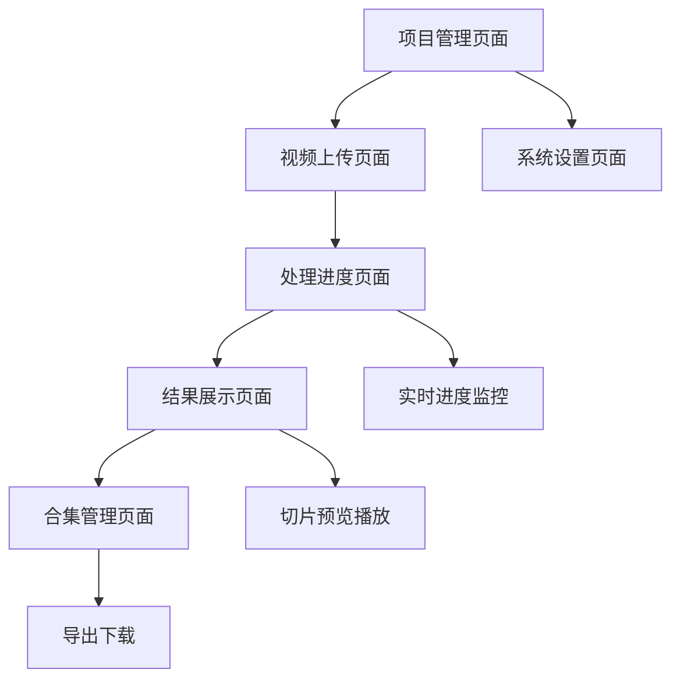

# AutoClip智能高光切片工具产品需求文档

## 1. 产品概述

AutoClip是一个基于AI的智能视频高光切片工具，能够自动分析视频内容，提取精彩片段并生成高质量的短视频合集。
- 解决长视频内容筛选效率低的问题，为内容创作者和视频编辑人员提供智能化的视频处理解决方案。
- 目标是成为视频内容创作领域的核心生产力工具，提升内容制作效率10倍以上。

## 2. 核心功能

### 2.1 用户角色

| 角色 | 注册方式 | 核心权限 |
|------|----------|----------|
| 普通用户 | 直接使用，无需注册 | 可上传视频、查看处理进度、下载切片结果 |
| 管理员 | 系统预设 | 可管理所有项目、查看系统状态、配置处理参数 |

### 2.2 功能模块

我们的AutoClip系统包含以下主要页面：
1. **项目管理页面**：项目列表、创建项目、项目状态监控
2. **视频上传页面**：文件上传、格式验证、预处理配置
3. **处理进度页面**：实时进度显示、任务状态跟踪、错误处理
4. **结果展示页面**：切片预览、质量评分、标题生成
5. **合集管理页面**：切片组合、合集编辑、导出设置
6. **系统设置页面**：处理参数配置、API密钥管理、系统监控

### 2.3 页面详情

| 页面名称 | 模块名称 | 功能描述 |
|----------|----------|----------|
| 项目管理页面 | 项目列表 | 显示所有项目、支持搜索筛选、状态标识、批量操作 |
| 项目管理页面 | 项目创建 | 创建新项目、设置项目名称和类型、选择处理模板 |
| 视频上传页面 | 文件上传 | 支持拖拽上传、进度显示、格式验证、大小限制 |
| 视频上传页面 | 字幕上传 | 可选SRT字幕文件上传、自动时间轴对齐 |
| 处理进度页面 | 实时进度 | WebSocket实时更新、6步处理流程显示、当前步骤详情 |
| 处理进度页面 | 任务管理 | 任务暂停/恢复、错误重试、日志查看 |
| 结果展示页面 | 切片预览 | 视频片段播放、时间轴标注、质量评分显示 |
| 结果展示页面 | 内容编辑 | 标题编辑、描述修改、标签管理 |
| 合集管理页面 | 切片选择 | 多选切片、排序调整、时长控制 |
| 合集管理页面 | 导出设置 | 分辨率选择、格式配置、水印添加 |
| 系统设置页面 | 参数配置 | 处理阈值设置、模型选择、并发控制 |
| 系统设置页面 | 系统监控 | 任务队列状态、系统资源使用、错误统计 |

## 3. 核心流程

### 普通用户流程
用户首先在项目管理页面创建新项目并选择视频类型，然后在视频上传页面上传视频文件和可选的字幕文件，系统开始6步智能处理流程（大纲提取→时间定位→内容评分→标题生成→主题聚类→视频切割），用户可在处理进度页面实时查看进度，处理完成后在结果展示页面预览所有切片，最后在合集管理页面选择优质切片组合成合集并导出。

### 管理员流程
管理员可以查看所有用户项目，在系统设置页面配置全局处理参数和监控系统状态，处理异常任务和系统维护。

## 4. 用户界面设计

### 4.1 设计风格
- **主色调**：深蓝色(#1890ff)作为主色，浅灰色(#f5f5f5)作为背景色
- **按钮样式**：圆角按钮，支持悬停效果和加载状态
- **字体**：系统默认字体，标题16px，正文14px，说明文字12px
- **布局风格**：卡片式布局，左侧导航栏，顶部面包屑导航
- **图标风格**：使用Ant Design图标库，简洁现代的线性图标

### 4.2 页面设计概览

| 页面名称 | 模块名称 | UI元素 |
|----------|----------|--------|
| 项目管理页面 | 项目列表 | 卡片网格布局，每个项目卡片显示缩略图、名称、状态、进度条，支持悬停效果 |
| 视频上传页面 | 文件上传区 | 大尺寸拖拽区域，虚线边框，上传图标，支持点击和拖拽两种方式 |
| 处理进度页面 | 进度指示器 | 6步骤水平进度条，当前步骤高亮显示，完成步骤显示绿色勾选 |
| 结果展示页面 | 视频播放器 | 内嵌视频播放器，时间轴标注，质量评分标签，操作按钮组 |
| 合集管理页面 | 切片选择器 | 多选列表，缩略图预览，拖拽排序，时长统计显示 |
| 系统设置页面 | 配置表单 | 分组表单布局，实时验证，保存状态提示 |

### 4.3 响应式设计
产品采用桌面优先设计，支持平板和移动端自适应，在移动端优化触摸交互体验，确保核心功能在小屏幕设备上的可用性。