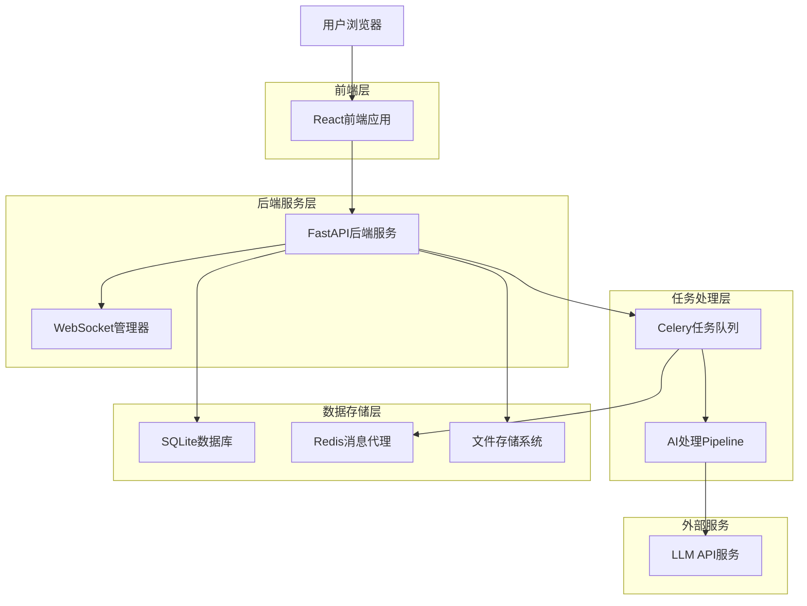
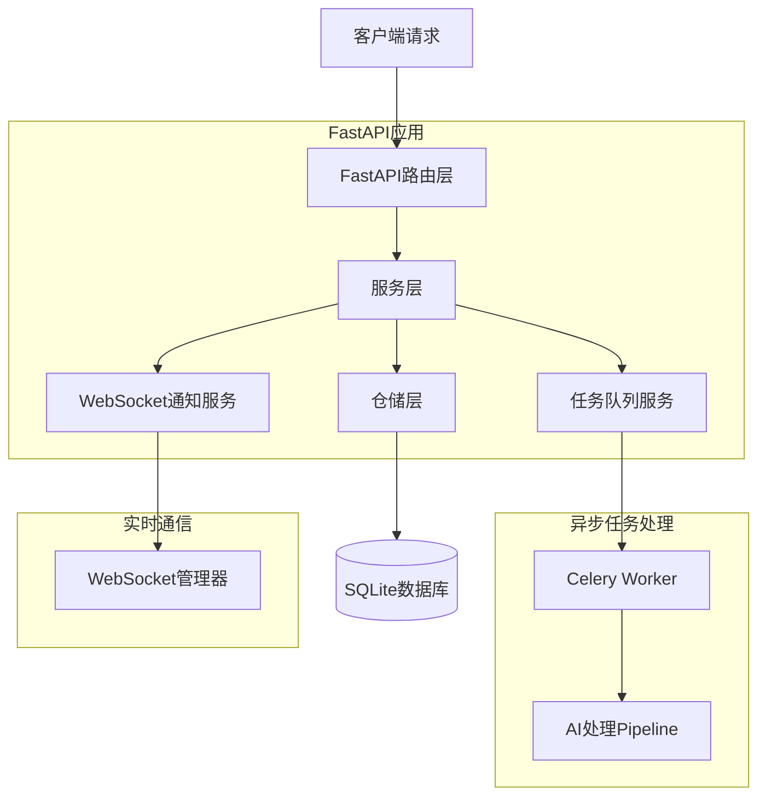
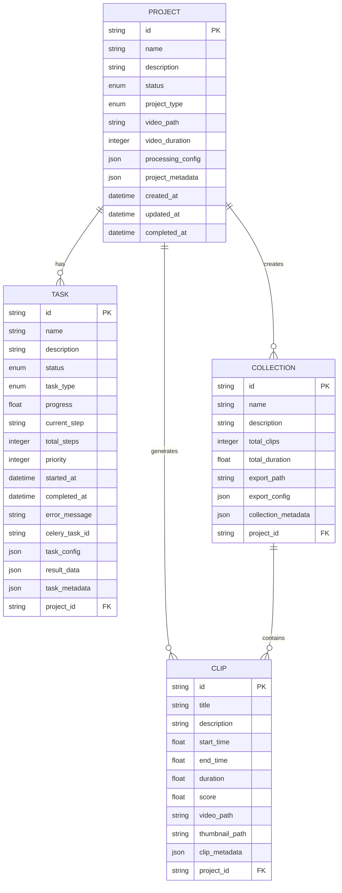

# AutoClip智能高光切片工具技术架构文档

## 1. 架构设计



## 2. 技术描述

- **前端**: React@18 + TypeScript + Ant Design + Zustand + Vite
- **后端**: FastAPI + SQLAlchemy 2.0 + Celery + WebSocket
- **数据库**: SQLite (开发) / PostgreSQL (生产)
- **消息队列**: Redis + Celery
- **AI处理**: 通义千问API + 自研Pipeline

## 3. 路由定义

| 路由 | 用途 |
|------|------|
| / | 首页，显示项目列表和快速操作入口 |
| /projects | 项目管理页面，创建和管理所有项目 |
| /projects/:id/upload | 视频上传页面，处理文件上传和预处理配置 |
| /projects/:id/progress | 处理进度页面，实时显示任务执行状态 |
| /projects/:id/results | 结果展示页面，预览和编辑生成的切片 |
| /projects/:id/collections | 合集管理页面，组合切片并导出 |
| /settings | 系统设置页面，配置处理参数和系统监控 |
| /ws | WebSocket连接端点，用于实时进度推送 |

## 4. API定义

### 4.1 核心API

**项目管理相关**
```
POST /api/v1/projects
```

请求参数:
| 参数名 | 参数类型 | 是否必需 | 描述 |
|--------|----------|----------|------|
| name | string | true | 项目名称 |
| description | string | false | 项目描述 |
| project_type | string | true | 项目类型(knowledge/business/opinion等) |
| processing_config | object | false | 处理配置参数 |

响应参数:
| 参数名 | 参数类型 | 描述 |
|--------|----------|------|
| id | string | 项目ID |
| name | string | 项目名称 |
| status | string | 项目状态 |
| created_at | string | 创建时间 |

示例:
```json
{
  "name": "知识科普视频处理",
  "project_type": "knowledge",
  "processing_config": {
    "min_score_threshold": 0.7,
    "max_clips_per_collection": 5
  }
}
```

**文件上传相关**
```
POST /api/v1/projects/{project_id}/upload
```

请求参数:
| 参数名 | 参数类型 | 是否必需 | 描述 |
|--------|----------|----------|------|
| video_file | file | true | 视频文件 |
| srt_file | file | false | 字幕文件 |
| file_type | string | true | 文件类型(video/srt) |

**任务处理相关**
```
POST /api/v1/projects/{project_id}/process
```

请求参数:
| 参数名 | 参数类型 | 是否必需 | 描述 |
|--------|----------|----------|------|
| processing_steps | array | false | 指定处理步骤 |
| priority | integer | false | 任务优先级 |

**WebSocket消息格式**
```
WS /api/v1/ws/{project_id}
```

消息格式:
```json
{
  "type": "progress_update",
  "data": {
    "task_id": "task_123",
    "progress": 45.5,
    "current_step": "step2_timeline",
    "message": "正在进行时间定位...",
    "estimated_remaining": 120
  }
}
```

## 5. 服务器架构图



## 6. 数据模型

### 6.1 数据模型定义



### 6.2 数据定义语言

**项目表 (projects)**
```sql
-- 创建项目表
CREATE TABLE projects (
    id VARCHAR(36) PRIMARY KEY DEFAULT (lower(hex(randomblob(4))) || '-' || lower(hex(randomblob(2))) || '-4' || substr(lower(hex(randomblob(2))),2) || '-' || substr('89ab',abs(random()) % 4 + 1, 1) || substr(lower(hex(randomblob(2))),2) || '-' || lower(hex(randomblob(6)))),
    name VARCHAR(255) NOT NULL,
    description TEXT,
    status VARCHAR(20) DEFAULT 'pending' CHECK (status IN ('pending', 'processing', 'completed', 'failed', 'cancelled')),
    project_type VARCHAR(50) DEFAULT 'default' CHECK (project_type IN ('default', 'knowledge', 'business', 'opinion', 'experience', 'speech', 'content_review', 'entertainment')),
    video_path VARCHAR(500),
    video_duration INTEGER,
    processing_config JSON,
    project_metadata JSON,
    created_at DATETIME DEFAULT CURRENT_TIMESTAMP,
    updated_at DATETIME DEFAULT CURRENT_TIMESTAMP,
    completed_at DATETIME
);

-- 创建索引
CREATE INDEX idx_projects_status ON projects(status);
CREATE INDEX idx_projects_type ON projects(project_type);
CREATE INDEX idx_projects_created_at ON projects(created_at DESC);
```

**任务表 (tasks)**
```sql
-- 创建任务表
CREATE TABLE tasks (
    id VARCHAR(36) PRIMARY KEY DEFAULT (lower(hex(randomblob(4))) || '-' || lower(hex(randomblob(2))) || '-4' || substr(lower(hex(randomblob(2))),2) || '-' || substr('89ab',abs(random()) % 4 + 1, 1) || substr(lower(hex(randomblob(2))),2) || '-' || lower(hex(randomblob(6)))),
    name VARCHAR(255) NOT NULL,
    description TEXT,
    status VARCHAR(20) DEFAULT 'pending' CHECK (status IN ('pending', 'running', 'completed', 'failed', 'cancelled')),
    task_type VARCHAR(50) NOT NULL CHECK (task_type IN ('video_processing', 'clip_generation', 'collection_creation', 'export', 'cleanup')),
    progress REAL DEFAULT 0.0,
    current_step VARCHAR(100),
    total_steps INTEGER DEFAULT 1,
    priority INTEGER DEFAULT 0,
    started_at DATETIME,
    completed_at DATETIME,
    error_message TEXT,
    celery_task_id VARCHAR(255),
    task_config JSON,
    result_data JSON,
    task_metadata JSON,
    project_id VARCHAR(36) NOT NULL,
    created_at DATETIME DEFAULT CURRENT_TIMESTAMP,
    updated_at DATETIME DEFAULT CURRENT_TIMESTAMP,
    FOREIGN KEY (project_id) REFERENCES projects(id) ON DELETE CASCADE
);

-- 创建索引
CREATE INDEX idx_tasks_project_id ON tasks(project_id);
CREATE INDEX idx_tasks_status ON tasks(status);
CREATE INDEX idx_tasks_celery_task_id ON tasks(celery_task_id);
CREATE INDEX idx_tasks_created_at ON tasks(created_at DESC);
```

**切片表 (clips)**
```sql
-- 创建切片表
CREATE TABLE clips (
    id VARCHAR(36) PRIMARY KEY DEFAULT (lower(hex(randomblob(4))) || '-' || lower(hex(randomblob(2))) || '-4' || substr(lower(hex(randomblob(2))),2) || '-' || substr('89ab',abs(random()) % 4 + 1, 1) || substr(lower(hex(randomblob(2))),2) || '-' || lower(hex(randomblob(6)))),
    title VARCHAR(255) NOT NULL,
    description TEXT,
    start_time REAL NOT NULL,
    end_time REAL NOT NULL,
    duration REAL NOT NULL,
    score REAL DEFAULT 0.0,
    video_path VARCHAR(500),
    thumbnail_path VARCHAR(500),
    clip_metadata JSON,
    project_id VARCHAR(36) NOT NULL,
    created_at DATETIME DEFAULT CURRENT_TIMESTAMP,
    updated_at DATETIME DEFAULT CURRENT_TIMESTAMP,
    FOREIGN KEY (project_id) REFERENCES projects(id) ON DELETE CASCADE
);

-- 创建索引
CREATE INDEX idx_clips_project_id ON clips(project_id);
CREATE INDEX idx_clips_score ON clips(score DESC);
CREATE INDEX idx_clips_duration ON clips(duration);
```

**合集表 (collections)**
```sql
-- 创建合集表
CREATE TABLE collections (
    id VARCHAR(36) PRIMARY KEY DEFAULT (lower(hex(randomblob(4))) || '-' || lower(hex(randomblob(2))) || '-4' || substr(lower(hex(randomblob(2))),2) || '-' || substr('89ab',abs(random()) % 4 + 1, 1) || substr(lower(hex(randomblob(2))),2) || '-' || lower(hex(randomblob(6)))),
    name VARCHAR(255) NOT NULL,
    description TEXT,
    total_clips INTEGER DEFAULT 0,
    total_duration REAL DEFAULT 0.0,
    export_path VARCHAR(500),
    export_config JSON,
    collection_metadata JSON,
    project_id VARCHAR(36) NOT NULL,
    created_at DATETIME DEFAULT CURRENT_TIMESTAMP,
    updated_at DATETIME DEFAULT CURRENT_TIMESTAMP,
    FOREIGN KEY (project_id) REFERENCES projects(id) ON DELETE CASCADE
);

-- 创建索引
CREATE INDEX idx_collections_project_id ON collections(project_id);
CREATE INDEX idx_collections_created_at ON collections(created_at DESC);

-- 初始化数据
INSERT INTO projects (name, description, project_type, status) VALUES 
('示例知识科普项目', '用于演示知识科普类视频处理流程', 'knowledge', 'pending'),
('示例商业财经项目', '用于演示商业财经类视频处理流程', 'business', 'pending');
```

## 7. 关键技术实现

### 7.1 Celery任务队列集成

**配置文件 (backend/core/celery_app.py)**
```python
from celery import Celery
from backend.core.config import settings

celery_app = Celery(
    "autoclip",
    broker=settings.REDIS_URL,
    backend=settings.REDIS_URL,
    include=["backend.tasks.processing", "backend.tasks.video"]
)

celery_app.conf.update(
    task_serializer="json",
    accept_content=["json"],
    result_serializer="json",
    timezone="UTC",
    enable_utc=True,
    task_track_started=True,
    task_time_limit=30 * 60,  # 30分钟超时
    task_soft_time_limit=25 * 60,  # 25分钟软超时
    worker_prefetch_multiplier=1,
    task_acks_late=True,
    worker_max_tasks_per_child=1000
)
```

### 7.2 WebSocket实时通信

**WebSocket管理器 (backend/core/websocket_manager.py)**
```python
from fastapi import WebSocket
from typing import Dict, List
import json

class WebSocketManager:
    def __init__(self):
        self.active_connections: Dict[str, List[WebSocket]] = {}
    
    async def connect(self, websocket: WebSocket, project_id: str):
        await websocket.accept()
        if project_id not in self.active_connections:
            self.active_connections[project_id] = []
        self.active_connections[project_id].append(websocket)
    
    async def disconnect(self, websocket: WebSocket, project_id: str):
        if project_id in self.active_connections:
            self.active_connections[project_id].remove(websocket)
    
    async def send_progress_update(self, project_id: str, data: dict):
        if project_id in self.active_connections:
            message = json.dumps({"type": "progress_update", "data": data})
            for connection in self.active_connections[project_id]:
                try:
                    await connection.send_text(message)
                except:
                    await self.disconnect(connection, project_id)
```

### 7.3 AI处理Pipeline集成

**Pipeline适配器 (backend/services/pipeline_adapter.py)**
```python
from shared.pipeline import step1_outline, step2_timeline, step3_scoring
from backend.models import Task, Project
from backend.core.websocket_manager import websocket_manager

class PipelineAdapter:
    def __init__(self):
        self.steps = {
            "step1_outline": step1_outline.OutlineExtractor,
            "step2_timeline": step2_timeline.TimelineExtractor,
            "step3_scoring": step3_scoring.ContentScorer,
            # ... 其他步骤
        }
    
    async def execute_pipeline(self, project: Project, task: Task):
        """执行完整的AI处理流程"""
        try:
            for i, (step_name, step_class) in enumerate(self.steps.items()):
                # 更新任务进度
                progress = (i / len(self.steps)) * 100
                await self.update_task_progress(task, progress, step_name)
                
                # 执行处理步骤
                processor = step_class()
                result = await processor.process(project)
                
                # 保存中间结果
                await self.save_step_result(project, step_name, result)
            
            # 完成任务
            await self.complete_task(task)
            
        except Exception as e:
            await self.fail_task(task, str(e))
    
    async def update_task_progress(self, task: Task, progress: float, current_step: str):
        """更新任务进度并发送WebSocket通知"""
        task.progress = progress
        task.current_step = current_step
        
        # 发送WebSocket通知
        await websocket_manager.send_progress_update(task.project_id, {
            "task_id": task.id,
            "progress": progress,
            "current_step": current_step,
            "message": f"正在执行{current_step}..."
        })
```