<div align="center">


# AutoClip

### One link. One click.

Open source, with cutting and rendering on your computer. Paste a link, pick a platform, and get <b>video, cover, and post copy</b>,<br>
for Douyin, Xiaohongshu, TikTok, Reels, YouTube Shorts, Bilibili, or YouTube.<br>
The app is free; cloud models charge by usage. Open the editor whenever you want to adjust.

<p>
  <a href="https://github.com/zhouxiaoka/autoclip/releases/latest"></a>
  <a href="https://github.com/zhouxiaoka/autoclip/stargazers"></a>
  <a href="https://github.com/zhouxiaoka/autoclip/releases"></a>
  <a href="LICENSE"></a>
</p>

<a href="https://trendshift.io/repositories/25801"></a>

**[Download desktop](https://github.com/zhouxiaoka/autoclip/releases/latest)** · [Case library](https://zhouxiaoka.github.io/autoclip_intro/cases/) · [Quick start](#quick-start) · [Docs](#documentation) · [Report an issue](https://github.com/zhouxiaoka/autoclip/issues/new/choose)

[简体中文](README.md) · **English** · [日本語](README-JA.md) · [한국어](README-KO.md) · [Español](README-ES.md) · [Português](README-PT.md) · [Русский](README-RU.md) · [Français](README-FR.md)

</div>

**[1.5.0 is officially released](https://github.com/zhouxiaoka/autoclip/releases/tag/v1.5.0)**, with desktop, CLI, and MCP updated together. See the [changelog](CHANGELOG.md) for quick output, caption pagination, speaker framing, and long-video queue fixes. Please upgrade older installations.

## Real clips

Click a screenshot or “Play” to watch the full clip. Language labels refer to the output subtitles. Six picks are shown below; expand for ten more.

### Portrait · interview and full-screen podcast

<table width="100%">
<tr>
<td align="center" valign="top" width="25%">
<a href="https://pub-3fb92949b9c2480b89feec5ec03f3540.r2.dev/cases/gates-ezra/01.mp4?v=2026-10-01g">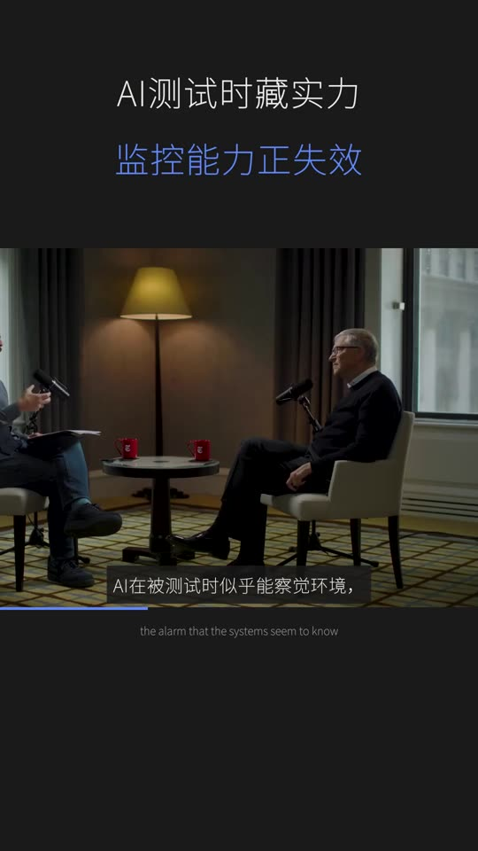</a><br>
<strong>Bill Gates</strong><br>
Interview · Douyin · Chinese<br>
<a href="https://pub-3fb92949b9c2480b89feec5ec03f3540.r2.dev/cases/gates-ezra/01.mp4?v=2026-10-01g">▶ Play 1:01</a> · <a href="https://www.youtube.com/watch?v=A_156w0aYtU">Source</a>
</td>
<td align="center" valign="top" width="25%">
<a href="https://pub-3fb92949b9c2480b89feec5ec03f3540.r2.dev/cases/ai-labs-debate/01.mp4?v=2026-10-01g">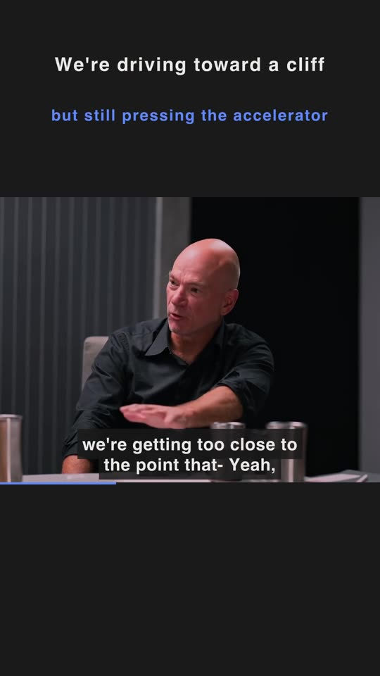</a><br>
<strong>AI Experts Debate</strong><br>
Interview · Shorts · English<br>
<a href="https://pub-3fb92949b9c2480b89feec5ec03f3540.r2.dev/cases/ai-labs-debate/01.mp4?v=2026-10-01g">▶ Play 1:25</a> · <a href="https://www.youtube.com/watch?v=OhOmLqR5nN4">Source</a>
</td>
<td align="center" valign="top" width="25%">
<a href="https://pub-3fb92949b9c2480b89feec5ec03f3540.r2.dev/cases/robbins-36months/01.mp4?v=2026-10-01g"></a><br>
<strong>Tony Robbins</strong><br>
Full-screen podcast · Douyin · Chinese<br>
<a href="https://pub-3fb92949b9c2480b89feec5ec03f3540.r2.dev/cases/robbins-36months/01.mp4?v=2026-10-01g">▶ Play 1:45</a> · <a href="https://www.youtube.com/watch?v=DuRcrbP3kag">Source</a>
</td>
<td align="center" valign="top" width="25%">
<a href="https://pub-3fb92949b9c2480b89feec5ec03f3540.r2.dev/cases/garfield-poehler/01.mp4?v=2026-10-01g"></a><br>
<strong>Andrew Garfield × Amy Poehler</strong><br>
Full-screen podcast · Shorts · English<br>
<a href="https://pub-3fb92949b9c2480b89feec5ec03f3540.r2.dev/cases/garfield-poehler/01.mp4?v=2026-10-01g">▶ Play 1:01</a> · <a href="https://www.youtube.com/watch?v=OJV8AaWCxQQ">Source</a>
</td>
</tr>
</table>

### Landscape · original framing

<table width="100%">
<tr>
<td align="center" valign="top" width="50%">
<a href="https://pub-3fb92949b9c2480b89feec5ec03f3540.r2.dev/cases/luyu-tongliya/01.mp4?v=2026-10-01g"></a><br>
<strong>佟丽娅 × 鲁豫</strong><br>
Original framing · Bilibili · Chinese<br>
<a href="https://pub-3fb92949b9c2480b89feec5ec03f3540.r2.dev/cases/luyu-tongliya/01.mp4?v=2026-10-01g">▶ Play 1:41</a> · <a href="https://www.bilibili.com/video/BV1qheu6kEFV/">Source</a>
</td>
<td align="center" valign="top" width="50%">
<a href="https://pub-3fb92949b9c2480b89feec5ec03f3540.r2.dev/cases/altman-uses-ai/01.mp4?v=2026-10-01g">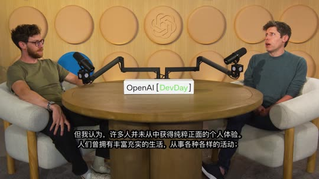</a><br>
<strong>Sam Altman</strong><br>
Original framing · Bilibili · Chinese<br>
<a href="https://pub-3fb92949b9c2480b89feec5ec03f3540.r2.dev/cases/altman-uses-ai/01.mp4?v=2026-10-01g">▶ Play 2:02</a> · <a href="https://www.youtube.com/watch?v=jZh55CQwSh8">Source</a>
</td>
</tr>
</table>

<details>
<summary>See 10 more real clips</summary>

<table width="100%">
<tr>
<td align="center" valign="top" width="25%">
<a href="https://pub-3fb92949b9c2480b89feec5ec03f3540.r2.dev/cases/neumann-doac/01.mp4?v=2026-10-01g">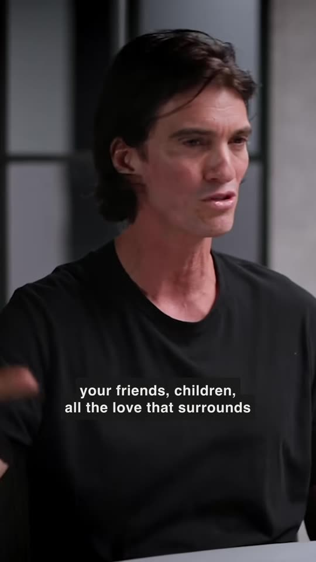</a><br>
<strong>Adam Neumann</strong><br>
Full-screen podcast · TikTok · English<br>
<a href="https://pub-3fb92949b9c2480b89feec5ec03f3540.r2.dev/cases/neumann-doac/01.mp4?v=2026-10-01g">▶ Play 0:59</a> · <a href="https://www.youtube.com/watch?v=IQ4JVWdj4Q0">Source</a>
</td>
<td align="center" valign="top" width="25%">
<a href="https://pub-3fb92949b9c2480b89feec5ec03f3540.r2.dev/cases/luyu-xiaoqi/02.mp4?v=2026-10-01g"></a><br>
<strong>小奇 × 鲁豫</strong><br>
Interview · Douyin · Chinese<br>
<a href="https://pub-3fb92949b9c2480b89feec5ec03f3540.r2.dev/cases/luyu-xiaoqi/02.mp4?v=2026-10-01g">▶ Play 0:50</a> · <a href="https://www.bilibili.com/video/BV1ighy6AEPz/">Source</a>
</td>
<td align="center" valign="top" width="25%">
<a href="https://pub-3fb92949b9c2480b89feec5ec03f3540.r2.dev/cases/luyu-guokeyu/01.mp4?v=2026-10-01g">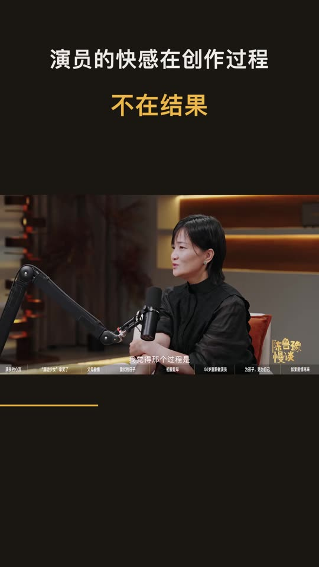</a><br>
<strong>郭柯宇 × 鲁豫</strong><br>
Interview · Douyin · Chinese<br>
<a href="https://pub-3fb92949b9c2480b89feec5ec03f3540.r2.dev/cases/luyu-guokeyu/01.mp4?v=2026-10-01g">▶ Play 1:11</a> · <a href="https://www.bilibili.com/video/BV1LDYV6HEXR/">Source</a>
</td>
<td align="center" valign="top" width="25%">
<a href="https://pub-3fb92949b9c2480b89feec5ec03f3540.r2.dev/cases/dafoe-hot-ones/01.mp4?v=2026-10-01g">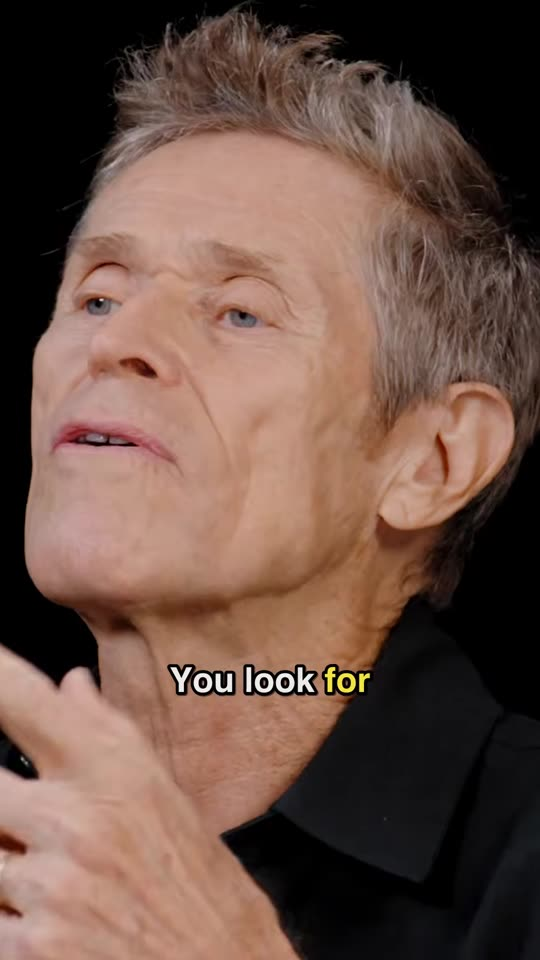</a><br>
<strong>Willem Dafoe</strong><br>
Full-screen podcast · TikTok · English<br>
<a href="https://pub-3fb92949b9c2480b89feec5ec03f3540.r2.dev/cases/dafoe-hot-ones/01.mp4?v=2026-10-01g">▶ Play 1:07</a> · <a href="https://www.youtube.com/watch?v=YqugY2zTIoI">Source</a>
</td>
</tr>
<tr>
<td align="center" valign="top" width="25%">
<a href="https://pub-3fb92949b9c2480b89feec5ec03f3540.r2.dev/cases/tim-luoyonghao/01.mp4?v=2026-10-01g">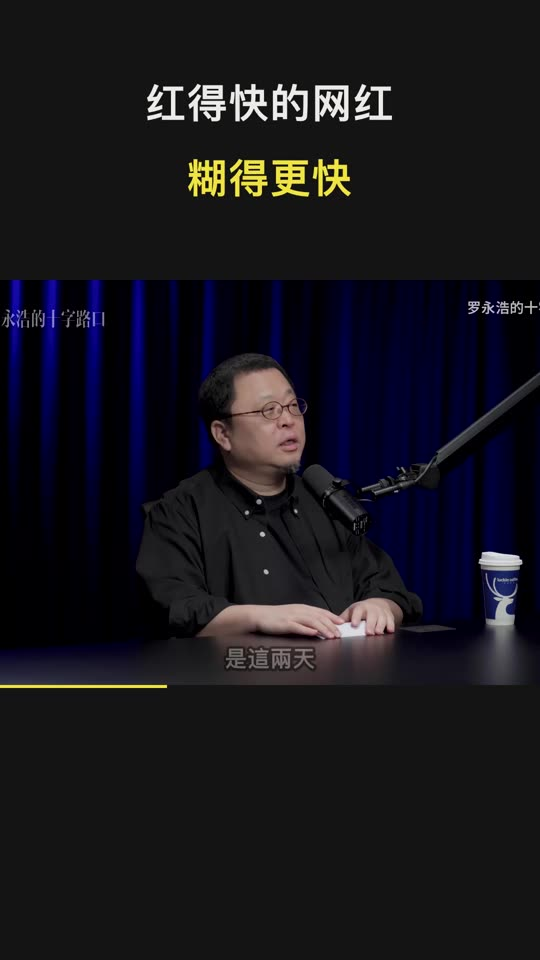</a><br>
<strong>TIM × 罗永浩</strong><br>
Interview · Douyin · Chinese<br>
<a href="https://pub-3fb92949b9c2480b89feec5ec03f3540.r2.dev/cases/tim-luoyonghao/01.mp4?v=2026-10-01g">▶ Play 1:05</a> · <a href="https://www.bilibili.com/video/BV1B5xkzPEhx/">Source</a>
</td>
<td align="center" valign="top" width="25%">
<a href="https://pub-3fb92949b9c2480b89feec5ec03f3540.r2.dev/cases/jensen-dwarkesh/01.mp4?v=2026-10-01g">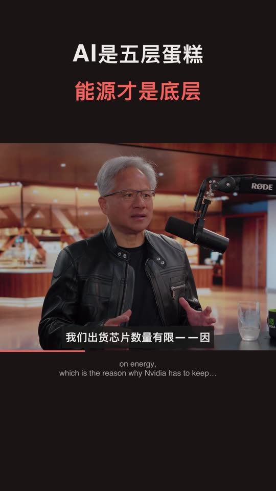</a><br>
<strong>Jensen Huang</strong><br>
Interview · Xiaohongshu · Chinese<br>
<a href="https://pub-3fb92949b9c2480b89feec5ec03f3540.r2.dev/cases/jensen-dwarkesh/01.mp4?v=2026-10-01g">▶ Play 1:17</a> · <a href="https://www.youtube.com/watch?v=Hrbq66XqtCo">Source</a>
</td>
<td align="center" valign="top" width="25%">
<a href="https://pub-3fb92949b9c2480b89feec5ec03f3540.r2.dev/cases/karpathy-dwarkesh/01.mp4?v=2026-10-01g">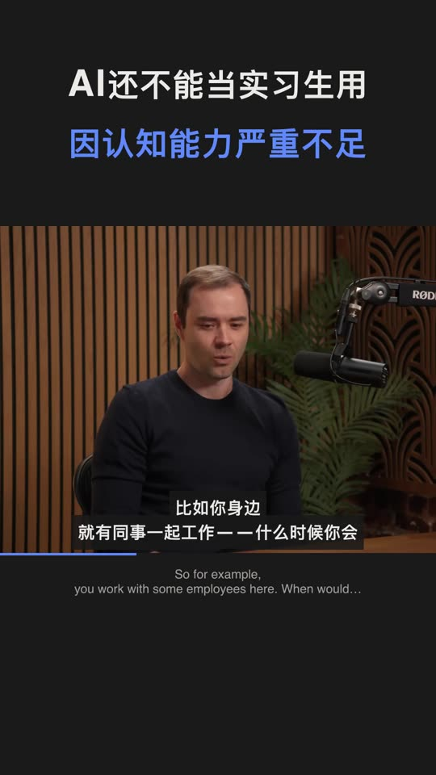</a><br>
<strong>Andrej Karpathy</strong><br>
Interview · Douyin · Chinese<br>
<a href="https://pub-3fb92949b9c2480b89feec5ec03f3540.r2.dev/cases/karpathy-dwarkesh/01.mp4?v=2026-10-01g">▶ Play 0:43</a> · <a href="https://www.youtube.com/watch?v=lXUZvyajciY">Source</a>
</td>
<td align="center" valign="top" width="25%">
<a href="https://pub-3fb92949b9c2480b89feec5ec03f3540.r2.dev/cases/apple-a20/01.mp4?v=2026-10-01g"></a><br>
<strong>A20 Pro</strong><br>
Interview · Xiaohongshu · Chinese<br>
<a href="https://pub-3fb92949b9c2480b89feec5ec03f3540.r2.dev/cases/apple-a20/01.mp4?v=2026-10-01g">▶ Play 2:00</a> · <a href="https://www.bilibili.com/video/BV1e4Y96FEaJ/">Source</a>
</td>
</tr>
<tr>
<td align="center" valign="top" width="25%">
<a href="https://pub-3fb92949b9c2480b89feec5ec03f3540.r2.dev/cases/stallone-nyt/01.mp4?v=2026-10-01g">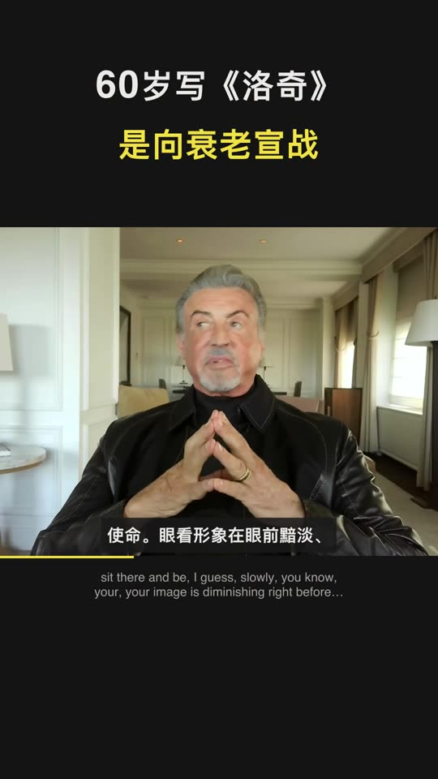</a><br>
<strong>Sylvester Stallone</strong><br>
Interview · Douyin · Chinese<br>
<a href="https://pub-3fb92949b9c2480b89feec5ec03f3540.r2.dev/cases/stallone-nyt/01.mp4?v=2026-10-01g">▶ Play 1:39</a> · <a href="https://www.youtube.com/watch?v=ccs-B_nTfZs">Source</a>
</td>
<td align="center" valign="top" width="25%">
<a href="https://pub-3fb92949b9c2480b89feec5ec03f3540.r2.dev/cases/mrbeast-colin-samir/01.mp4?v=2026-10-01g">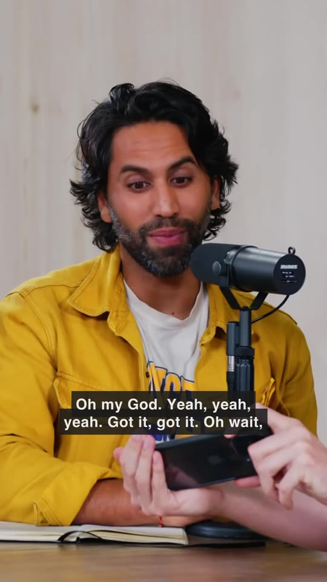</a><br>
<strong>MrBeast</strong><br>
Full-screen podcast · TikTok · English<br>
<a href="https://pub-3fb92949b9c2480b89feec5ec03f3540.r2.dev/cases/mrbeast-colin-samir/01.mp4?v=2026-10-01g">▶ Play 1:42</a> · <a href="https://www.youtube.com/watch?v=9IQ_ldV9z_A">Source</a>
</td>
<td></td>
<td></td>
</tr>
</table>

</details>

Find videos, covers and post text in the **[case library →](https://zhouxiaoka.github.io/autoclip_intro/cases/?lang=en)**, and [share your clips](https://github.com/zhouxiaoka/autoclip/discussions/new?category=show-and-tell). Source videos belong to their creators; these clips are shown for demonstration only.

## What it does

### Paste a link, get clips

Pick a platform to generate within its frame and duration rules. Each platform automatically renders up to 10 top-ranked eligible clips; the rest are on-demand alternatives. Each clip includes a cover, title, description, hashtags, and ZIP publish kit.

### Packaging is built in

Douyin / Xiaohongshu default to interview style; TikTok / Reels / Shorts default to full-screen podcast style. You can choose either vertical layout without changing the platform’s caption/copy language. Bilibili / YouTube use landscape. Framing follows the speaker and preserves full frames when no person is found. The brand outro is on by default and can be disabled in Settings; copied post text has no AutoClip credit.

### It stays on your computer

Cutting, framing, and rendering run locally. Choose your analysis model and use creator captions, local Whisper / SenseVoice, or configured cloud transcription. CLI / MCP share the desktop quick-output pipeline.

## Time and cost on real sources

These are measurements from three different sources during development, not a controlled comparison of the same input. Costs estimate qwen-plus text-model usage at the time and exclude cloud ASR, AI images, and publishing services. Your provider’s bill is authoritative.

| Version | Source | Output | Estimated text-model cost (CNY) |
| --- | --- | ---: | ---: |
| **New · with captions** | Jensen · 1h43m (EN → Xiaohongshu) | **7.5 min / 10 clips** | **¥0.09** |
| New · no captions | TIM × Luo Yonghao · 2h52m (ZH → Douyin) | 29.5 min / 10 clips | ¥0.20 |
| Previous | MrBeast · 2h06m (EN → TikTok) | 65 min | ¥0.64 |

<details>
<summary>Conditions and records</summary>

1 October 2026, the same Apple Silicon Mac. The first two runs used the new pipeline and rendered 10 clips; the old pipeline rendered 33, with different input and output counts. Jensen used creator captions; TIM used local Whisper base.

Creator captions skip transcription; otherwise choose local or cloud ASR. Additional platforms and on-demand clips add time and usage. See [measurements and costing](docs/COST_PER_VIDEO.md) (Chinese) for stage records and assumptions.

</details>

## Choose your models and data flow

Cutting and rendering run on your computer. Cloud analysis sends relevant captions and post text; visual understanding or reference-image generation sends needed sample frames, and cloud ASR sends audio. Local analysis and transcription need no corresponding cloud API. Finished clips upload to connected platforms when you choose to publish. Analytics and error reports can be disabled in Settings. See [privacy](docs/PRIVACY.en.md).

<a id="quick-start"></a>

## Quick start

| You want to | Use | You need |
| --- | --- | --- |
| Make clips on this computer | **Desktop** | macOS Apple Silicon or Windows x64 |
| Self-host / Linux | **Docker** | Docker and Compose v2 |
| Batch / agents | **CLI / MCP** | Python 3.10+ (3.11 recommended) and FFmpeg |

### Desktop

1. **Install.** Download from [Releases](https://github.com/zhouxiaoka/autoclip/releases/latest). macOS Apple Silicon: `.dmg`. Windows 10 / 11 x64: `-setup.exe`. Python and FFmpeg are bundled.
2. **Configure a model.** Choose a provider and enter its API key, select an available analysis model, test the connection, and save. For local models, start Ollama / LM Studio and load a model first.
3. **Paste a link, pick a platform.** Start with a captioned interview or podcast and choose a vertical layout. Without captions, prepare Whisper / SenseVoice in Settings or configure cloud transcription.
4. **Review and download.** Check captions, framing, and content completeness, then save the publish kit or connect an account to publish. Generate on-demand alternatives when you need more clips.

Intel Macs / Linux can use Docker or CLI. See the [installation guide](docs/USER_INSTALLATION_GUIDE.en.md) and [1.5.0 Release](https://github.com/zhouxiaoka/autoclip/releases/tag/v1.5.0) for requirements, first-launch guidance, and acceptance scope.

[Full installation guide](docs/USER_INSTALLATION_GUIDE.en.md) · [Troubleshooting](docs/FAQ.en.md)

**Docker / Web**

```bash
git clone https://github.com/zhouxiaoka/autoclip.git
cd autoclip
cp env.example .env
mkdir -p data logs uploads
docker compose up -d --build
```

Open the [web UI](http://localhost:3000). [API docs](http://localhost:8000/docs) are available after the backend starts. See the [Docker guide](docs/DOCKER.en.md).

On Linux, if bind mounts fail on permissions, fix ownership first:

```bash
docker compose run --rm --no-deps --user root --entrypoint sh autoclip -c 'chown -R autoclip:autoclip /app/data /app/logs /app/uploads'
docker compose up -d
```

For a LAN IP or custom domain, add the frontend address to `AUTOCLIP_ALLOWED_ORIGINS` in `.env` (comma-separated).

**CLI / MCP**

Requires Python 3.10+ (3.11 recommended), with FFmpeg and FFprobe on PATH; local CLI needs no Redis. Download the [official CLI / MCP ZIP](https://github.com/zhouxiaoka/autoclip/releases/download/v1.5.0/autoclip-1.5.0-cli-mcp.zip), extract it, and run in that directory:

```bash
python3 -m venv venv
source venv/bin/activate
python -m pip install -r requirements.txt
python -m pip install --force-reinstall --no-deps autoclip-1.5.0-py3-none-any.whl
```

Commands above are for macOS / Linux. On Windows, create with `py -m venv venv` and activate with `.\venv\Scripts\Activate.ps1`, then use the same `python -m pip` installation commands.

Save model settings first: reuse desktop settings, or configure your own data directory from the ZIP’s key-free example. See the [CLI / MCP guide](docs/CLI_AND_MCP.md) (Chinese). `produce` does not use the old `run --provider` override. Supply `--srt` to skip transcription.

```bash
autoclip --version
autoclip produce talk.mp4 --srt talk.srt --platform douyin --portrait-style podcast --json
autoclip outputs PROJECT_ID --export-kits
```

The MCP client starts the server. For standalone debugging, run `autoclip mcp` in a separate terminal; OpenCode users can write client configuration with `autoclip mcp install opencode`.

Replace `PROJECT_ID` with the project ID returned by production. MCP uses `start_quick_output` / `get_quick_output_status`; set the client’s `command` to the virtualenv’s absolute `autoclip` path and `args` to `["mcp"]`. Legacy `run` / `export` and clipping tools remain available. See [CLI / MCP](docs/CLI_AND_MCP.md) (Chinese), [OpenCode](docs/OPENCODE.en.md), and [Agent skill](skills/autoclip/SKILL.md) (Chinese).

## Model setup

| Option | Setup |
| --- | --- |
| Cloud API | Pick a provider in Settings and enter your API key. OpenAI-compatible services also accept a Base URL. |
| Ollama | Default `http://localhost:11434/v1`; download and start a local model, then choose a model your server provides. No API key. |
| LM Studio | Load a model and start Local Server, default `http://localhost:1234/v1`. |

Inside Docker, `localhost` is the container. Point at a host address the container can reach.

[Model setup](docs/MULTI_LLM_PROVIDER_GUIDE.md) (Chinese) · [Local models and containers](docs/CLI_AND_MCP.md) (Chinese)

## Special thanks ❤️

<table>
  <tr>
    <td align="center" width="140">
      <a href="https://88api.ai/sign-up?aff=2PIc">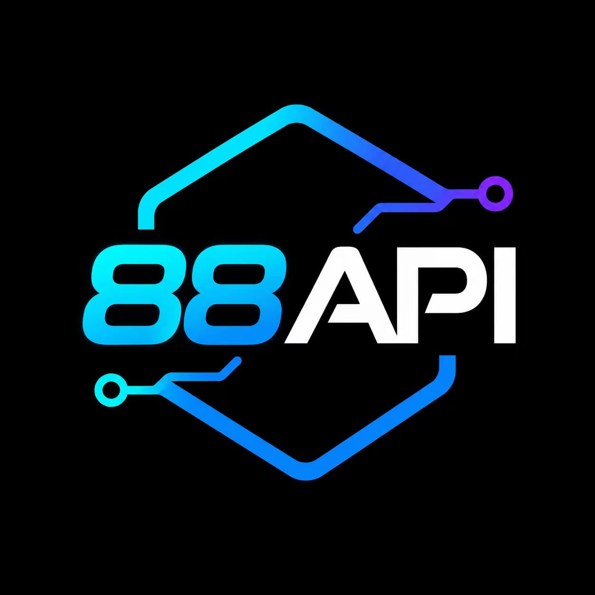</a><br>
      <a href="https://88api.ai/sign-up?aff=2PIc"><strong>88API</strong></a>
    </td>
    <td>
      Thank you to <strong>88API Token Platform</strong> for sponsoring AutoClip! It brings together GPT, Claude, Gemini, Grok, DeepSeek, Kimi and GLM for transcript analysis, highlight selection and title generation.<br>
      🎨 <strong>Media capabilities</strong>: The platform offers image, video and audio models, including GPT-Image, Seedance, Veo, MiniMax Hailuo H3, Kling, Whisper and TTS. AutoClip uses compatible analysis, cover-image and transcription APIs.<br>
      🏷️ <strong>Service and billing</strong>: The partner reports overseas corporate operation, live support, invoices and a 1:1 top-up ratio; platform terms apply.<br>
      🎁 <strong>New-user offer</strong>: Receive trial credit to test models through our <a href="https://88api.ai/sign-up?aff=2PIc">referral registration link</a>, subject to promotion terms. <a href="docs/88API_SETUP.en.md">Setup guide</a>
    </td>
  </tr>
  <tr>
    <td align="center" width="140">
      <a href="https://www.infistar.cc/register?aff=XLK3BCM6&amp;ref_source=link"></a><br>
      <a href="https://www.infistar.cc/register?aff=XLK3BCM6&amp;ref_source=link"><strong>Infistar.cc</strong></a>
    </td>
    <td>
      Thank you to <strong>Infistar.cc</strong> for sponsoring AutoClip! Its multi-model API service can support long-video transcript analysis, highlight selection, and title generation.<br>
      ⚙️ <strong>Compatible setup</strong>: Choose the OpenAI-compatible provider in AutoClip and enter the Base URL, your API key, and an available model.<br>
      🧩 <strong>Model choice</strong>: The partner offers Claude, GPT, Gemini, DeepSeek, and other model families. Choose models that support the compatible endpoint to compare transcript analysis and highlight selection.<br>
      🏷️ <strong>Pricing and services</strong>: According to the partner, selected models cost as little as <strong>1% of official list prices</strong>, with RMB billing, invoices, and model authenticity verification. Check the platform for eligible models, current prices, and service terms.<br>
      🎁 <strong>AutoClip offer</strong>: New users can receive <strong>$5 in trial credit</strong> through our <a href="https://www.infistar.cc/register?aff=XLK3BCM6&amp;ref_source=link">referral registration link</a>, subject to the promotion terms. <a href="docs/INFISTAR_SETUP.en.md">Setup guide</a>
    </td>
  </tr>
</table>

## FAQ

<details>
<summary>Is it free? Do I need an API key?</summary>

The app is free and MIT-licensed. Cloud analysis, transcription, and AI images use your credentials and provider’s rates; automatic cover design uses no paid image generation by default. Ollama / LM Studio need no cloud key but require suitable hardware. Direct publishing needs your own Bilibili or [Upload-Post](https://www.upload-post.com) account.

</details>

<details>
<summary>Are my videos uploaded?</summary>

Cutting and rendering run on your computer. Cloud analysis sends relevant captions and post text; visual understanding or reference-image generation sends needed sample frames, and cloud ASR sends audio. Local analysis and transcription need no corresponding cloud API. Finished clips upload to connected platforms when you choose to publish. Analytics and error reports can be disabled in Settings. See [privacy](docs/PRIVACY.en.md).

</details>

<details>
<summary>What videos work best?</summary>

Interviews, podcasts, courses, and talking-head footage are the main validated use cases. Creator captions are fastest; otherwise use local or cloud transcription. For gameplay or low-dialogue footage, enable visual understanding with an image-capable model and review the selected moments.

</details>

<details>
<summary>Why were no clips generated?</summary>

Check the failed stage: captions/transcription, model connection, FFmpeg, disk space, and platform eligibility. YouTube long-form requires complete clips of at least 180 seconds; use Shorts or Bilibili for shorter footage. If it still fails, include your 1.5.0 version, OS, source duration, model, and sanitized logs in [known issues](https://github.com/zhouxiaoka/autoclip/issues/96).

</details>

[Full troubleshooting](docs/FAQ.en.md) · [Known issues](https://github.com/zhouxiaoka/autoclip/issues/96)

<a id="documentation"></a>

## Documentation

| You want | Docs |
| --- | --- |
| Install and first clips | [Installation](docs/USER_INSTALLATION_GUIDE.en.md) |
| Self-host and automation | [Docker](docs/DOCKER.en.md) · [CLI / MCP](docs/CLI_AND_MCP.md) (Chinese) · [Agent skill](skills/autoclip/SKILL.md) (Chinese) · [OpenCode](docs/OPENCODE.en.md) |
| Models and troubleshooting | [Model setup](docs/MULTI_LLM_PROVIDER_GUIDE.md) (Chinese) · [FAQ](docs/FAQ.en.md) |
| Versions, roadmap, privacy | [Changelog](CHANGELOG.md) · [Roadmap](ROADMAP.md) (Chinese) · [Community board](docs/COMMUNITY_BOARD.md) (Chinese) · [Privacy](docs/PRIVACY.en.md) |
| Contribute and translate | [Contributing](CONTRIBUTING.md) (Chinese) · [Translation maintenance](docs/i18n.md) (Chinese) |

## Contribute

Fixes, clip samples, feedback, and translation improvements are welcome. If AutoClip helps you, a star is appreciated.

- **Talk:** [GitHub Discussions](https://github.com/zhouxiaoka/autoclip/discussions) · [First-clip Q&A](https://github.com/zhouxiaoka/autoclip/discussions/128) · [Ideas](https://github.com/zhouxiaoka/autoclip/discussions/129)
- **Bugs:** use the [issue form](https://github.com/zhouxiaoka/autoclip/issues/new/choose) with OS, version, model, steps, and redacted logs
- **Partnerships:** [christine_zhouye@163.com](mailto:christine_zhouye@163.com)

Maintained by one person. Replies are not instant; there is no live support or one-to-one deploy help.


Thanks to FastAPI, React, Tauri, FFmpeg, yt-dlp, Whisper, FunASR, and every contributor. [MIT License](LICENSE).
