<div align="center">


# AutoClip

### Herramienta de código abierto para extraer momentos destacados con IA

Convierte vídeos largos en momentos que merece la pena compartir.

[](https://github.com/zhouxiaoka/autoclip/releases/latest)
[](https://github.com/zhouxiaoka/autoclip/stargazers)
[](LICENSE)

<p align="center">
  <a href="https://trendshift.io/repositories/25801"></a>
  <a href="https://trendshift.io/repositories/25801"></a>
  <a href="https://trendshift.io/repositories/25801"></a>
</p>

**[Descargar aplicación](https://github.com/zhouxiaoka/autoclip/releases/latest)** · [Inicio rápido](#quick-start) · [Sitio web](https://zhouxiaoka.github.io/autoclip_intro/) · [Documentación](#documentation) · [Informar de un problema](https://github.com/zhouxiaoka/autoclip/issues/new/choose)

[简体中文](README.md) · [English](README-EN.md) · [日本語](README-JA.md) · [한국어](README-KO.md) · **Español** · [Português](README-PT.md) · [Русский](README-RU.md) · [Français](README-FR.md)

</div>

AutoClip utiliza IA para analizar los subtítulos de un vídeo, encontrar momentos destacados, crear títulos y generar clips y recopilaciones. Está pensado para entrevistas, pódcasts, cursos y grabaciones de directos, con una aplicación de escritorio, una interfaz web mediante Docker y acceso por CLI / MCP.

## Vista de la aplicación

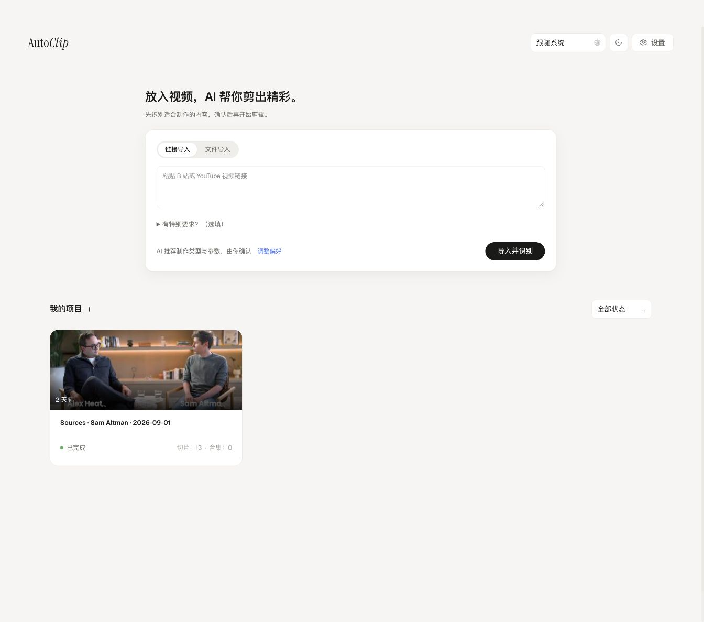

<table>
  <tr>
    <td width="50%" align="center"><strong>Clips generados por IA</strong></td>
    <td width="50%" align="center"><strong>Vista previa y edición en Studio</strong></td>
  </tr>
  <tr>
    <td><a href="docs/images/clips-v1.4.0.png">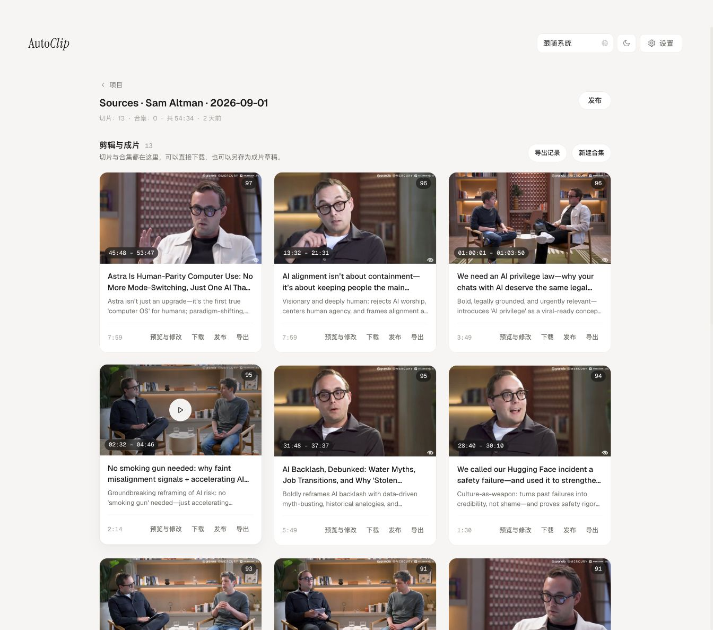</a></td>
    <td><a href="docs/images/studio-v1.4.0.png">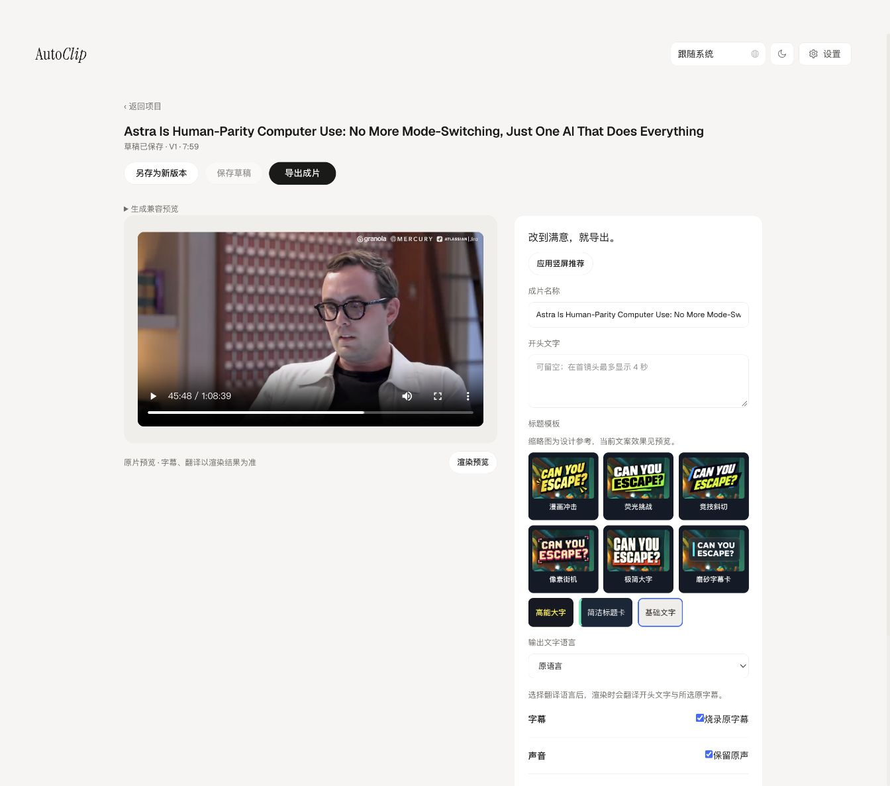</a></td>
  </tr>
</table>

<sub>Interfaz real de v1.4.0 con correcciones posteriores de Studio: importa vídeos, revisa clips realmente generados y edítalos en Studio. La interfaz está en chino; la transcripción y los títulos del ejemplo están en inglés.</sub>

[Versión de las capturas y fuente del ejemplo (chino)](docs/images/README.md)

## Agradecimientos ❤️

<table>
  <tr>
    <td align="center" width="140">
      <a href="https://www.infistar.cc/register?aff=XLK3BCM6&amp;ref_source=link"></a><br>
      <a href="https://www.infistar.cc/register?aff=XLK3BCM6&amp;ref_source=link"><strong>Infistar.cc</strong></a>
    </td>
    <td>
      ¡Gracias a <strong>Infistar.cc</strong> por patrocinar AutoClip! Ofrece una API multimodelo para analizar transcripciones de vídeos largos, seleccionar momentos destacados y generar títulos.<br>
      ⚙️ <strong>Configuración compatible</strong>: En AutoClip, elige el proveedor compatible con OpenAI e introduce la Base URL, tu clave API y un modelo disponible.<br>
      🧩 <strong>Variedad de modelos</strong>: El proveedor ofrece Claude, GPT, Gemini, DeepSeek y otras familias. Elige modelos que admitan el endpoint compatible para comparar el análisis de transcripciones y la selección de momentos destacados.<br>
      🏷️ <strong>Precios y servicios</strong>: Según el patrocinador, algunos modelos cuestan desde el <strong>1% del precio oficial</strong>, con facturación en RMB, emisión de facturas y verificación de autenticidad del modelo. Consulta en la plataforma los modelos, precios y condiciones vigentes.<br>
      🎁 <strong>Oferta para AutoClip</strong>: Los nuevos usuarios pueden recibir <strong>$5 de crédito de prueba</strong> al registrarse mediante el <a href="https://www.infistar.cc/register?aff=XLK3BCM6&amp;ref_source=link">enlace de referido</a>, según las condiciones de la promoción. <a href="docs/INFISTAR_SETUP.en.md">Guía de configuración (inglés)</a>
    </td>
  </tr>
</table>

## Qué puedes hacer

Haz clic en una miniatura para ver la imagen completa.

<table>
  <tr>
    <td width="50%" valign="top">
      <h4>Importar vídeos</h4>
      <p>Usa archivos locales o enlaces de YouTube y Bilibili, con subtítulos SRT opcionales.</p>
      <a href="docs/images/feature-import.png">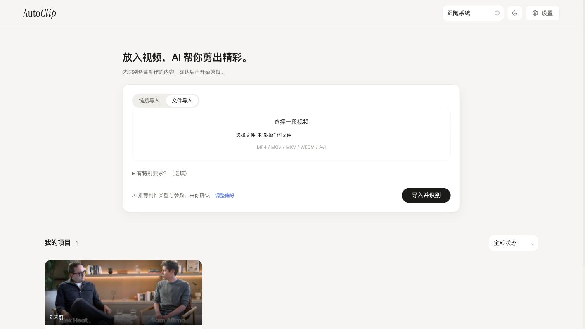</a>
    </td>
    <td width="50%" valign="top">
      <h4>Encontrar momentos destacados</h4>
      <p>Extrae resúmenes, intervalos por tema, puntuaciones y títulos a partir de los subtítulos.</p>
      <a href="docs/images/clips-v1.4.0.png"></a>
    </td>
  </tr>
  <tr>
    <td width="50%" valign="top">
      <h4>Crear clips y recopilaciones</h4>
      <p>Genera clips y recopilaciones sugeridas, y ajusta su orden manualmente.</p>
      <a href="docs/images/feature-collections.png">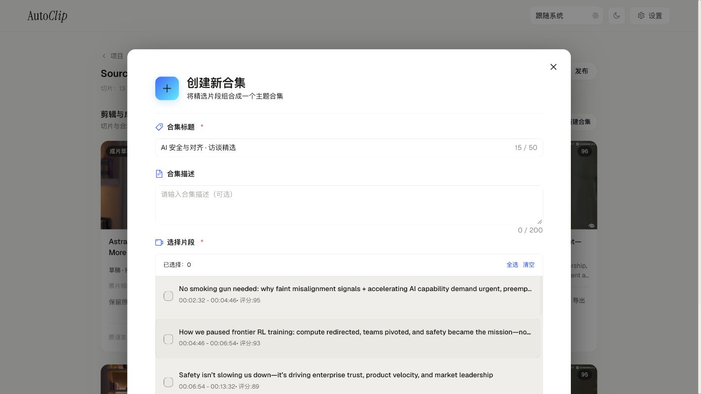</a>
    </td>
    <td width="50%" valign="top">
      <h4>Exportar para publicar</h4>
      <p>Usa ajustes para Douyin, Xiaohongshu, YouTube Shorts y Bilibili, con subtítulos incrustados y tarjetas de título.</p>
      <a href="docs/images/feature-export.png">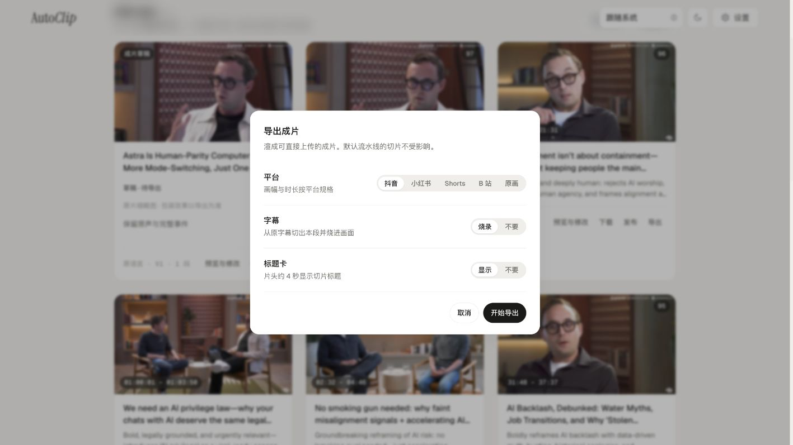</a>
    </td>
  </tr>
  <tr>
    <td width="50%" valign="top">
      <h4>Portadas y publicación</h4>
      <p>Desde v1.3.2, genera portadas y publica de inmediato o con programación. Conecta plataformas internacionales mediante tu cuenta de Upload-Post; Bilibili se configura por separado.</p>
      <a href="docs/images/feature-publish.png">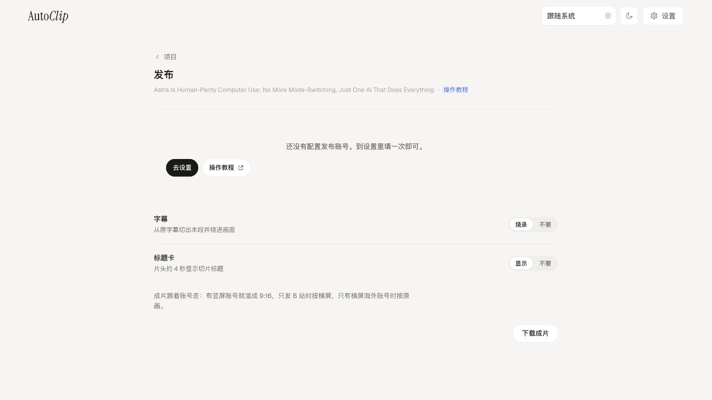</a>
      <a href="docs/images/feature-cover.png">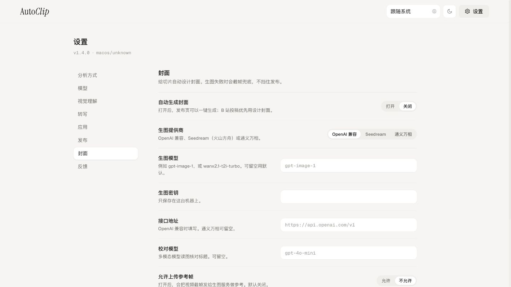</a>
      <p><sub>La demo no tiene una cuenta de publicación conectada. Se muestran la entrada de publicación y los ajustes de portada, no publicaciones completadas.</sub></p>
    </td>
    <td width="50%" valign="top">
      <h4>Gestión de publicaciones</h4>
      <p>Consulta el historial y el calendario, administra publicaciones pendientes o descarga los clips sin publicarlos.</p>
      <a href="docs/images/feature-calendar.png">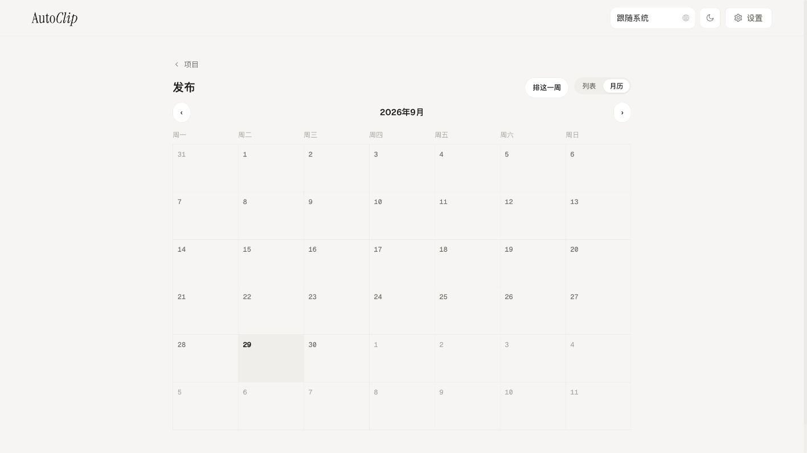</a>
    </td>
  </tr>
  <tr>
    <td width="50%" valign="top">
      <h4>Elige tus modelos</h4>
      <p>Qwen, API compatibles con OpenAI, Gemini y otros servicios en la nube, o modelos locales con Ollama / LM Studio.</p>
      <a href="docs/images/feature-models.png">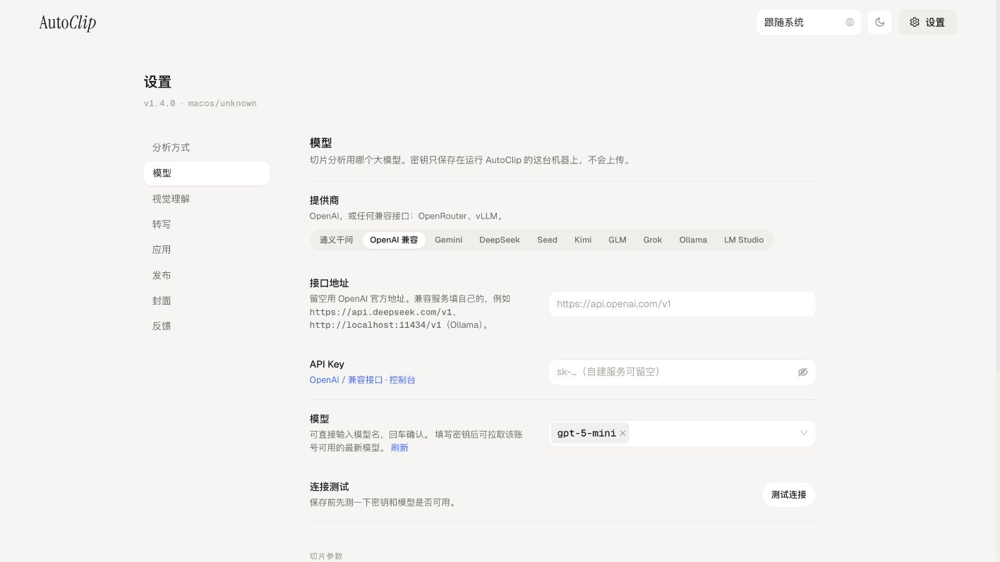</a>
    </td>
    <td width="50%" valign="top">
      <h4>Automatizar tareas</h4>
      <p>Organiza ejecuciones con la CLI o llama al mismo flujo de procesamiento desde un cliente MCP.</p>
      <a href="docs/images/feature-cli.png">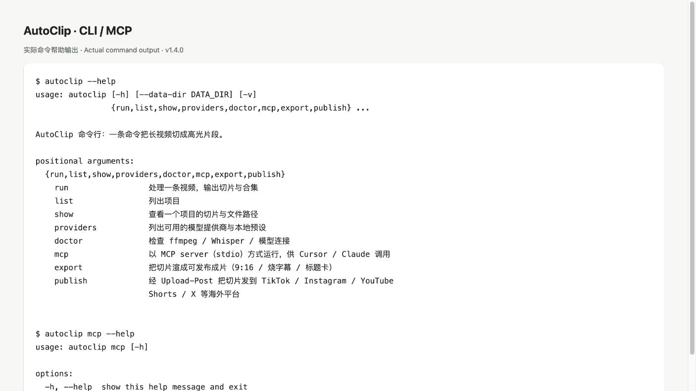</a>
      <p><sub>CLI / MCP no tiene GUI: la captura muestra una página con la salida real de ayuda de los comandos.</sub></p>
    </td>
  </tr>
  <tr>
    <td colspan="2" align="center" valign="top">
      <h4>Interfaz multilingüe</h4>
      <p>Desde v1.3.1, la aplicación, el sitio web y el README admiten chino, inglés, japonés, coreano, español, portugués, ruso y francés. Elige el idioma en la cabecera o sigue el del sistema. Tus archivos y el contenido generado conservan su idioma original.</p>
      <a href="docs/images/feature-languages.png">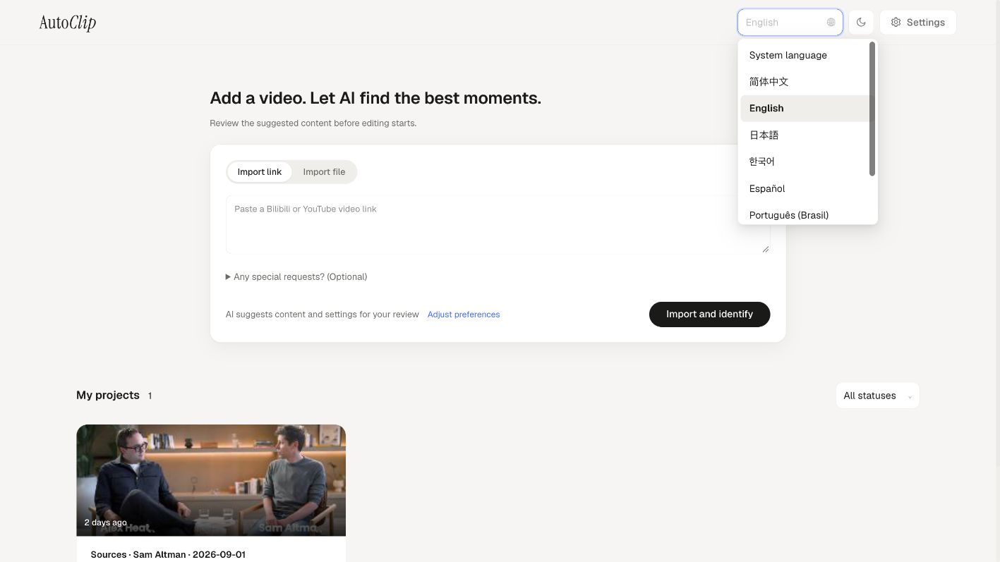</a>
      <p><sub>Interfaz en inglés y menú de idiomas; los medios y el contenido generado mantienen su idioma original.</sub></p>
    </td>
  </tr>
</table>

<details>
<summary>Plataformas, requisitos de cuenta y detalles de exportación</summary>

Cuando los clips estén listos, abre Publicar en un clip. Disponible en **v1.3.2**. En el extranjero se usan las plataformas conectadas en tu propia cuenta de Upload-Post: TikTok, Instagram, YouTube, Facebook, LinkedIn, X, Threads, Pinterest, Bluesky, Discord, Telegram y Google Business, según lo que esa cuenta tenga conectado. Bilibili es una sola cuenta: pega una Cookie una vez en Ajustes.

Debe incluir SESSDATA, bili_jct y DedeUserID. Puedes publicar ahora o programar. El título y la descripción son opcionales y, si se dejan vacíos, usan el título del clip. Los subtítulos incrustados vienen activados, igual que la tarjeta de título de unos 4 segundos.

La visibilidad predeterminada es solo yo / private donde la plataforma lo admite. AutoClip promete eso solo para TikTok, YouTube y Bilibili. También puedes descargar sin publicar. La página del proyecto muestra el historial y el calendario, y permite cancelar una programación que aún no ha salido. «Planear la semana» solo cubre el extranjero: rellena lunes, miércoles y viernes a las 09:00, sin Bilibili.

Las cuentas verticales se renderizan en 9:16 sin corte a 60 segundos. Solo Bilibili usa horizontal. Solo LinkedIn o X conserva el encuadre original. Vertical y Bilibili en el mismo envío se renderizan por separado.

Al publicar se puede generar una portada automáticamente, para que Bilibili no rechace una portada vacía.

Los detalles de la portada y la tarjeta de título por defecto siguen las notas de ese instalador. Disponible en **v1.3.2**.

</details>


> Importar vídeo → Subtítulos / transcripción → Análisis y puntuación con IA → Clips y recopilaciones → Exportación

<a id="quick-start"></a>

## Inicio rápido

| Uso | Opción recomendada | Requisitos |
| --- | --- | --- |
| Editar en tu ordenador | **Aplicación de escritorio** | macOS Apple Silicon / Windows x64 |
| Servidor propio / Linux | **Docker** | Docker + Compose v2 |
| Procesamiento por lotes / agentes | **CLI / MCP** | Python 3.10+ (se recomienda 3.11) + FFmpeg |

### Escritorio: tus primeros clips

1. **Instala.** Descarga desde [Releases](https://github.com/zhouxiaoka/autoclip/releases/latest) el archivo `.dmg` para macOS Apple Silicon o `-setup.exe` para Windows 10 / 11 x64. Incluye Python y FFmpeg. Para Intel Mac / Linux, usa Docker o la CLI. Consulta los requisitos de cada versión.
2. **Configura el modelo.** Elige un proveedor en Ajustes, introduce tu clave API y el modelo, prueba la conexión y guarda. Para modelos locales, inicia primero Ollama o LM Studio.
3. **Importa un vídeo.** Empieza con una muestra de 3–5 minutos y, si tienes, subtítulos SRT. Sin subtítulos, prepara primero los componentes locales de Whisper y el modelo de voz en Ajustes.
4. **Revisa y exporta.** Comprueba los límites, títulos y contenido de los clips. Elige un preajuste de exportación o conecta una cuenta para publicar.

[Guía de instalación completa (inglés)](docs/USER_INSTALLATION_GUIDE.en.md) · [Solución de problemas (inglés)](docs/FAQ.en.md)

<details>
<summary><strong>Docker / Web</strong></summary>

Necesitas Docker y Docker Compose v2. Ejecuta estos comandos desde la raíz del repositorio:

```bash
git clone https://github.com/zhouxiaoka/autoclip.git
cd autoclip
```

```bash
cp env.example .env
```

Antes de iniciar, edita `.env`: selecciona `LLM_PROVIDER` e indica la clave de API y el modelo correspondientes. También puedes configurar el proveedor desde la aplicación después del inicio.

```bash
mkdir -p data logs uploads
docker compose up -d --build
```

Abre la [interfaz web](http://localhost:3000). La [documentación de la API](http://localhost:8000/docs) estará disponible cuando arranque el backend. Consulta la [guía de Docker](DOCKER.md) (en chino) para más detalles.

En Linux, si los directorios montados producen errores de permisos, corrige el propietario de los directorios de datos del proyecto con este comando y vuelve a iniciar los servicios:

```bash
docker compose run --rm --no-deps --user root --entrypoint sh autoclip -c 'chown -R autoclip:autoclip /app/data /app/logs /app/uploads'
docker compose up -d
```

</details>

<details>
<summary><strong>CLI / MCP</strong></summary>

Necesitas Python 3.10 o posterior (se recomienda 3.11) y FFmpeg en el PATH. El ejemplo usa una shell de macOS / Linux; en PowerShell de Windows, activa el entorno con `venv\Scripts\Activate.ps1`. El procesamiento local por CLI no necesita Redis.

```bash
git clone https://github.com/zhouxiaoka/autoclip.git
cd autoclip
python3 -m venv venv
source venv/bin/activate
python -m pip install -r requirements.txt
python -m pip install -e .
```

Ejemplo con un modelo local: instala e inicia Ollama y descarga un modelo. Los vídeos sin subtítulos requieren `faster-whisper`; el modelo de voz se descarga en el primer uso. Para usar subtítulos existentes, añade `--srt talk.srt`.

```bash
ollama pull qwen2.5:7b
python -m pip install faster-whisper
autoclip doctor --provider ollama
autoclip run talk.mp4 --provider ollama --json
```

Sustituye `PROJECT_ID` por el ID del proyecto devuelto al procesar el vídeo para exportar en formato Shorts. Inicia el servidor MCP por stdio con `autoclip mcp`:

```bash
autoclip export PROJECT_ID --preset shorts
autoclip mcp
```

En el cliente MCP, configura `command` con la ruta absoluta a `autoclip` dentro del entorno virtual y `args` con `["mcp"]`. Consulta la [guía de CLI / MCP](docs/CLI_AND_MCP.md) y la [skill para agentes](skills/autoclip/SKILL.md) (ambas en chino).

</details>

## Configuración de modelos

| Opción | Configuración |
| --- | --- |
| Modelos en la nube | Elige un proveedor en Ajustes e introduce tu clave API y el modelo. Los servicios compatibles con OpenAI permiten configurar la Base URL. |
| Ollama | Dirección predeterminada: `http://localhost:11434/v1`; modelo: `qwen2.5:7b`. No requiere clave de API. |
| LM Studio | Carga un modelo e inicia Local Server, por defecto en `http://localhost:1234/v1`. Selecciona un modelo disponible en tu servidor. |

Dentro de Docker, `localhost` apunta al contenedor. Para usar un modelo del equipo anfitrión, configura una dirección accesible desde el contenedor; consulta la guía de CLI / MCP. El corte del vídeo se realiza localmente; el análisis con modelos en la nube envía el texto de los subtítulos al proveedor elegido. La descarga de vídeos y modelos requiere conexión a internet.

[Infistar · Guía de configuración (inglés)](docs/INFISTAR_SETUP.en.md)

## Preguntas frecuentes

<details>
<summary>¿Es gratuito? ¿Necesito una clave de API?</summary>

AutoClip sigue siendo gratuito y de código abierto bajo MIT. Los proveedores de modelos en la nube cobran por el uso y requieren tu propia clave de API. Ollama / LM Studio no necesitan clave de nube, pero sí modelos y hardware adecuado. Desde **v1.3.2**, publicar en el extranjero requiere tu propia cuenta de [Upload-Post](https://www.upload-post.com). Los planes gratuitos y de pago, y los cupos diarios de TikTok, YouTube, Instagram y otras plataformas, siguen las páginas de Upload-Post. No son promesas de AutoClip.

</details>

<details>
<summary>¿Se suben mis vídeos?</summary>

La edición permanece en tu dispositivo. El análisis con modelos en la nube envía el texto de los subtítulos al proveedor elegido. El clip terminado sale del equipo solo después de pulsar Publicar, y solo hacia las plataformas que conectaste. También puedes descargarlo sin publicar. Esa página Publicar está disponible en **v1.3.2**. Las estadísticas y los informes de errores dependen de la versión y los ajustes; consulta las notas de privacidad.

</details>

<details>
<summary>¿Puedo usar vídeos sin subtítulos?</summary>

Sí, tras preparar los componentes locales de Whisper y un modelo de voz. También puedes importar subtítulos SRT existentes. Unos subtítulos precisos pueden reducir la espera y los errores de transcripción.

</details>

<details>
<summary>¿Por qué no se generaron clips?</summary>

Revisa la fase que falló: subtítulos vacíos, conexión al modelo, umbral de puntuación demasiado alto o problemas de FFmpeg y disco. Puedes probar a reducir el umbral de 0.7 a 0.5, pero eso no garantiza clips.

</details>

<details>
<summary>¿Qué vídeos funcionan mejor y cuánto tarda?</summary>

El análisis se basa principalmente en los subtítulos: entrevistas, pódcasts, cursos y comentarios hablados son adecuados. La acción visual o la música pueden ofrecer peores resultados. El tiempo depende de la duración, el hardware, el modelo y la exportación; prueba primero con una muestra corta.

Consulta la [guía de primeros clips (inglés)](docs/USER_INSTALLATION_GUIDE.en.md) para preparar muestras y ver ejemplos públicos.

</details>

[Guía completa de solución de problemas (inglés)](docs/FAQ.en.md) · [Problemas conocidos](https://github.com/zhouxiaoka/autoclip/issues/96)

<a id="documentation"></a>

## Documentación

| Tema | Documentación |
| --- | --- |
| Primeros pasos | [Instalación (inglés)](docs/USER_INSTALLATION_GUIDE.en.md) |
| Alojamiento y automatización | [Docker (inglés)](docs/DOCKER.en.md) · [CLI / MCP (chino)](docs/CLI_AND_MCP.md) · [Agent skill (chino)](skills/autoclip/SKILL.md) |
| Modelos y solución de problemas | [Modelos (chino)](docs/MULTI_LLM_PROVIDER_GUIDE.md) · [Solución de problemas (inglés)](docs/FAQ.en.md) |
| Versiones y privacidad | [Historial de cambios](CHANGELOG.md) · [Privacidad (inglés)](docs/PRIVACY.en.md) |
| Desarrollo y traducción | [Contribuir (chino)](CONTRIBUTING.md) · [Mantenimiento de traducciones (chino)](docs/i18n.md) |
| Configuración del patrocinador | [Infistar](docs/INFISTAR_SETUP.en.md) |

El README está disponible en ocho idiomas. Las guías de instalación, Docker y solución de problemas también están en inglés; las demás referencias detalladas están principalmente en chino.

## Contribuir y contactar

Agradecemos las correcciones, los comentarios y las mejoras de traducción. Al informar de un fallo, incluye el sistema operativo, la versión, el modelo, los pasos para reproducirlo y los registros de error sin información confidencial.

Proyecto mantenido por una persona en su tiempo libre. Los tiempos de respuesta varían; no se ofrece asistencia inmediata ni ayuda individual de despliegue. Consulta las preguntas frecuentes y los problemas conocidos antes de escribir.

Las ideas, los usos y las peticiones de modelos van a [GitHub Discussions](https://github.com/zhouxiaoka/autoclip/discussions). Los fallos reproducibles usan la [plantilla de issue](https://github.com/zhouxiaoka/autoclip/issues/new/choose). Reglas del tablero: [community board](docs/COMMUNITY_BOARD.md) (chino).

- [Bienvenida y categorías](https://github.com/zhouxiaoka/autoclip/discussions/127)
- [Preguntas sobre el primer clip](https://github.com/zhouxiaoka/autoclip/discussions/128)
- [Ideas](https://github.com/zhouxiaoka/autoclip/discussions/129)

- Correo electrónico: [christine_zhouye@163.com](mailto:christine_zhouye@163.com)

Gracias a FastAPI, React, Tauri, FFmpeg, yt-dlp, Whisper y a todas las personas que contribuyen. Distribuido bajo la [licencia MIT](LICENSE). Si AutoClip te resulta útil, puedes apoyar el proyecto con una estrella.

<details>
<summary>Reconocimiento de la comunidad · Star History</summary>

Estas insignias las proporciona Trendshift. Haz clic para consultar los logros registrados de AutoClip. GitHub Trending y Trendshift son clasificaciones distintas; las insignias muestran logros registrados, no una posición en tiempo real.

[](https://star-history.com/#zhouxiaoka/autoclip&Date)

</details>
