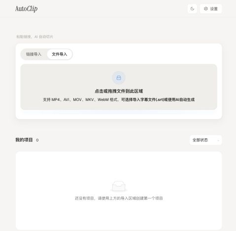

<div align="center">


# AutoClip

**Transformez vos longues vidéos en moments à partager.**

[简体中文](README.md) · [English](README-EN.md) · [日本語](README-JA.md) · [한국어](README-KO.md) · [Español](README-ES.md) · [Português](README-PT.md) · [Русский](README-RU.md) · **Français**

[](https://github.com/zhouxiaoka/autoclip/releases/latest)
[](https://github.com/zhouxiaoka/autoclip/stargazers)
[](https://github.com/zhouxiaoka/autoclip/forks)
[](https://github.com/zhouxiaoka/autoclip/issues)
[](LICENSE)

[Site du projet](https://zhouxiaoka.github.io/autoclip_intro/) · [Signaler un problème](https://github.com/zhouxiaoka/autoclip/issues)

**Programmes d’installation: [macOS · Apple Silicon](https://github.com/zhouxiaoka/autoclip/releases/latest) · [Windows · x64](https://github.com/zhouxiaoka/autoclip/releases/latest)**

[Installation et premiers extraits (English)](docs/USER_INSTALLATION_GUIDE.en.md) · [Guide complet de dépannage (anglais)](docs/FAQ.en.md)

</div>

AutoClip utilise l’IA pour analyser les sous-titres, repérer les temps forts, créer des titres et générer automatiquement des extraits et des compilations. Adapté aux entretiens, podcasts, cours et rediffusions de directs, il propose une application de bureau, une interface web via Docker et un accès CLI / MCP.

## Aperçu de l’interface



Interface web réelle de v1.3.0 : ajoutez une vidéo locale dans la zone d’importation, avec des sous-titres SRT facultatifs.

## Reconnaissance de la communauté

<p align="center">
  <a href="https://trendshift.io/repositories/25801"></a>
  <a href="https://trendshift.io/repositories/25801"></a>
  <a href="https://trendshift.io/repositories/25801"></a>
</p>

Ces badges sont fournis par Trendshift. Cliquez pour consulter les résultats enregistrés d’AutoClip. GitHub Trending et Trendshift sont deux classements distincts ; les badges indiquent des résultats enregistrés, pas une position en temps réel.

## Fonctionnalités

| Fonction | Description |
| --- | --- |
| Importer des vidéos | Utilisez des fichiers locaux ou des liens YouTube et Bilibili, avec des sous-titres SRT facultatifs. |
| Repérer les temps forts | Extrayez des plans, des plages temporelles par sujet, des scores et des titres à partir des sous-titres. |
| Créer des extraits et des compilations | Générez des extraits et des compilations suggérées, puis ajustez leur ordre manuellement. |
| Exporter pour publier | Profils pour Douyin, Xiaohongshu, YouTube Shorts et Bilibili, avec sous-titres incrustés et cartons de titre. |
| Choisir les modèles | Utilisez Qwen, des API compatibles OpenAI, Gemini, SiliconFlow ou des modèles locaux via Ollama / LM Studio. |
| Automatiser les tâches | Orchestrez les traitements avec la CLI ou appelez le même pipeline depuis un client MCP. |

> Importer une vidéo → Sous-titres / transcription → Analyse et évaluation par IA → Extraits et compilations → Export

## Démarrage rapide

### 1. Application de bureau

Téléchargez le programme d’installation adapté depuis [GitHub Releases](https://github.com/zhouxiaoka/autoclip/releases/latest) :

| Plateforme | Installation |
| --- | --- |
| macOS · Apple Silicon | `.dmg` |
| Windows 10 / 11 · x64 | `-setup.exe` |
| Intel Mac / Linux | Utilisez Docker ou la CLI ci-dessous |

Les programmes d’installation incluent Python et FFmpeg. Consultez chaque version pour les plateformes disponibles et les consignes de premier lancement. Après l’installation, choisissez un fournisseur de modèles dans les paramètres, testez la connexion, enregistrez et importez une vidéo.

### 2. Docker / Web

Docker et Docker Compose v2 sont nécessaires. Exécutez ces commandes à la racine du dépôt :

```bash
git clone https://github.com/zhouxiaoka/autoclip.git
cd autoclip
```

```bash
cp env.example .env
```

Avant de démarrer, modifiez `.env` : choisissez `LLM_PROVIDER` et renseignez la clé API et le nom du modèle correspondants. Vous pouvez aussi configurer le fournisseur dans l’interface après le démarrage.

```bash
mkdir -p data logs uploads
docker compose up -d --build
```

Ouvrez l’[interface web](http://localhost:3000). La [documentation de l’API](http://localhost:8000/docs) est accessible après le démarrage du backend. Consultez le [guide Docker](DOCKER.md) (en chinois) pour les détails.

Sous Linux, si les répertoires montés provoquent des erreurs de permissions, corrigez le propriétaire des répertoires de données du projet avec cette commande, puis redémarrez les services :

```bash
docker compose run --rm --no-deps --user root --entrypoint sh autoclip -c 'chown -R autoclip:autoclip /app/data /app/logs /app/uploads'
docker compose up -d
```

### 3. CLI / MCP

Python 3.10 ou supérieur (3.11 recommandé) et FFmpeg dans le PATH sont nécessaires. L’exemple utilise un shell macOS / Linux ; sous Windows PowerShell, activez l’environnement avec `venv\Scripts\Activate.ps1`. Le traitement local par CLI ne nécessite pas Redis.

```bash
git clone https://github.com/zhouxiaoka/autoclip.git
cd autoclip
python3 -m venv venv
source venv/bin/activate
python -m pip install -r requirements.txt
python -m pip install -e .
```

Exemple avec un modèle local : installez et démarrez Ollama, puis téléchargez un modèle. Les vidéos sans sous-titres nécessitent `faster-whisper` ; le modèle vocal est téléchargé à la première utilisation. Pour fournir des sous-titres existants, ajoutez `--srt talk.srt`.

```bash
ollama pull qwen2.5:7b
python -m pip install faster-whisper
autoclip doctor --provider ollama
autoclip run talk.mp4 --provider ollama --json
```

Remplacez `PROJECT_ID` par l’identifiant du projet renvoyé après le traitement pour exporter au format Shorts. Lancez le serveur MCP via stdio avec `autoclip mcp` :

```bash
autoclip export PROJECT_ID --preset shorts
autoclip mcp
```

Dans votre client MCP, définissez `command` avec le chemin absolu de `autoclip` dans l’environnement virtuel et `args` avec `["mcp"]`. Consultez le [guide CLI / MCP](docs/CLI_AND_MCP.md) et la [skill pour agents](skills/autoclip/SKILL.md) (en chinois).

## Configuration des modèles

| Option | Configuration |
| --- | --- |
| Modèles cloud | Choisissez Qwen, une API compatible OpenAI, Gemini ou SiliconFlow et saisissez la clé API. Les services compatibles acceptent une Base URL personnalisée. |
| Ollama | Adresse par défaut : `http://localhost:11434/v1` ; modèle : `qwen2.5:7b`. Aucune clé API nécessaire. |
| LM Studio | Chargez un modèle et démarrez Local Server, par défaut sur `http://localhost:1234/v1`. Sélectionnez un modèle disponible sur votre serveur. |

Dans Docker, `localhost` désigne le conteneur lui-même. Pour utiliser un modèle sur l’hôte, configurez une adresse accessible depuis le conteneur ; voir le guide CLI / MCP. Le découpage vidéo est local, mais l’analyse par un modèle cloud envoie le texte des sous-titres au fournisseur choisi. Le téléchargement des vidéos et modèles nécessite une connexion internet.

## Questions fréquentes

<details>
<summary>Est-ce gratuit ? Faut-il une clé API ?</summary>

AutoClip est gratuit et open source sous MIT. Les fournisseurs cloud facturent l’utilisation de leurs modèles et nécessitent votre clé API. Ollama / LM Studio n’exigent pas de clé cloud, mais nécessitent des modèles et un matériel adapté.

</details>

<details>
<summary>Mes vidéos sont-elles envoyées sur un serveur ?</summary>

Le montage local s’effectue sur votre appareil. Les modèles cloud reçoivent le texte des sous-titres. Les fonctions de publication envoient la vidéo à la plateforme choisie lorsque vous les utilisez. Les statistiques et rapports d’erreurs dépendent de la version et des paramètres ; consultez les notes de confidentialité.

</details>

<details>
<summary>Puis-je utiliser une vidéo sans sous-titres ?</summary>

Oui, après avoir préparé les composants locaux de Whisper et un modèle vocal. Vous pouvez aussi importer un SRT existant. Des sous-titres précis peuvent réduire l’attente et les erreurs de transcription.

</details>

<details>
<summary>Pourquoi aucun extrait n’a-t-il été généré ?</summary>

Vérifiez l’étape en échec : sous-titres vides, connexion au modèle, seuil trop élevé, FFmpeg ou espace disque. Vous pouvez essayer de réduire le seuil de 0.7 à 0.5, sans garantie de génération.

</details>

<details>
<summary>Quelles vidéos conviennent et combien de temps faut-il ?</summary>

L’analyse repose principalement sur les sous-titres : entretiens, podcasts, cours et commentaires parlés conviennent bien. L’action visuelle ou la musique peuvent donner des résultats limités. Le temps dépend de la durée, du matériel, du modèle et de l’export ; commencez par un court exemple.

</details>

[Guide complet de dépannage (anglais)](docs/FAQ.en.md) · [Problèmes connus](https://github.com/zhouxiaoka/autoclip/issues/96)

## Documentation

Le README est disponible en huit langues ; les guides détaillés ci-dessous sont principalement en chinois. Les langues du README ne correspondent pas nécessairement aux langues prises en charge par l’interface ou les modèles de transcription.

- [Installation et premiers extraits (English)](docs/USER_INSTALLATION_GUIDE.en.md)
- [Déploiement Docker (chinois)](DOCKER.md)
- [CLI, MCP et modèles locaux (chinois)](docs/CLI_AND_MCP.md)
- [Fournisseurs de modèles (chinois)](docs/MULTI_LLM_PROVIDER_GUIDE.md)
- [Questions fréquentes (chinois)](docs/FAQ.md)
- [Guide de contribution (chinois)](CONTRIBUTING.md)
- [Historique des modifications](CHANGELOG.md)
- [Confidentialité (chinois / anglais)](docs/PRIVACY.en.md)
- [Traduction du README et entretien des badges (chinois)](docs/i18n.md)

## Contribuer et nous contacter

Les corrections, retours et améliorations des traductions sont les bienvenus. Pour signaler un bug, indiquez le système, la version, le modèle, les étapes de reproduction et les journaux d’erreurs sans données sensibles.

Projet maintenu par une personne sur son temps libre. Les délais de réponse varient ; aucune assistance immédiate ou individuelle au déploiement n’est proposée. Consultez la FAQ et les problèmes connus avant de nous contacter.

- E-mail: [christine_zhouye@163.com](mailto:christine_zhouye@163.com)

Merci à FastAPI, React, Tauri, FFmpeg, yt-dlp, Whisper et à toutes les personnes qui contribuent. Distribué sous [licence MIT](LICENSE). Si AutoClip vous est utile, vous pouvez soutenir le projet avec une étoile.

[](https://star-history.com/#zhouxiaoka/autoclip&Date)
