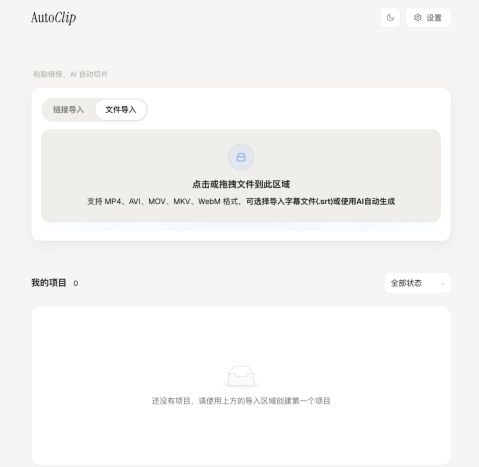

# AutoClip

**AI が動画の見どころを自動で見つけ、ワンクリックで HD ショート動画を生成。**

[简体中文](README.md) · [English](README-EN.md) · **日本語** · [한국어](README-KO.md) · [Español](README-ES.md) · [Português](README-PT.md) · [Русский](README-RU.md) · [Français](README-FR.md)

  

無料・オープンソース · ローカル編集 · クラウド・ローカルモデル対応

[公式サイト](https://zhouxiaoka.github.io/autoclip_intro/) · [Discussions](https://github.com/zhouxiaoka/autoclip/discussions) · [問題を報告](https://github.com/zhouxiaoka/autoclip/issues)

**デスクトップ版: [macOS · Apple Silicon](https://github.com/zhouxiaoka/autoclip/releases/latest) · [Windows · x64](https://github.com/zhouxiaoka/autoclip/releases/latest)**

[インストールと最初のクリップ作成 (English)](docs/USER_INSTALLATION_GUIDE.en.md) · [詳しいトラブル対処（英語）](docs/FAQ.en.md)

インタビュー、ポッドキャスト、講座、ライブ配信のアーカイブからショート動画を作成。AutoClip が見どころを抽出し、タイトルやクリップ、まとめ動画を作ります。生成後も編集して書き出せます。

## 画面プレビュー

ローカル動画と SRT 字幕を読み込めます。画像は中国語の UI です。

## 主な機能

| 機能 | 内容 |
| --- | --- |
| 動画の読み込み | ローカルファイル、YouTube、Bilibili のリンクに対応。 |
| 見どころの抽出 | 字幕から見どころ、タイトル、話題のタイムラインを生成。 |
| クリップ編集 | クリップやまとめ動画を作成し、開始・終了位置、文字、画面比率を調整。 |
| ゲームハイライト | プレイ録画のイベントを検出。視覚モデルの設定とゲーム分析の有効化が必要です。クラウド利用料は提供元が請求します。[設定ガイド（中国語）](docs/MULTI_LLM_PROVIDER_GUIDE.md)。 |
| 書き出し・投稿 | 横長・縦長動画、字幕、タイトルカード、カバー生成、即時・予約投稿に対応。[投稿ガイド（中国語）](docs/PUBLISH_UPLOAD_POST.md)。 |
| モデル・自動化 | Qwen、OpenAI、Gemini、DeepSeek などのクラウドモデルと Ollama / LM Studio のローカルモデルに対応。CLI・MCP も利用可能。 |

> 読み込み → 制作タイプの確認 → AI 分析・編集 → 調整・書き出し

## はじめ方

1. **インストール。** [GitHub Releases](https://github.com/zhouxiaoka/autoclip/releases/latest) から macOS Apple Silicon 用 `.dmg` または Windows x64 用 `-setup.exe` をダウンロード。Python と FFmpeg を同梱しています。
2. **モデル設定。** 設定画面でクラウド API Key またはローカルモデルを設定し、接続をテストして保存します。
3. **クリップ作成。** 動画を読み込み、制作タイプを確認して分析・編集を開始。結果を調整して書き出します。

Windows 実機でのインストール・読み込み・保存の検証は未完了です。Intel Mac / Linux では Docker または CLI を利用できます。

[インストール（英語）](docs/USER_INSTALLATION_GUIDE.en.md) · [トラブル解決（英語）](docs/FAQ.en.md)

Docker / Web、CLI、MCP

- **Docker / Web：** [Docker ガイド（英語）](docs/DOCKER.en.md)でセルフホストできます。
- **CLI：** バッチ処理やスクリプト連携は [CLI ガイド（中国語）](docs/CLI_AND_MCP.md)を参照。
- **MCP：** 同ガイドで対応クライアントを設定するか、[Agent skill（中国語）](skills/autoclip/SKILL.md)を利用できます。

## よくある質問

料金はかかりますか？

AutoClip は MIT ライセンスの無料オープンソースです。クラウドモデルには自分の API Key が必要で、提供元の利用料がかかります。Ollama / LM Studio はクラウド Key 不要です。海外向け投稿には自分の [Upload-Post](https://www.upload-post.com) アカウントが必要です。料金・上限は公式サイトをご確認ください。

動画はアップロードされますか？

編集・レンダリングは端末上で実行します。クラウドでの字幕分析は関連テキスト、視覚分析は抽出したフレームと必要なテキストを送信します。投稿時には完成動画を接続先へアップロードします。ローカル保存だけでも利用できます。[プライバシー説明（英語）](docs/PRIVACY.en.md)。

字幕のない動画も使えますか？

ローカルの Whisper と音声モデルを設定すると文字起こしできます。既存の SRT も読み込めます。最初は字幕付きの短い動画がおすすめです。[入門ガイド（英語）](docs/USER_INSTALLATION_GUIDE.en.md)。

どんな動画に向いていますか？ HD 出力はできますか？

字幕分析はインタビュー、ポッドキャスト、講座、会話中心の動画に向いています。ゲーム録画には視覚分析を利用できます。縦長・横長の 1080p 出力に対応し、画質は元動画と出力設定に依存します。処理時間は動画の長さ、モデル、端末性能によって変わります。

## プロジェクトを支援する

AutoClip の継続的な開発・保守を支える、企業・個人からのスポンサー支援を歓迎します。企業スポンサーは README にブランドやサービスの紹介を掲載できます。

スポンサーのご相談： [christine_zhouye@163.com](mailto:christine_zhouye@163.com)

## ドキュメント・コミュニティ

- [インストール（英語）](docs/USER_INSTALLATION_GUIDE.en.md) · [モデル設定（中国語）](docs/MULTI_LLM_PROVIDER_GUIDE.md) · [トラブル解決（英語）](docs/FAQ.en.md)
- [変更履歴（中国語）](CHANGELOG.md) · [ドキュメント（中国語）](docs/README.md)
- 質問や提案は [Discussions](https://github.com/zhouxiaoka/autoclip/discussions)、不具合報告は [Issues](https://github.com/zhouxiaoka/autoclip/issues/new/choose) へ。
- コード、文書、翻訳の改善を歓迎します。[貢献ガイド（中国語）](CONTRIBUTING.md)。
- 連絡・スポンサーのご相談：[christine_zhouye@163.com](mailto:christine_zhouye@163.com)

すべての貢献者と FastAPI、React、Tauri、FFmpeg、yt-dlp、Whisper などの開発者に感謝します。役に立ったら Star で応援してください。

