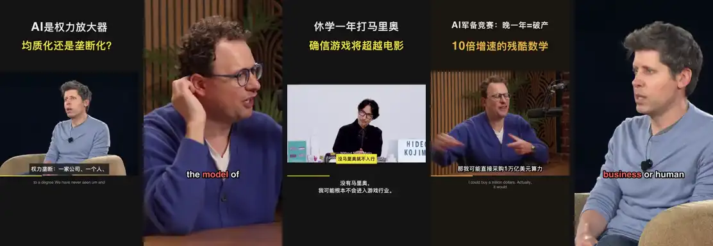

<div align="center">


# AutoClip

### Одна ссылка — один клик.

Открытый код, нарезка и рендер на вашем компьютере. Вставьте ссылку, выберите площадку и получите <b>видео, обложку и текст</b>,<br>
для Douyin, Xiaohongshu, TikTok, Reels, YouTube Shorts, Bilibili или YouTube.<br>
Приложение бесплатно; облачные модели оплачиваются по использованию. Результат можно поправить в редакторе.

<p>
  <a href="https://github.com/zhouxiaoka/autoclip/releases/latest"></a>
  <a href="https://github.com/zhouxiaoka/autoclip/stargazers"></a>
  <a href="https://github.com/zhouxiaoka/autoclip/releases"></a>
  <a href="LICENSE"></a>
</p>

<a href="https://trendshift.io/repositories/25801"></a>

**[Скачать десктоп](https://github.com/zhouxiaoka/autoclip/releases/latest)** · [Кейсы](https://zhouxiaoka.github.io/autoclip_intro/cases/) · [Быстрый старт](#быстрый-старт) · [Документация](#документация) · [Ошибка](https://github.com/zhouxiaoka/autoclip/issues/new/choose)

[简体中文](README.md) · [English](README-EN.md) · [日本語](README-JA.md) · [한국어](README-KO.md) · [Español](README-ES.md) · [Português](README-PT.md) · **Русский** · [Français](README-FR.md)

</div>

**[1.5.0 официально выпущен](https://github.com/zhouxiaoka/autoclip/releases/tag/v1.5.0)**, вместе с desktop, CLI и MCP. Автовыпуск, разбивка субтитров, кадрирование и очередь длинных видео описаны в [истории изменений](CHANGELOG.md). Обновите старые версии.

## Настоящие клипы



Каждый исходник — одна вставленная ссылка. Каждый клип выше — сырой вывод AutoClip: выбор, кадр, перевод, упаковка, без ручной правки. **[Смотреть со звуком в библиотеке →](https://zhouxiaoka.github.io/autoclip_intro/cases/)**

Каждый клип включает видео, обложку, заголовок, описание, хештеги и ZIP для площадки. Библиотека обновляется; [присылайте клипы](https://github.com/zhouxiaoka/autoclip/discussions/new?category=show-and-tell).

Права на исходник остаются у авторов. Примеры: [Dwarkesh Patel — Dario Amodei](https://www.youtube.com/watch?v=n1E9IZfvGMA) · [Y Combinator — Sam Altman](https://www.youtube.com/watch?v=ZIaOBAjvc38) · [WIRED — Hideo Kojima](https://www.youtube.com/watch?v=02Ah5VQrzvA)

## Что умеет

### Вставил ссылку — получил клипы

Генерация по формату и длительности площадки. Для каждой площадки автоматически создаётся до 10 лучших подходящих клипов; остальные — по запросу. В комплекте обложка, заголовок, описание, хештеги и ZIP.

### Упаковка встроена

Douyin / Xiaohongshu — интервью по умолчанию; TikTok / Reels / Shorts — полноэкранный подкаст. Вертикальный макет можно выбрать, язык субтитров и текста задаёт площадка. Bilibili / YouTube — горизонтальные. Кадр следует за говорящим, сцены без людей сохраняются целиком. Брендовый финал включён по умолчанию, отключается в настройках; в копируемом тексте нет подписи AutoClip.

### Остаётся на компьютере

Нарезка, кадрирование и рендер локальные. Выбирайте модель, авторские субтитры, локальный Whisper / SenseVoice или настроенную облачную транскрипцию. CLI / MCP используют тот же поток, что desktop.

## Время и стоимость на реальных видео

Три разных источника измерены во время разработки, не контролируемое сравнение одного входа. Стоимость оценена по тогдашнему использованию текстового qwen-plus, без облачного ASR, AI-изображений и публикации. Фактический счёт задаёт провайдер.

| Версия | Исходник | Выход | Оценка стоимости текстовой модели (CNY) |
| --- | --- | ---: | ---: |
| **Новая · есть субтитры** | Jensen · 1ч43м (EN → Xiaohongshu) | **7,5 мин / 10 клипов** | **¥0,09** |
| Новая · без субтитров | TIM × Ло Юнхао · 2ч52м (ZH → Douyin) | 29,5 мин / 10 клипов | ¥0,20 |
| Старая | MrBeast · 2ч06м (EN → TikTok) | 65 мин | ¥0,64 |

<details>
<summary>Условия и записи</summary>

1 октября 2026, тот же Apple Silicon Mac. Два новых запуска сделали 10 клипов; старый — 33. Различаются и исходники, и число результатов. Jensen использовал авторские субтитры; TIM — локальный Whisper base.

Авторские субтитры позволяют пропустить транскрипцию; иначе выбирайте локальный или облачный ASR. Дополнительные площадки и клипы увеличивают время и расход. [Измерения и расчёт](docs/COST_PER_VIDEO.md) (кит.).

</details>

## Выбирайте модели и поток данных

Нарезка и рендер на вашем компьютере. Облачный анализ отправляет нужные субтитры и текст; анализ изображения или генерация с референсом — необходимые кадры; облачная транскрипция — аудио. Локальные анализ и транскрипция не требуют соответствующего облачного API. Готовые клипы загружаются на подключённые площадки при выборе публикации. Аналитику и отчёты об ошибках можно выключить. [Конфиденциальность](docs/PRIVACY.en.md).

## Быстрый старт

| Задача | Способ | Нужно |
| --- | --- | --- |
| Делать клипы на этом ПК | **Десктоп** | macOS Apple Silicon или Windows x64 |
| Свой веб / Linux | **Docker** | Docker и Compose v2 |
| Пакеты / агенты | **CLI / MCP** | Python 3.10+ (лучше 3.11) и FFmpeg |

### Десктоп

1. **Установка.** Из [Releases](https://github.com/zhouxiaoka/autoclip/releases/latest). macOS Apple Silicon: `.dmg`. Windows 10 / 11 x64: `-setup.exe`. Python и FFmpeg уже внутри.
2. **Модель.** В настройках выберите провайдера и вставьте API Key; модель анализа подставится сама. Для локальных сначала запустите Ollama или LM Studio.
3. **Ссылка и площадка.** Начните с интервью/подкаста с субтитрами и выберите вертикальный макет. Без субтитров подготовьте Whisper / SenseVoice или облачную транскрипцию в настройках.
4. **Проверьте и сохраните.** Проверьте субтитры, кадр и полноту содержания, затем скачайте комплект или подключите аккаунт для публикации. При необходимости создавайте резервные клипы.

Установщики ещё без нотаризации Apple и подписи Windows. На macOS первый запуск — правый клик → Открыть. На Windows в SmartScreen — Подробнее → Выполнить в любом случае.

Intel Mac / Linux могут использовать Docker или CLI. Пакет Windows прошёл CI установки, обновления и обработки видео; ручная проверка интерфейса и полный период наблюдения ещё не завершены. См. [1.5.0 Release](https://github.com/zhouxiaoka/autoclip/releases/tag/v1.5.0).

[Установка](docs/USER_INSTALLATION_GUIDE.en.md) · [Неполадки](docs/FAQ.en.md)

**Docker / Web**

```bash
git clone https://github.com/zhouxiaoka/autoclip.git
cd autoclip
cp env.example .env
mkdir -p data logs uploads
docker compose up -d --build
```

Откройте [веб-интерфейс](http://localhost:3000). [API](http://localhost:8000/docs) доступна после старта бэкенда. [Гид по Docker](docs/DOCKER.en.md).

В Linux при ошибке прав на bind сначала исправьте владельца:

```bash
docker compose run --rm --no-deps --user root --entrypoint sh autoclip -c 'chown -R autoclip:autoclip /app/data /app/logs /app/uploads'
docker compose up -d
```

Для LAN IP или своего домена добавьте адрес frontend в `AUTOCLIP_ALLOWED_ORIGINS` в `.env` (через запятую).

**CLI / MCP**

Python 3.10+ (лучше 3.11), FFmpeg и FFprobe в PATH; Redis не нужен. Скачайте [официальный ZIP CLI / MCP](https://github.com/zhouxiaoka/autoclip/releases/download/v1.5.0/autoclip-1.5.0-cli-mcp.zip), распакуйте и выполните в этом каталоге:

```bash
python3 -m venv venv
source venv/bin/activate
python -m pip install -r requirements.txt
python -m pip install --force-reinstall --no-deps autoclip-1.5.0-py3-none-any.whl
```

Активация выше для macOS / Linux. В Windows создайте `py -m venv venv`, активируйте `venv\Scripts\Activate.ps1`. Старые кандидаты wheel 1.5 нужно принудительно заменить официальным; одного номера версии недостаточно.

Сначала сохраните настройки модели: используйте desktop или свой каталог по примеру без ключей из ZIP. [CLI / MCP](docs/CLI_AND_MCP.md) (кит.). `produce` не использует временную настройку `run --provider`. `--srt` пропускает транскрипцию.

```bash
autoclip --version
autoclip produce talk.mp4 --srt talk.srt --platform douyin --portrait-style podcast --json
autoclip outputs PROJECT_ID --export-kits
autoclip mcp
autoclip mcp install opencode
```

Замените `PROJECT_ID` полученным ID. MCP: `start_quick_output` / `get_quick_output_status`; `command` — абсолютный путь к `autoclip` в venv, `args` — `["mcp"]`. Старые `run` / `export` и инструменты доступны. [CLI / MCP](docs/CLI_AND_MCP.md) (кит.), [OpenCode](docs/OPENCODE.en.md), [Agent skill](skills/autoclip/SKILL.md) (кит.).

## Модели

| Способ | Настройка |
| --- | --- |
| Облачный API | Провайдер и API Key в настройках. Совместимые с OpenAI принимают Base URL. |
| Ollama | По умолчанию `http://localhost:11434/v1`, модель `qwen2.5:7b`, ключ не нужен. |
| LM Studio | Загрузите модель и запустите Local Server, по умолчанию `http://localhost:1234/v1`. |

В Docker `localhost` — сам контейнер. Для модели на хосте укажите адрес, доступный из контейнера.

[Модели](docs/MULTI_LLM_PROVIDER_GUIDE.md) (кит.) · [Локально и контейнеры](docs/CLI_AND_MCP.md) (кит.)

## Спонсоры

Спасибо партнёрам. Оба дают API, совместимый с OpenAI: выберите в настройках, вставьте ключ — появятся модели.

<table>
  <tr>
    <td align="center" width="140" valign="middle">
      <a href="https://88api.ai/sign-up?aff=2PIc"></a><br>
      <a href="https://88api.ai/sign-up?aff=2PIc"><strong>88API</strong></a>
    </td>
    <td valign="middle">
      Агрегатор токенов: GPT, Claude, Gemini, Grok, DeepSeek, Kimi, GLM, плюс картинка, видео и речь. Поддержка, счета, пополнение 1:1. Пробный кредит по <a href="https://88api.ai/sign-up?aff=2PIc">реферальной ссылке</a>. <a href="docs/88API_SETUP.en.md">Настройка</a>
    </td>
  </tr>
  <tr>
    <td align="center" width="140" valign="middle">
      <a href="https://www.infistar.cc/register?aff=XLK3BCM6&amp;ref_source=link"></a><br>
      <a href="https://www.infistar.cc/register?aff=XLK3BCM6&amp;ref_source=link"><strong>Infistar</strong></a>
    </td>
    <td valign="middle">
      Мультимодельный API: Claude, GPT, Gemini, DeepSeek и другие; часть моделей до 1% от прайса, юани, счета, проверка. $5 пробных по <a href="https://www.infistar.cc/register?aff=XLK3BCM6&amp;ref_source=link">реферальной ссылке</a>. <a href="docs/INFISTAR_SETUP.en.md">Настройка</a>
    </td>
  </tr>
</table>

Услуги, цены и акции дают партнёры; смотрите их сайты.

## Частые вопросы

<details>
<summary>Это бесплатно? Нужен API Key?</summary>

Приложение бесплатно под MIT. Облачный анализ, транскрипция и AI-изображения используют ваши ключи и тарифы провайдера. Автообложка по умолчанию не вызывает платную генерацию. Ollama / LM Studio требуют железо, но не облачный ключ. Публикация — со своим Bilibili или [Upload-Post](https://www.upload-post.com).

</details>

<details>
<summary>Видео куда-то отправляется?</summary>

Нарезка и рендер на вашем компьютере. Облачный анализ отправляет нужные субтитры и текст; анализ изображения или генерация с референсом — необходимые кадры; облачная транскрипция — аудио. Локальные анализ и транскрипция не требуют соответствующего облачного API. Готовые клипы загружаются на подключённые площадки при выборе публикации. Аналитику и отчёты об ошибках можно выключить. [Конфиденциальность](docs/PRIVACY.en.md).

</details>

<details>
<summary>Какие видео подходят лучше?</summary>

Основные проверенные случаи — интервью, подкасты, курсы и речь. Авторские субтитры быстрее всего; иначе используйте локальную/облачную транскрипцию. Для игр или малого диалога включите анализ кадров с подходящей моделью и проверьте выбранные моменты.

</details>

<details>
<summary>Почему нет клипов?</summary>

Проверьте транскрипцию, соединение с моделью, FFmpeg, диск и условия площадки. Длинный YouTube требует цельных клипов от 180 секунд; для короткого источника выберите Shorts/Bilibili. Если ошибка остаётся, приложите версию 1.5.0, OS, длительность, модель и очищенные логи в [известные проблемы](https://github.com/zhouxiaoka/autoclip/issues/96).

</details>

[Неполадки](docs/FAQ.en.md) · [Известные проблемы](https://github.com/zhouxiaoka/autoclip/issues/96)

## Документация

| Нужно | Документы |
| --- | --- |
| Установка и первые клипы | [Установка](docs/USER_INSTALLATION_GUIDE.en.md) |
| Свой хостинг и автоматизация | [Docker](docs/DOCKER.en.md) · [CLI / MCP](docs/CLI_AND_MCP.md) (кит.) · [Agent skill](skills/autoclip/SKILL.md) (кит.) · [OpenCode](docs/OPENCODE.en.md) |
| Модели и сбои | [Модели](docs/MULTI_LLM_PROVIDER_GUIDE.md) (кит.) · [FAQ](docs/FAQ.en.md) |
| Версии, план, приватность | [Changelog](CHANGELOG.md) · [План](ROADMAP.md) (кит.) · [Доска](docs/COMMUNITY_BOARD.md) (кит.) · [Приватность](docs/PRIVACY.en.md) |
| Участие и перевод | [Вклад](CONTRIBUTING.md) (кит.) · [Переводы](docs/i18n.md) (кит.) |

## Участие

Правки, примеры, отзывы и переводы приветствуются. Если AutoClip помог — звезда кстати.

- **Общение:** [Discussions](https://github.com/zhouxiaoka/autoclip/discussions) · [Первый клип](https://github.com/zhouxiaoka/autoclip/discussions/128) · [Идеи](https://github.com/zhouxiaoka/autoclip/discussions/129)
- **Баги:** [форма](https://github.com/zhouxiaoka/autoclip/issues/new/choose) с ОС, версией, моделью, шагами и журналами без секретов
- **Партнёрство:** [christine_zhouye@163.com](mailto:christine_zhouye@163.com)

Ведёт один человек. Живой поддержки и личного деплоя нет.


Спасибо FastAPI, React, Tauri, FFmpeg, yt-dlp, Whisper, FunASR и всем, кто вкладывается. [MIT License](LICENSE).
