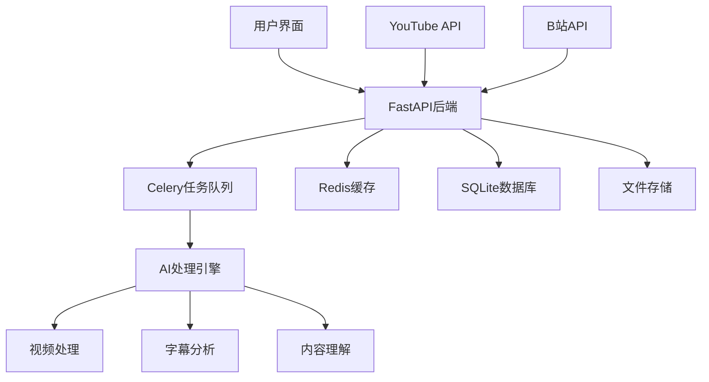

# AutoClip - AI视频智能切片系统


## 基于AI的智能视频切片处理系统

支持YouTube/B站视频下载、自动切片、智能合集生成

[](https://python.org)
[](https://reactjs.org)
[](https://fastapi.tiangolo.com)
[](https://www.typescriptlang.org)
[](https://celeryproject.org)
[](LICENSE)

[](https://github.com/zhouxiaoka/autoclip)
[](https://github.com/zhouxiaoka/autoclip)
[](https://github.com/zhouxiaoka/autoclip/issues)

**语言**: [English](README-EN.md) | [中文](README.md)  
**联系邮箱**: [christine_zhouye@163.com](mailto:christine_zhouye@163.com)

</div>

## 🎯 项目简介

AutoClip是一个基于AI的智能视频切片处理系统，能够自动从YouTube、B站等平台下载视频，通过AI分析提取精彩片段，并智能生成合集。系统采用现代化的前后端分离架构，提供直观的Web界面和强大的后端处理能力。

**联系方式**: [christine_zhouye@163.com](mailto:christine_zhouye@163.com)

### ✨ 核心特性

- 🎬 **多平台支持**: YouTube、B站视频一键下载，支持本地文件上传
- 🤖 **AI智能分析**: 基于通义千问大语言模型的视频内容理解
- ✂️ **自动切片**: 智能识别精彩片段并自动切割，支持多种视频分类
- 📚 **智能合集**: AI推荐和手动创建视频合集，支持拖拽排序
- 🚀 **实时处理**: 异步任务队列，实时进度反馈，WebSocket通信
- 🎨 **现代界面**: React + TypeScript + Ant Design，响应式设计
- 📱 **移动端支持**【开发中】: 响应式设计，正在完善移动端体验
- 🔐 **账号管理**【开发中】: 支持B站多账号管理，自动健康检查
- 📊 **数据统计**: 完整的项目管理和数据统计功能
- 🛠️ **易于部署**: 一键启动脚本，Docker支持，详细文档
- 📤 **B站上传**【开发中】: 自动上传切片视频到B站
- ✏️ **字幕编辑**【开发中】: 可视化字幕编辑和同步功能

## 🏗️ 系统架构



### 技术栈

#### 后端技术

- **FastAPI**: 现代化Python Web框架，自动API文档生成
- **Celery**: 分布式任务队列，支持异步处理
- **Redis**: 消息代理和缓存，任务状态管理
- **SQLite**: 轻量级数据库，支持升级到PostgreSQL
- **yt-dlp**: YouTube视频下载，支持多种格式
- **通义千问**: AI内容分析，支持多种模型
- **WebSocket**: 实时通信，进度推送
- **Pydantic**: 数据验证和序列化

#### 前端技术

- **React 18**: 用户界面框架，Hooks和函数组件
- **TypeScript**: 类型安全，更好的开发体验
- **Ant Design**: 企业级UI组件库
- **Vite**: 快速构建工具，热重载
- **Zustand**: 轻量级状态管理
- **React Router**: 路由管理
- **Axios**: HTTP客户端
- **React Player**: 视频播放器

## 🚀 快速开始

### 环境要求

#### Docker部署（推荐）

- **Docker**: 20.10+
- **Docker Compose**: 2.0+
- **内存**: 最少 4GB，推荐 8GB+
- **存储**: 最少 10GB 可用空间

#### 本地部署

- **操作系统**: macOS / Linux / Windows (WSL)
- **Python**: 3.8+ (推荐 3.9+)
- **Node.js**: 16+ (推荐 18+)
- **Redis**: 6.0+ (推荐 7.0+)
- **FFmpeg**: 视频处理依赖
- **内存**: 最少 4GB，推荐 8GB+
- **存储**: 最少 10GB 可用空间

### 一键启动

#### 方式一：Docker部署（推荐）

```bash
# 克隆项目
git clone https://github.com/zhouxiaoka/autoclip.git
cd autoclip

# Docker一键启动
./docker-start.sh

# 开发环境启动
./docker-start.sh dev

# 停止服务
./docker-stop.sh

# 检查服务状态
./docker-status.sh
```

#### 方式二：本地部署

```bash
# 克隆项目
git clone https://github.com/zhouxiaoka/autoclip.git
cd autoclip

# 一键启动（推荐，包含完整检查和监控）
./start_autoclip.sh

# 快速启动（开发环境，跳过详细检查）
./quick_start.sh

# 检查系统状态
./status_autoclip.sh

# 停止系统
./stop_autoclip.sh
```

### 手动安装

```bash
# 1. 创建虚拟环境
python3 -m venv venv
source venv/bin/activate  # Linux/macOS
# 或 venv\Scripts\activate  # Windows

# 2. 安装Python依赖
pip install -r requirements.txt

# 3. 安装前端依赖
cd frontend && npm install && cd ..

# 4. 安装Redis
# macOS
brew install redis
brew services start redis

# Ubuntu/Debian
sudo apt update
sudo apt install redis-server
sudo systemctl start redis-server

# CentOS/RHEL
sudo yum install redis
sudo systemctl start redis

# 5. 安装FFmpeg
# macOS
brew install ffmpeg

# Ubuntu/Debian
sudo apt install ffmpeg

# CentOS/RHEL
sudo yum install ffmpeg

# 6. 配置环境变量
cp env.example .env
# 编辑 .env 文件，填入API密钥等配置
```

## 🎬 功能演示

### 主要功能展示

1. **视频下载与处理**
   - 支持YouTube、B站视频链接解析
   - 自动下载视频和字幕文件
   - 支持本地文件上传

2. **AI智能分析**
   - 自动提取视频大纲
   - 智能识别话题时间点
   - 对片段进行精彩度评分

3. **视频切片与合集**
   - 自动生成精彩片段
   - 智能推荐合集组合
   - 支持手动编辑和排序

4. **实时进度监控**
   - WebSocket实时进度推送
   - 详细的任务状态显示
   - 错误处理和重试机制

5. **B站上传功能**【开发中】
   - 自动上传切片视频到B站
   - 支持多账号管理
   - 批量上传和队列管理

6. **字幕编辑功能**【开发中】
   - 可视化字幕编辑器
   - 字幕同步和调整
   - 多语言字幕支持

## 📖 使用指南

### 1. 视频下载

#### YouTube视频

1. 在首页点击"新建项目"
2. 选择"YouTube链接"
3. 粘贴视频URL
4. 选择浏览器Cookie（可选）
5. 点击"开始下载"

#### B站视频

1. 在首页点击"新建项目"
2. 选择"B站链接"
3. 粘贴视频URL
4. 选择登录账号
5. 点击"开始下载"

#### 本地文件

1. 在首页点击"新建项目"
2. 选择"文件上传"
3. 拖拽或选择视频文件
4. 上传字幕文件（可选）
5. 点击"开始处理"

### 2. 智能处理

系统会自动执行以下步骤：

1. **素材准备**: 下载视频和字幕文件
2. **内容分析**: AI提取视频大纲和关键信息
3. **时间线提取**: 识别话题时间区间
4. **精彩评分**: 对每个片段进行AI评分
5. **标题生成**: 为精彩片段生成吸引人标题
6. **合集推荐**: AI推荐视频合集
7. **视频生成**: 生成切片视频和合集视频

### 3. 结果管理

- **查看切片**: 在项目详情页查看所有生成的视频片段
- **编辑信息**: 修改片段标题、描述等信息
- **创建合集**: 手动创建或使用AI推荐的合集
- **下载导出**: 下载单个片段或完整合集
- **B站上传**【开发中】: 一键上传切片视频到B站
- **字幕编辑**【开发中】: 可视化编辑和同步字幕文件

## 🔧 配置说明

### 环境变量配置

创建 `.env` 文件：

```bash
# 数据库配置
DATABASE_URL=sqlite:///./data/autoclip.db

# Redis配置
REDIS_URL=redis://localhost:6379/0

# AI API配置
API_DASHSCOPE_API_KEY=your_dashscope_api_key
API_MODEL_NAME=qwen-plus

# 日志配置
LOG_LEVEL=INFO
ENVIRONMENT=development
DEBUG=true

# 文件存储
UPLOAD_DIR=./data/uploads
PROJECT_DIR=./data/projects
```

### B站账号配置【开发中】

1. 在设置页面点击"B站账号管理"
2. 选择登录方式：
   - **Cookie导入**（推荐）：从浏览器导出Cookie
   - **账号密码**：直接输入账号密码
   - **二维码登录**：扫描二维码登录
3. 添加成功后系统会自动管理账号健康状态

## 📁 项目结构

```text
autoclip/
├── backend/                 # 后端代码
│   ├── api/                # API路由
│   │   ├── v1/            # API v1版本
│   │   │   ├── youtube.py # YouTube下载API
│   │   │   ├── bilibili.py # B站下载API
│   │   │   ├── projects.py # 项目管理API
│   │   │   ├── clips.py   # 视频片段API
│   │   │   ├── collections.py # 合集管理API
│   │   │   └── settings.py # 系统设置API
│   │   └── upload_queue.py # 上传队列管理
│   ├── core/              # 核心配置
│   │   ├── database.py    # 数据库配置
│   │   ├── celery_app.py  # Celery配置
│   │   ├── config.py      # 系统配置
│   │   └── llm_manager.py # AI模型管理
│   ├── models/            # 数据模型
│   │   ├── project.py     # 项目模型
│   │   ├── clip.py        # 片段模型
│   │   ├── collection.py  # 合集模型
│   │   └── bilibili.py    # B站账号模型
│   ├── services/          # 业务逻辑
│   │   ├── video_service.py # 视频处理服务
│   │   ├── ai_service.py  # AI分析服务
│   │   └── upload_service.py # 上传服务
│   ├── tasks/             # Celery任务
│   │   ├── processing.py  # 处理任务
│   │   ├── upload.py      # 上传任务
│   │   └── maintenance.py # 维护任务
│   ├── pipeline/          # 处理流水线
│   │   ├── step1_outline.py # 大纲提取
│   │   ├── step2_timeline.py # 时间线分析
│   │   ├── step3_scoring.py # 精彩度评分
│   │   └── step6_video.py # 视频生成
│   └── utils/             # 工具函数
├── frontend/              # 前端代码
│   ├── src/
│   │   ├── components/    # React组件
│   │   │   ├── UploadModal.tsx # 上传模态框
│   │   │   ├── ClipCard.tsx # 片段卡片
│   │   │   ├── CollectionCard.tsx # 合集卡片
│   │   │   └── BilibiliManager.tsx # B站管理
│   │   ├── pages/         # 页面组件
│   │   │   ├── HomePage.tsx # 首页
│   │   │   ├── ProjectDetailPage.tsx # 项目详情
│   │   │   └── SettingsPage.tsx # 设置页面
│   │   ├── services/      # API服务
│   │   │   └── api.ts     # API客户端
│   │   └── stores/        # 状态管理
│   └── package.json
├── data/                  # 数据存储
│   ├── projects/          # 项目数据
│   ├── uploads/           # 上传文件
│   ├── temp/              # 临时文件
│   ├── output/            # 输出文件
│   └── autoclip.db        # 数据库文件
├── scripts/               # 工具脚本
│   ├── start_autoclip.sh  # 启动脚本
│   ├── stop_autoclip.sh   # 停止脚本
│   └── status_autoclip.sh # 状态检查
├── docs/                  # 文档
│   ├── README.md          # 文档中心
│   ├── i18n.md           # 国际化配置
│   └── *.md              # 其他文档
├── logs/                  # 日志文件
├── Dockerfile             # Docker镜像构建文件
├── Dockerfile.dev         # 开发环境Docker文件
├── docker-compose.yml     # 生产环境Docker编排
├── docker-compose.dev.yml # 开发环境Docker编排
├── docker-start.sh        # Docker启动脚本
├── docker-stop.sh         # Docker停止脚本
├── docker-status.sh       # Docker状态检查脚本
├── .dockerignore          # Docker忽略文件
├── DOCKER.md              # Docker部署文档
└── *.sh                   # 启动脚本
```

## 🌐 API文档

启动系统后访问以下地址查看API文档：

- **Swagger UI**: [http://localhost:8000/docs](http://localhost:8000/docs) (本地开发环境)
- **ReDoc**: [http://localhost:8000/redoc](http://localhost:8000/redoc) (本地开发环境)

### 主要API端点

| 端点 | 方法 | 描述 |
|------|------|------|
| `/api/v1/projects` | GET | 获取项目列表 |
| `/api/v1/projects` | POST | 创建新项目 |
| `/api/v1/projects/{id}` | GET | 获取项目详情 |
| `/api/v1/youtube/parse` | POST | 解析YouTube视频信息 |
| `/api/v1/youtube/download` | POST | 下载YouTube视频 |
| `/api/v1/bilibili/download` | POST | 下载B站视频 |
| `/api/v1/projects/{id}/process` | POST | 开始处理项目 |
| `/api/v1/projects/{id}/status` | GET | 获取处理状态 |

## 🔍 故障排除

### 常见问题

#### 1. 端口被占用

```bash
# 检查端口占用
lsof -i :8000  # 后端端口
lsof -i :3000  # 前端端口

# 停止占用进程
kill -9 <PID>
```

#### 2. Redis连接失败

```bash
# 检查Redis状态
redis-cli ping

# 启动Redis服务
brew services start redis  # macOS
systemctl start redis      # Linux
```

#### 3. YouTube下载失败

- 检查网络连接
- 更新yt-dlp版本：`pip install --upgrade yt-dlp`
- 尝试使用浏览器Cookie
- 检查视频是否可用

#### 4. B站下载失败

- 检查账号登录状态
- 更新账号Cookie
- 检查视频权限设置

### 日志查看

```bash
# 查看所有日志
tail -f logs/*.log

# 查看特定服务日志
tail -f logs/backend.log    # 后端日志
tail -f logs/frontend.log   # 前端日志
tail -f logs/celery.log     # 任务队列日志
```

### 系统状态检查

```bash
# 详细状态检查
./status_autoclip.sh

# 手动检查服务
curl http://localhost:8000/api/v1/health/  # 后端健康检查
curl http://localhost:3000/                # 前端访问测试
redis-cli ping                             # Redis连接测试
```

## 🛠️ 开发指南

### 后端开发

```bash
# 激活虚拟环境
source venv/bin/activate

# 设置Python路径
export PYTHONPATH="${PWD}:${PYTHONPATH}"

# 启动后端开发服务器
python -m uvicorn backend.main:app --reload --port 8000
```

### 前端开发

```bash
# 进入前端目录
cd frontend

# 启动开发服务器
npm run dev
```

### Celery Worker

```bash
# 启动Worker
celery -A backend.core.celery_app worker --loglevel=info

# 启动Beat调度器
celery -A backend.core.celery_app beat --loglevel=info

# 启动Flower监控
celery -A backend.core.celery_app flower --port=5555
```

## 📊 性能优化

### 生产环境配置

1. **数据库优化**
   - 使用PostgreSQL替代SQLite
   - 配置连接池
   - 启用查询缓存

2. **Redis优化**
   - 配置内存限制
   - 启用持久化
   - 设置过期策略

3. **Celery优化**
   - 调整并发数
   - 配置任务路由
   - 启用结果后端

## 🔒 安全配置

### 生产环境安全

1. **环境变量**
   - 使用强密码
   - 定期轮换密钥
   - 限制API访问

2. **网络安全**
   - 配置防火墙
   - 使用HTTPS
   - 限制CORS

3. **数据安全**
   - 定期备份
   - 加密敏感数据
   - 访问控制

## 🚀 部署指南

### Docker部署

#### 快速启动

```bash
# 克隆项目
git clone https://github.com/zhouxiaoka/autoclip.git
cd autoclip

# 配置环境变量
cp env.example .env
# 编辑 .env 文件，填入必要的配置

# 启动所有服务
docker-compose up -d

# 查看服务状态
docker-compose ps
```

#### 访问服务

- **前端界面**: [http://localhost:3000](http://localhost:3000) (本地开发环境)
- **后端API**: [http://localhost:8000](http://localhost:8000) (本地开发环境)
- **API文档**: [http://localhost:8000/docs](http://localhost:8000/docs) (本地开发环境)
- **Flower监控**: [http://localhost:5555](http://localhost:5555) (本地开发环境)

#### 开发环境

```bash
# 使用开发环境配置
docker-compose -f docker-compose.dev.yml up -d

# 实时查看日志
docker-compose -f docker-compose.dev.yml logs -f
```

#### 详细说明

完整的Docker部署指南请参考 [DOCKER.md](DOCKER.md) 文档。

### 系统服务

```bash
# 创建systemd服务文件
sudo nano /etc/systemd/system/autoclip.service

[Unit]
Description=AutoClip Video Processing System
After=network.target redis.service

[Service]
Type=forking
User=autoclip
WorkingDirectory=/opt/autoclip
ExecStart=/opt/autoclip/start_autoclip.sh
ExecStop=/opt/autoclip/stop_autoclip.sh
Restart=always

[Install]
WantedBy=multi-user.target
```

## 📈 路线图

### 即将推出

- [ ] **B站上传功能**: 自动上传切片视频到B站，支持多账号管理
- [ ] **字幕编辑功能**: 可视化字幕编辑器和同步功能
- [ ] **多语言支持**: 支持更多语言的视频处理
- [ ] **云端存储**: 集成云存储服务
- [ ] **批量处理**: 支持批量视频处理
- [ ] **API开放**: 提供公开API接口
- [ ] **移动应用**: 开发移动端应用

### 长期规划

- [ ] **AI模型优化**: 集成更多AI模型
- [ ] **实时协作**: 支持多用户协作
- [ ] **插件系统**: 支持第三方插件
- [ ] **企业版**: 企业级功能和服务

## 🤝 贡献指南

我们欢迎所有形式的贡献！无论是代码贡献、文档改进、问题报告还是功能建议。

### 如何贡献

1. **Fork** 项目到您的GitHub账户
2. 克隆您的Fork到本地：

   ```bash
   git clone https://github.com/zhouxiaoka/autoclip.git
   cd autoclip
   ```

3. 创建功能分支：

   ```bash
   git checkout -b feature/amazing-feature
   ```

4. 进行开发和测试
5. 提交更改：

   ```bash
   git add .
   git commit -m 'feat: add amazing feature'
   ```

6. 推送分支：

   ```bash
   git push origin feature/amazing-feature
   ```

7. 在GitHub上创建 **Pull Request**

### 开发规范

#### 代码规范

- 后端：遵循PEP 8 Python代码规范
- 前端：使用TypeScript，遵循ESLint规则
- 提交信息：使用约定式提交格式（feat, fix, docs, style, refactor, test, chore）

#### 开发流程

1. 确保所有测试通过
2. 添加必要的测试用例
3. 更新相关文档
4. 确保代码质量检查通过

#### 提交信息格式

```text
<type>(<scope>): <description>

[optional body]

[optional footer(s)]
```

示例：

- `feat(api): add video download endpoint`
- `fix(ui): resolve upload modal display issue`
- `docs(readme): update installation instructions`

## 📄 许可证

本项目采用 [MIT License](LICENSE) 许可证。

## ❓ 常见问题

### 安装和启动问题

**Q: 启动时提示端口被占用怎么办？**
A: 使用以下命令检查并停止占用端口的进程：

```bash
# 检查端口占用
lsof -i :8000  # 后端端口
lsof -i :3000  # 前端端口

# 停止进程
kill -9 <PID>
```

**Q: Redis连接失败怎么办？**
A: 确保Redis服务正在运行：

```bash
# 检查Redis状态
redis-cli ping

# 启动Redis服务
brew services start redis  # macOS
sudo systemctl start redis-server  # Linux
```

**Q: 前端依赖安装失败怎么办？**
A: 尝试清理缓存后重新安装：

```bash
cd frontend
rm -rf node_modules package-lock.json
npm cache clean --force
npm install
```

### 功能使用问题

**Q: YouTube视频下载失败怎么办？**
A:

1. 检查网络连接
2. 更新yt-dlp：`pip install --upgrade yt-dlp`
3. 尝试使用浏览器Cookie
4. 检查视频是否可用或需要登录

**Q: B站视频下载失败怎么办？**
A:

1. 检查账号登录状态
2. 更新账号Cookie
3. 检查视频权限设置
4. 尝试使用其他账号

**Q: AI处理速度慢怎么办？**
A:

1. 检查API密钥配置
2. 调整处理参数（减少chunk_size）
3. 检查网络连接
4. 考虑使用更快的AI模型

**Q: B站上传功能什么时候可以使用？**
A: B站上传功能正在开发中，预计在下一个版本中发布。该功能将支持：

- 自动上传切片视频到B站
- 多账号管理和切换
- 批量上传和队列管理
- 上传进度监控

**Q: 字幕编辑功能什么时候可以使用？**
A: 字幕编辑功能正在开发中，预计在下一个版本中发布。该功能将支持：

- 可视化字幕编辑器
- 字幕时间轴同步
- 多语言字幕支持
- 字幕格式转换

### 性能优化

**Q: 如何提高处理速度？**
A:

1. 增加Celery Worker并发数
2. 使用SSD存储
3. 增加系统内存
4. 优化视频质量设置

**Q: 如何减少存储空间占用？**
A:

1. 定期清理临时文件
2. 压缩输出视频
3. 删除不需要的项目
4. 使用外部存储

## 📞 支持与反馈

### 获取帮助

- **问题反馈**: [GitHub Issues](https://github.com/zhouxiaoka/autoclip/issues)
- **功能建议**: [GitHub Discussions](https://github.com/zhouxiaoka/autoclip/discussions)
  (仓库创建后可用)
- **Bug报告**: 请使用GitHub Issues模板
- **文档**: [项目文档](docs/)

### 联系方式

如有问题或建议，请通过以下方式联系：

### 💬 QQ


### 📱 飞书


### 📧 其他联系方式

- 提交 [GitHub Issue](https://github.com/zhouxiaoka/autoclip/issues)
- 发送邮件至：[christine_zhouye@163.com](mailto:christine_zhouye@163.com)
- 添加上述QQ或飞书联系

## 🙏 致谢

感谢以下开源项目和服务的支持：

### 核心技术栈

- [FastAPI](https://fastapi.tiangolo.com/) - 现代化Python Web框架
- [React](https://reactjs.org/) - 用户界面库
- [Ant Design](https://ant.design/) - 企业级UI设计语言
- [TypeScript](https://typescriptlang.org/) - JavaScript的超集
- [Celery](https://docs.celeryproject.org/) - 分布式任务队列
- [Redis](https://redis.io/) - 内存数据结构存储

### 视频处理

- [yt-dlp](https://github.com/yt-dlp/yt-dlp) - YouTube视频下载工具
- [FFmpeg](https://ffmpeg.org/) - 音视频处理框架

### AI服务

- [通义千问](https://tongyi.aliyun.com/) - 阿里云大语言模型服务
- [DashScope](https://dashscope.aliyun.com/) - 阿里云AI服务平台

### 开发工具

- [Vite](https://vitejs.dev/) - 前端构建工具
- [Zustand](https://github.com/pmndrs/zustand) - 状态管理库
- [Pydantic](https://pydantic-docs.helpmanual.io/) - 数据验证库

### 特别感谢

- 所有为开源社区贡献的开发者
- 提供反馈和建议的用户
- 参与测试和贡献代码的社区成员

---

## 如果这个项目对你有帮助，请给我们一个 ⭐ Star

[](https://star-history.com/#zhouxiaoka/autoclip&Date)

Made with ❤️ by AutoClip Team

⭐ 如果觉得有用，请给个Star支持一下！
