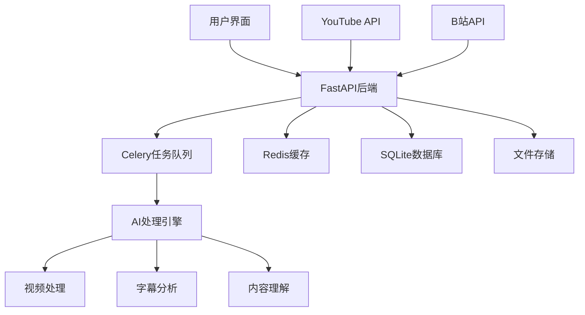

# AutoClip - AI视频智能切片系统

<div align="center">


**基于AI的智能视频切片处理系统，支持YouTube/B站视频下载、自动切片、智能合集生成**

[](https://python.org)
[](https://reactjs.org)
[](https://fastapi.tiangolo.com)
[](LICENSE)

</div>

## 🎯 项目简介

AutoClip是一个基于AI的智能视频切片处理系统，能够自动从YouTube、B站等平台下载视频，通过AI分析提取精彩片段，并智能生成合集。系统采用现代化的前后端分离架构，提供直观的Web界面和强大的后端处理能力。

### ✨ 核心特性

- 🎬 **多平台支持**: YouTube、B站视频一键下载
- 🤖 **AI智能分析**: 基于大语言模型的视频内容理解
- ✂️ **自动切片**: 智能识别精彩片段并自动切割
- 📚 **智能合集**: AI推荐和手动创建视频合集
- 🚀 **实时处理**: 异步任务队列，实时进度反馈
- 🎨 **现代界面**: React + TypeScript + Ant Design
- 📱 **响应式设计**: 支持桌面和移动端

## 🏗️ 系统架构



### 技术栈

**后端技术**
- **FastAPI**: 现代化Python Web框架
- **Celery**: 分布式任务队列
- **Redis**: 消息代理和缓存
- **SQLite**: 轻量级数据库
- **yt-dlp**: YouTube视频下载
- **通义千问**: AI内容分析

**前端技术**
- **React 18**: 用户界面框架
- **TypeScript**: 类型安全
- **Ant Design**: UI组件库
- **Vite**: 构建工具
- **Zustand**: 状态管理

## 🚀 快速开始

### 环境要求

- **操作系统**: macOS / Linux
- **Python**: 3.8+
- **Node.js**: 16+
- **Redis**: 6.0+

### 一键启动

```bash
# 克隆项目
git clone <repository-url>
cd autoclip

# 一键启动（推荐）
./start_autoclip.sh

# 快速启动（开发环境）
./quick_start.sh
```

### 手动安装

```bash
# 1. 创建虚拟环境
python3 -m venv venv
source venv/bin/activate

# 2. 安装Python依赖
pip install -r requirements.txt

# 3. 安装前端依赖
cd frontend && npm install && cd ..

# 4. 安装Redis
brew install redis  # macOS
brew services start redis

# 5. 配置环境变量
cp env.example .env
# 编辑 .env 文件，填入API密钥等配置
```

## 📖 使用指南

### 1. 视频下载

#### YouTube视频
1. 在首页点击"新建项目"
2. 选择"YouTube链接"
3. 粘贴视频URL
4. 选择浏览器Cookie（可选）
5. 点击"开始下载"

#### B站视频
1. 在首页点击"新建项目"
2. 选择"B站链接"
3. 粘贴视频URL
4. 选择登录账号
5. 点击"开始下载"

#### 本地文件
1. 在首页点击"新建项目"
2. 选择"文件上传"
3. 拖拽或选择视频文件
4. 上传字幕文件（可选）
5. 点击"开始处理"

### 2. 智能处理

系统会自动执行以下步骤：

1. **素材准备**: 下载视频和字幕文件
2. **内容分析**: AI提取视频大纲和关键信息
3. **时间线提取**: 识别话题时间区间
4. **精彩评分**: 对每个片段进行AI评分
5. **标题生成**: 为精彩片段生成吸引人标题
6. **合集推荐**: AI推荐视频合集
7. **视频生成**: 生成切片视频和合集视频

### 3. 结果管理

- **查看切片**: 在项目详情页查看所有生成的视频片段
- **编辑信息**: 修改片段标题、描述等信息
- **创建合集**: 手动创建或使用AI推荐的合集
- **下载导出**: 下载单个片段或完整合集

## 🔧 配置说明

### 环境变量配置

创建 `.env` 文件：

```bash
# 数据库配置
DATABASE_URL=sqlite:///./data/autoclip.db

# Redis配置
REDIS_URL=redis://localhost:6379/0

# AI API配置
API_DASHSCOPE_API_KEY=your_dashscope_api_key
API_MODEL_NAME=qwen-plus

# 日志配置
LOG_LEVEL=INFO
ENVIRONMENT=development
DEBUG=true

# 文件存储
UPLOAD_DIR=./data/uploads
PROJECT_DIR=./data/projects
```

### B站账号配置

1. 在设置页面点击"B站账号管理"
2. 选择登录方式：
   - **Cookie导入**（推荐）：从浏览器导出Cookie
   - **账号密码**：直接输入账号密码
   - **二维码登录**：扫描二维码登录
3. 添加成功后系统会自动管理账号健康状态

## 📁 项目结构

```
autoclip/
├── backend/                 # 后端代码
│   ├── api/                # API路由
│   │   ├── v1/            # API v1版本
│   │   │   ├── youtube.py # YouTube下载API
│   │   │   ├── bilibili.py # B站下载API
│   │   │   └── projects.py # 项目管理API
│   │   └── upload_queue.py # 上传队列管理
│   ├── core/              # 核心配置
│   │   ├── database.py    # 数据库配置
│   │   ├── celery_app.py  # Celery配置
│   │   └── config.py      # 系统配置
│   ├── models/            # 数据模型
│   ├── services/          # 业务逻辑
│   ├── tasks/             # Celery任务
│   └── pipeline/          # 处理流水线
├── frontend/              # 前端代码
│   ├── src/
│   │   ├── components/    # React组件
│   │   ├── pages/         # 页面组件
│   │   ├── services/      # API服务
│   │   └── store/         # 状态管理
│   └── package.json
├── data/                  # 数据存储
│   ├── projects/          # 项目数据
│   ├── uploads/           # 上传文件
│   └── autoclip.db        # 数据库文件
├── scripts/               # 工具脚本
├── docs/                  # 文档
└── *.sh                   # 启动脚本
```

## 🌐 API文档

启动系统后访问以下地址查看API文档：

- **Swagger UI**: http://localhost:8000/docs
- **ReDoc**: http://localhost:8000/redoc

### 主要API端点

| 端点 | 方法 | 描述 |
|------|------|------|
| `/api/v1/projects` | GET | 获取项目列表 |
| `/api/v1/projects` | POST | 创建新项目 |
| `/api/v1/projects/{id}` | GET | 获取项目详情 |
| `/api/v1/youtube/parse` | POST | 解析YouTube视频信息 |
| `/api/v1/youtube/download` | POST | 下载YouTube视频 |
| `/api/v1/bilibili/download` | POST | 下载B站视频 |
| `/api/v1/projects/{id}/process` | POST | 开始处理项目 |
| `/api/v1/projects/{id}/status` | GET | 获取处理状态 |

## 🔍 故障排除

### 常见问题

#### 1. 端口被占用
```bash
# 检查端口占用
lsof -i :8000  # 后端端口
lsof -i :3000  # 前端端口

# 停止占用进程
kill -9 <PID>
```

#### 2. Redis连接失败
```bash
# 检查Redis状态
redis-cli ping

# 启动Redis服务
brew services start redis  # macOS
systemctl start redis      # Linux
```

#### 3. YouTube下载失败
- 检查网络连接
- 更新yt-dlp版本：`pip install --upgrade yt-dlp`
- 尝试使用浏览器Cookie
- 检查视频是否可用

#### 4. B站下载失败
- 检查账号登录状态
- 更新账号Cookie
- 检查视频权限设置

### 日志查看

```bash
# 查看所有日志
tail -f logs/*.log

# 查看特定服务日志
tail -f logs/backend.log    # 后端日志
tail -f logs/frontend.log   # 前端日志
tail -f logs/celery.log     # 任务队列日志
```

### 系统状态检查

```bash
# 详细状态检查
./status_autoclip.sh

# 手动检查服务
curl http://localhost:8000/api/v1/health/  # 后端健康检查
curl http://localhost:3000/                # 前端访问测试
redis-cli ping                             # Redis连接测试
```

## 🛠️ 开发指南

### 后端开发

```bash
# 激活虚拟环境
source venv/bin/activate

# 设置Python路径
export PYTHONPATH="${PWD}:${PYTHONPATH}"

# 启动后端开发服务器
python -m uvicorn backend.main:app --reload --port 8000
```

### 前端开发

```bash
# 进入前端目录
cd frontend

# 启动开发服务器
npm run dev
```

### Celery Worker

```bash
# 启动Worker
celery -A backend.core.celery_app worker --loglevel=info

# 启动Beat调度器
celery -A backend.core.celery_app beat --loglevel=info

# 启动Flower监控
celery -A backend.core.celery_app flower --port=5555
```

## 📊 性能优化

### 生产环境配置

1. **数据库优化**
   - 使用PostgreSQL替代SQLite
   - 配置连接池
   - 启用查询缓存

2. **Redis优化**
   - 配置内存限制
   - 启用持久化
   - 设置过期策略

3. **Celery优化**
   - 调整并发数
   - 配置任务路由
   - 启用结果后端

## 🔒 安全配置

### 生产环境安全

1. **环境变量**
   - 使用强密码
   - 定期轮换密钥
   - 限制API访问

2. **网络安全**
   - 配置防火墙
   - 使用HTTPS
   - 限制CORS

3. **数据安全**
   - 定期备份
   - 加密敏感数据
   - 访问控制

## 🚀 部署指南

### Docker部署

```dockerfile
# Dockerfile示例
FROM python:3.9-slim

WORKDIR /app

# 安装系统依赖
RUN apt-get update && apt-get install -y \
    ffmpeg \
    redis-tools \
    && rm -rf /var/lib/apt/lists/*

# 安装Python依赖
COPY requirements.txt .
RUN pip install -r requirements.txt

# 复制代码
COPY . .

# 启动服务
CMD ["./start_autoclip.sh"]
```

### 系统服务

```bash
# 创建systemd服务文件
sudo nano /etc/systemd/system/autoclip.service

[Unit]
Description=AutoClip Video Processing System
After=network.target redis.service

[Service]
Type=forking
User=autoclip
WorkingDirectory=/opt/autoclip
ExecStart=/opt/autoclip/start_autoclip.sh
ExecStop=/opt/autoclip/stop_autoclip.sh
Restart=always

[Install]
WantedBy=multi-user.target
```

## 📈 路线图

### 即将推出

- [ ] **多语言支持**: 支持更多语言的视频处理
- [ ] **云端存储**: 集成云存储服务
- [ ] **批量处理**: 支持批量视频处理
- [ ] **API开放**: 提供公开API接口
- [ ] **移动应用**: 开发移动端应用

### 长期规划

- [ ] **AI模型优化**: 集成更多AI模型
- [ ] **实时协作**: 支持多用户协作
- [ ] **插件系统**: 支持第三方插件
- [ ] **企业版**: 企业级功能和服务

## 🤝 贡献指南

我们欢迎所有形式的贡献！

### 如何贡献

1. **Fork** 项目
2. 创建功能分支：`git checkout -b feature/amazing-feature`
3. 提交更改：`git commit -m 'Add amazing feature'`
4. 推送分支：`git push origin feature/amazing-feature`
5. 创建 **Pull Request**

### 开发规范

- 遵循PEP 8 Python代码规范
- 使用TypeScript进行前端开发
- 编写清晰的提交信息
- 添加必要的测试用例
- 更新相关文档

## 📄 许可证

本项目采用 [MIT License](LICENSE) 许可证。

## 📞 支持与反馈

- **问题反馈**: [GitHub Issues](https://github.com/your-repo/issues)
- **功能建议**: [GitHub Discussions](https://github.com/your-repo/discussions)
- **文档**: [项目文档](docs/)

## 🙏 致谢

感谢以下开源项目的支持：

- [FastAPI](https://fastapi.tiangolo.com/) - 现代化Python Web框架
- [React](https://reactjs.org/) - 用户界面库
- [Ant Design](https://ant.design/) - 企业级UI设计语言
- [yt-dlp](https://github.com/yt-dlp/yt-dlp) - YouTube视频下载工具
- [Celery](https://docs.celeryproject.org/) - 分布式任务队列

---

<div align="center">

**如果这个项目对你有帮助，请给我们一个 ⭐ Star！**

Made with ❤️ by AutoClip Team

</div>
