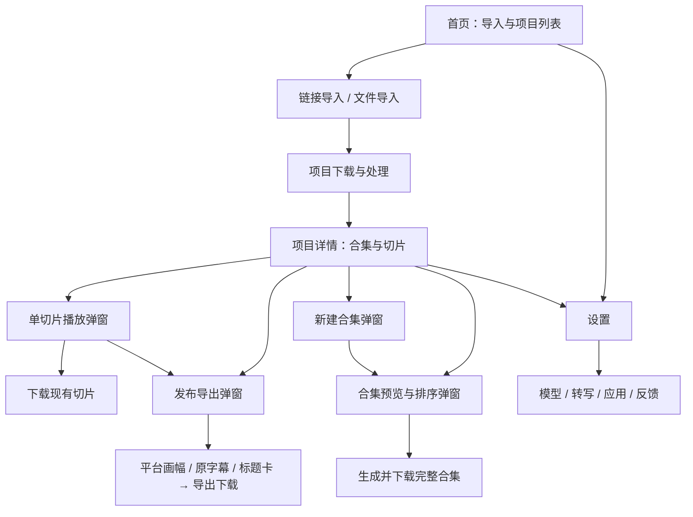

# AutoClip 当前界面与交互拆解

核对日期：2026-09-21。工作分支：`codex/visual-game-ads`。

## 0. 基线与证据范围

本次以功能分支的产品代码基线 `aaf863bb` 为准，当前分支 `62a5301b` 仅增加本功能规划和样片工程，没有改动产品前端。另对比原工作区未提交的界面增量：全局更新提示、设置中的版本检查和崩溃报告开关；这些属于其他功能，未迁入本分支，也不改变下述核心流程。

核对方式：路由、组件引用、事件处理和 API 调用静态追踪；启动原前端组件，以只读示例接口在浏览器核对首页、完成态项目页、合集预览、发布导出及设置页。示例项目及其两个切片不是用户真实项目，没有媒体播放或真实 AI 结果。未执行导入、付费模型调用、导出、上传、删除或保存设置。因此下面分别区分已观察的页面结构、代码支持的操作和待做的端到端验证。

本文件描述现状并提出讨论项，不批准新的导航或编辑器设计。

## 1. 当前产品的基本对象

| 对象 | 当前承载的内容 | 用户心智 |
| --- | --- | --- |
| 项目 | 一次链接或一个本地视频导入，分类、处理状态、生成结果 | 我处理过的一份视频 |
| 切片 | 原视频的一段时间范围、标题、推荐分、推荐理由、生成的视频 | AI 帮我找出的可用片段 |
| 合集 | 有顺序的切片 ID 列表、标题、描述、AI 推荐或手动来源 | 把几个片段串起来 |
| 导出任务 | 对单条切片应用平台预设、烧字幕、片头标题卡 | 另存一份适合上传的视频 |

当前没有用户可操作的独立「广告创意」「成片版本」「语言版本」「品牌素材包」对象。切片修改标题不会自动变成完整广告文案编辑。

## 2. 页面与浮层地图

实际路由只有三个，见 [App.tsx](../frontend/src/App.tsx)：

多数操作是在项目详情上打开弹窗；当前不是有独立制作页、时间轴页、素材库页的编辑器结构。

## 3. 按界面逐一拆解

### A. 全局栏

- 左侧 AutoClip 品牌入口回首页；右侧主题切换、设置。
- 无全局素材库、创意库、导出中心或任务中心导航。
- 内页自行提供返回入口。设计规范使用暖灰、克制蓝、卡片和较大留白。
- 参考：[Header.tsx](../frontend/src/components/Header.tsx)、[DESIGN.md](../DESIGN.md)。

### B. 首页：上方导入，下方我的项目

- 默认「链接导入」，支持 B 站和 YouTube；切换到「文件导入」使用拖拽区。
- 下方按创建时间倒序排列项目卡，支持全部、已完成、处理中、处理失败筛选。
- 项目卡显示封面、分类、时间、状态、切片及合集数量；提供下载、删除，失败时重试与反馈。
- 浏览器核对：点击封面的播放图标进入项目；点击标题显示提示，不会进入详情。
- 这里同时承担创建入口、项目管理和处理监控，没有单独的创作目标选择。
- 参考：[HomePage.tsx](../frontend/src/pages/HomePage.tsx)、[ProjectCard.tsx](../frontend/src/components/ProjectCard.tsx)。

### C. 导入区：按来源分两条路径

| 路径 | 用户操作与条件 | 接下来发生什么 |
| --- | --- | --- |
| 链接导入 | 粘贴 URL；输入框失焦触发解析；解析成功后出现项目名、可选浏览器 Cookie 来源、分类 | 点击开始导入，创建项目并后台下载；成功创建后重置输入区，可继续添加 |
| 文件导入 | 选择一个视频、可选 SRT；填项目名、分类 | 点击「开始导入并处理」；未提供 SRT 时提示自动语音识别 |
| 配置不完整 | 导入前调用 API 配置检查 | 引导去配置模型，不能仅把它当作无条件导入成功 |

文件输入框虽然允许多文件选择，数据结构只有一个 `video` 和一个 `srt` 槽位，不等于批量视频素材池。当前分类偏知识、商业、观点、演讲等；它是内容类别，并非「高光提取 / 广告制作」任务目标。

参考：[BilibiliDownload.tsx](../frontend/src/components/BilibiliDownload.tsx)、[FileUpload.tsx](../frontend/src/components/FileUpload.tsx)。

### D. 处理状态：项目卡与详情分担

- 首页卡片显示导入、下载、处理、失败等状态与进度；失败可重试。
- 详情页依据状态分支：完成显示结果；失败显示错误与重试；未完成显示任务区域与「还在处理中」。
- 没有持续可编辑的项目工作台；等待和结果是不同页面状态。
- 链接旧响应路径的「停止监控」只停止客户端监控，不应理解成取消后台任务。
- 本地文件上传进度由前端定时增长到 85%，请求完成后归 100%，不是字节级实际上传进度。
- 本次未启动真实处理任务，处理阶段时序、完成后自动更新和重试恢复需另做实测。

### E. 项目详情：合集在上、切片在下

- 页头：项目名、切片/合集数量、切片总时长、创建时间。
- 第一屏优先展示合集横排卡片与「新建合集」。
- 下方是切片网格，支持按推荐分或源时间排序。
- 切片卡：缩略图、推荐分、源时间范围、可编辑标题、推荐理由、时长、播放/下载/导出。
- 没有完整原片播放器与全片候选时间轴；当前入口也没有可拖动的片段入出点、镜头替换、文字图层或配音编辑。
- 页面依靠结果卡片表达产物，尚未分开「备选素材」和「已完成创意」。
- 参考：[ProjectDetailPage.tsx](../frontend/src/pages/ProjectDetailPage.tsx)、[ClipCard.tsx](../frontend/src/components/ClipCard.tsx)。

### F. 单切片：播放、标题编辑、下载、发布导出

- 播放弹窗展示视频、标题、时间范围、时长和推荐分；能进入标题编辑弹窗。
- 标题编辑支持手改、AI 生成后再保存；不支持在这里直接改视频里的字幕样式。
- 「下载」获取当前已生成切片。
- 「发布导出」打开独立配置弹窗，当前只提供：平台（抖音、小红书、Shorts、B 站、原画）、原字幕烧录开关、片头约四秒标题卡开关。
- 提交后在弹窗轮询进度，成功后下载成片；渲染期间取消/关闭受限。没有成片效果实时预览、语言设置、声音配置或导出版本列表。
- 导出名字中的「发布」不等于发布到平台，实际动作是本地成片导出。
- 参考：[ClipCard.tsx](../frontend/src/components/ClipCard.tsx)、[EditableTitle.tsx](../frontend/src/components/EditableTitle.tsx)、[publish_export.py](../backend/services/publish_export.py)。

### G. 合集：已有可复用的轻量编排

- 新建合集弹窗：标题、可选描述、选择已有切片、全选/清空。
- 预览弹窗：左侧当前片段播放器与前后切换，右侧播放列表。
- 已接线操作：拖拽排序、添加/移除切片、改切片标题、删除合集、生成并下载完整视频。
- 合集标题可在外部卡片直接编辑。
- 预览采用逐个片段播放；不是对已包装成片的统一时间轴预览。
- 「投稿」「投稿到 B 站」可见，但当前按钮仅提示开发中。不能把存在的上传组件当作主路径可用发布能力。
- 合集完整导出与单切片发布导出是两条路径，当前没有共用的语言/版式/声音配置面板。
- 参考：[CollectionCard.tsx](../frontend/src/components/CollectionCard.tsx)、[CollectionPreviewModal.tsx](../frontend/src/components/CollectionPreviewModal.tsx)、[CreateCollectionModal.tsx](../frontend/src/components/CreateCollectionModal.tsx)。

### H. 设置：全局工具配置

| 分组 | 当前内容 |
| --- | --- |
| 模型 | 提供商、API Key、模型、部分提供商的接口地址、连接测试；文本分块、最低评分、合集切片数量 |
| 转写 | Whisper 运行时安装、模型下载/删除及状态；不是成片字幕语言面板 |
| 应用 | 主题、桌面开机启动、匿名统计；B 站账号显示即将推出 |
| 反馈 | 应用内反馈、外部表单、Issue 和已知问题入口 |

原工作区未提交增量另有版本检查、更新弹窗、崩溃报告；不把它们当作本分支已包含。模型设置与创作偏好目前也没有按「用户默认 → 项目 → 单创意」组织。

参考：[SettingsPage.tsx](../frontend/src/pages/SettingsPage.tsx)、[SpeechRecognitionConfig.tsx](../frontend/src/components/SpeechRecognitionConfig.tsx)。

## 4. 存在文件但不能算主流程能力

通过路由与引用核对，`ProcessingPage`、`UploadStatusPage`、`DebugPage`、`SimpleProgressDemo` 没有接入当前 App 路由；`FirstRunWizard`、`ClipDetailModal`、`PipelineControl`、`TaskProgressModal` 没有在当前主界面接入。不能因文件名就认定用户已有首次向导、字幕剪辑器或完整任务控制。

类似地，`BilibiliManager`/`UploadModal` 的组件或 API 存在，不代表主界面开放了投稿。需以真实入口和事件处理为准。

## 5. 已确认的交互断点与验证项

| 现状/问题 | 用户影响 | 证据等级 |
| --- | --- | --- |
| 下载、发布导出、合集导出分三种语义 | 不容易判断哪一个得到最终成片 | 浏览器 + 事件代码 |
| 合集先于切片展示 | 用户先看到已组合结果，再看备选片段 | 浏览器观察；是否调整尚未决定 |
| 导入即进入自动处理，缺少目标简报 | 无法先表达受众、时长、语言、希望突出什么 | 导入与页面代码 |
| 字幕开关仅烧录源字幕 | 无法配置翻译、双语、广告文字或配音 | 浏览器 + 导出请求 |
| 预览与包装导出分离 | 改画幅/字幕/标题后，导出前看不到最终效果 | 浏览器 + 组件代码 |
| 修改聚集在多个弹窗 | 没有一个持续保存的成片工作区 | 路由 + 浏览器 |
| 投稿按钮为开发中 | 看似可发布，实际只得到提示 | 事件代码；未发起上传 |
| 首页失败筛选值是 `error`，项目详情接受 `failed` 和 `error` | `failed` 项目可能被「处理失败」筛选漏掉 | 静态代码确认，真实项目复现待测 |
| 主路径未提供人工调整切片边界 | 高光边界不准时缺少直接修正入口 | 可达组件检查 |
| 处理阶段真实进度、取消、恢复行为 | 不宜直接承诺可靠任务中心 | 待真实任务专项验证 |

## 6. 基于现状的设计讨论顺序

1. **先定义用户最终管理什么。** 保留项目作为工作容器；讨论切片是否明确定位为素材，以及是否新增独立成片/创意对象。不要先把合集直接改名为广告。
2. **再定义首次动作。** 导入后立即自动切片，还是先选择高光/内容切片/广告制作目标；是否允许先看推荐结果再改目标。
3. **再定义项目页。** 继续把它当结果陈列，还是让它承接素材选择、创意版本和任务状态。现有卡片与简洁视觉可以保留。
4. **再定义最小编辑闭环。** 优先把选镜头、改文字语言、预览和导出接在一起；现有合集的增删排序可复用，不急于堆满专业时间轴功能。
5. **最后统一导出。** 明确原始片段下载和成片输出的区别，并让单片、合集、新广告共用一致的输出设置和版本记录。

本轮只梳理界面，没有修改产品交互。上述是下一轮讨论框架，并非已确认的改版方案。
