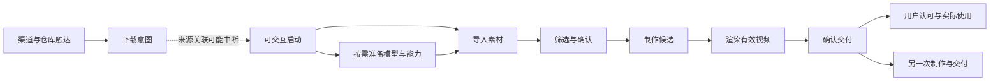
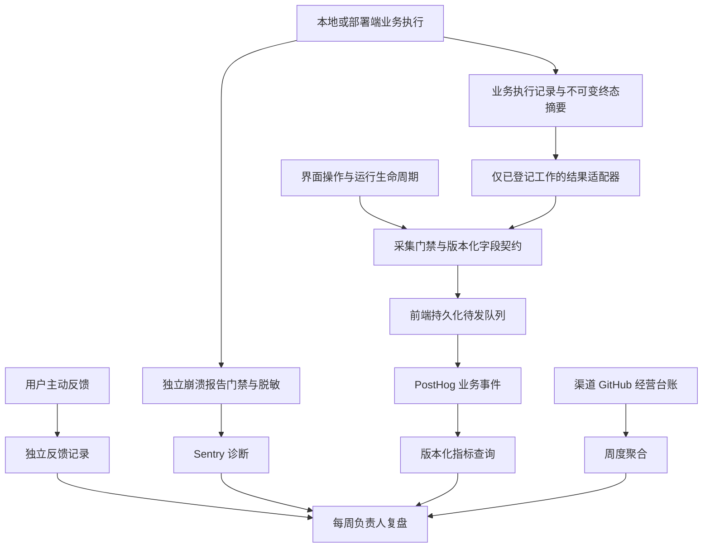

# AutoClip 数据系统设计方案

**版本：v0.2 / 2026-09-30 / 待共同 review。**

> 2026-09-30 基线更新：已核对最新 main `c2625752`（#232）。首次模型引导、可实际导出的示例工程、统一 AI 设置及按镜头取景已经实现，但对应观测尚未闭环。具体代码证据、事件覆盖和修订顺序见[最新 main 埋点复核](TELEMETRY_REVIEW_MAIN_2026-09-30.md)。本设计中的目标事件和新架构仍待实施，不能把新版功能上线等同于新数据契约上线。

### v0.2 增量要求

- `processing_config.example` / `example_version` 已有，优先映射为全链路素材用途；示例编辑、渲染、保存不得计入真实激活，随后真实任务应独立计算。
- 首次引导新增实际可见、稍后/转设置和配置拦截事实；引导资格来自配置状态，不代表新安装身份。
- 统一配置的保存、模型发现、连接测试分别定义；新 UI 已改走 `/settings/ai-models/*`，不能依赖旧 `provider_test_*` 证明新路径覆盖。保存对全部 connection 发旧事件不能作为配置人数。
- 设置 section 采用受控可见分区，不采集原始 query；自动模型发现和隐藏组件加载不能算主动采用。
- 自动取景区分自动/手动/竖屏预设、零检测/失败、结果保留/手动调整；修订 Sentry phase 白名单。取景效果以最终采用和交付观察，不以按钮次数代替。
- 实施优先级先做素材分类与隐私门禁、引导与新配置路径，再完成统一执行关联和取景采用分析；精确转化率仍以身份和终态闭环为前提。

本方案以项目负责人与增长负责人的决策需求为起点。它是目标设计，不表示已实施、已上线或历史数据已具备相应能力。此次仅新增文档。

## 阅读与 review 导航

| 先看什么 | 对应章节 | 需要判断 |
|---|---|---|
| 业务目标和首页 | 1–3 | 衡量的是否是我们真正希望改善的事 |
| 指标口径 | 4–5 | 什么算首次成功、再次使用、质量和有效增长 |
| 数据如何产生和送达 | 6–10 | 关联、持久化、同意范围和维护成本是否合理 |
| 怎么使用和信任数据 | 11–14 | 看板、质量检查、复盘与验收能否指导行动 |
| 如何落地 | 15–17 | 范围、顺序和待定取舍是否接受 |

依据：此前确认的[业务需求](ANALYTICS_BUSINESS_REQUIREMENTS_2026-09-29.md)、[需求到埋点映射](ANALYTICS_MEASUREMENT_PLAN_2026-09-29.md)、[现状审计](ANALYTICS_SYSTEM_REVIEW_2026-09-29.md)。这三份保留为依据，本稿作为整合 review 入口。冲突处以本稿明确的建议为准；最终批准后再同步指标字典与实现契约。

## 1. 项目目标、约束和设计原则

### 1.1 业务目标

AutoClip 希望成为真正帮助用户、具有持续社区影响力、能够获得持续赞助的开源 AI 高光剪辑项目。近期主线是把已有视频转成有用的短视频；游戏高光是适用场景之一，广告投放经营闭环暂不纳入。

数据系统需要持续支持三个判断：

1. **价值：** 有多少使用者完成实际工作，成片是否可用，是否持续使用。
2. **增长：** 哪些人群、渠道和内容带来实际成功，而不只是关注。
3. **可持续性：** 维护投入是否有效，社区和赞助是否支持长期发展。

### 1.2 资源约束

- 按个人维护、每周有限投入设计，优先复用 PostHog、Sentry、现有本地存储和简单台账。
- 没有强制账户，采用匿名设备口径；不承诺跨设备自然人去重。
- 桌面离线、关窗、重启、用户关闭采集都是正常情况。
- 已有旧版用户与多种事件契约，历史数据不能自动变成新口径。
- 无法从应用内采集完整观察到“下载了但安装/启动失败”的人。

### 1.3 原则

每个数据项必须对应一个决策；每个比率必须有明确分母；事实、推断、自报分开。统计不能影响出片主流程，不能为了数据完整性绕过用户选择。未知保留为未知，不补成成功、失败或流失原因。

## 2. 决策需求全景

| 编号 | 负责人要回答的问题 | 数据需求 | 决策 |
|---|---|---|---|
| B1 | 谁需要我们，拿来做什么 | 场景、原有工作方式、成功与复用、支持成本 | 优先服务的人群、预设、案例 |
| B2 | 流量来自哪里，投入是否有效 | 来源、内容、尝试、可归因首次成功、投入时间 | 渠道与传播内容分配 |
| B3 | 首次使用为何没成功 | 各阶段结果、等待、重试、配置与导入障碍 | 修复和 onboarding 优先级 |
| B4 | 成片是否真的有用 | 技术交付、可用性评价、问题类别、时间节省 | 选段/字幕/构图/声音/节奏改进 |
| B5 | 成功后会不会回来 | 不同制作任务的再次交付、使用频率 | 持续价值判断和获客节奏 |
| B6 | 新版本有没有改善 | 版本/系统下的结果、耗时、未知数、固定样本质量 | 推广、修复、延期及发布复盘 |
| B7 | 社区是否持续参与 | 有效反馈、首次/持续贡献、响应、积压、案例 | 贡献者支持与维护流程 |
| B8 | 赞助是否可持续 | 到账、资源额度、支持投入、Provider 实际使用效果 | 合作选择与续约 |

## 3. 指标体系与负责人首页

### 3.1 核心指标

**每周成功出片的可观测设备数，拆分首次成功与已有成功经历。**

它反映项目实际帮助完成工作的范围。配套看首次成功率、再次出片和用户认可，防止只追求量。第一期桌面确认保存为强证据；Web 的生成与交付意图单列。

Star、曝光、下载量是关注与尝试信号，继续看，但不作为唯一成功标准。现金赞助是可持续性指标，不替代用户价值。

### 3.2 首页六组信息

| 卡片 | 展示内容 | 默认下钻 |
|---|---|---|
| 实际交付 | 周成功设备；首次/已有成功经历 | 系统、版本、场景、证据级别 |
| 首次体验 | 成熟新设备 cohort 的 7 日首次出片率 | 配置、导入、筛选、制作、渲染、保存 |
| 持续使用 | 成熟首次成功 cohort 的 28 日再次出片率；7 日早期观察 | 场景、首次成功版本 |
| 最大阻碍 | 阻止首次成功的前三类问题 | 受影响设备/任务、分类、可诊断案例 |
| 成片可用性 | 可直接用/小改/大改/不可用；前三类质量问题 | 回复样本数、回复率、场景 |
| 有效增长 | 来源下的可确认首次成功、推广投入 | 内容代号、来源证据、未知归因 |

首页顶部标明统计周、数据截至时间、覆盖平台/契约、数据健康状态。每个比率展示分子/分母。无样本显示“无数据”，窗口未结束显示“观察中”，不可确认显示“未知”。

## 4. 核心指标字典

### 4.1 通用口径

- 周期：Asia/Shanghai，周一至周日；只比较完整周。窗口指标使用起点后的实际 7×24 / 28×24 小时。
- 范围：production、新契约、允许采集且实际送达的记录；排除明确的测试和示例。无法确认素材用途者为 unknown，不算真实素材成功。
- 去重：先按 event_id 去重，再按设备/flow/attempt/artifact 的指标粒度聚合。
- 新用户代理：有本地首次运行证据的新设备；升级已有安装或无法判断者单列，不能称为新用户。
- 未知：无法恢复结果与明确仍在进行分开。未进入下一步不自动判定为主动放弃。
- 延迟：按发生时间归属，显示入库/观察延迟；最近数据可随补报修订。每周归档保留当时快照与修订时间。

### 4.2 业务指标

| 指标 | 定义 | 使用限制 |
|---|---|---|
| 周成功出片设备 | 统计周至少一次非示例有效视频的合格交付设备去重 | 一期 native_saved；Web 分列 |
| 首次成功设备 | 最早合格交付发生在该周的设备 | 历史不全则写“新契约下首次观察成功”，不宣称终身首次 |
| 7 日首次出片率 | 合格首次启动后 7 日内首次真实交付的设备 / 已满 7 日的合格新设备 cohort | 包括已启动但未制作的设备；不能只取导入者作分母 |
| 7/28 日再次出片率 | 首次真实交付后窗口内，另一个 flow 有合格交付的设备 / 已满窗口的首次成功设备 | 重下载、复制草稿、重复渲染不算新 flow |
| 阶段首次成功率 | 各 flow 在该 stage 的第一个已受理 attempt 成功数 / 该 stage 已满观察期限的首个已受理 attempt 数 | partial/cancelled/ongoing/unknown 一并展示；不能仅在已知终态中报一个“整体成功率” |
| 重试挽回率 | 首次阶段失败并明确发起重试的 flow，在固定 7 日窗口内该阶段成功 / 满窗口的此类 flow | 用户未重试者另报，不归进挽回分母 |
| 操作拒绝/不确定 | operation 的 rejected、transport_unknown 分布 | API 超时不等于 worker 失败 |
| 终态覆盖 | 受理满 24h 的 attempt 中终态已知占比；仍运行、未知分列 | 24h 是初始观察阈值，不是业务超时；长任务另列 |
| 首次交付耗时 | 首次可交互启动→首次真实交付；另列导入请求→交付，p50/p90 | 仅成功样本的条件分布；必须与未成功比例并看 |
| 可用性分布 | 有效结构化反馈四档占比 | 按反馈邀请/修订去重；展示回复数与抽样范围，不外推全部用户 |
| 来源首次成功 | 各固定首次来源下的合格首次成功数 | 自报、链接记录、未知分开；无贯通链路不计算跨源转化率 |

“首次运行”的标记不属于统计历史：若用户初次安装时关闭采集、后来打开，只能进入 observation_only，不能补报之前启动或冒充 fresh_install。无法识别重装/清理数据的情况需持续披露为设备口径限制。

### 4.3 项目经营指标

| 领域 | 指标 | 来源 |
|---|---|---|
| 关注 | 新增 Star、渠道访问、外部教程/提及、下载意图 | GitHub/渠道聚合、人工传播台账 |
| 社区 | 有效反馈、外部首次/持续贡献、响应时长、PR 积压 | GitHub 与反馈分类；排除维护者/机器人 |
| 维护 | 本周支持/修复/新功能/传播投入小时，主要重复问题 | 私有简表，每周粗记 |
| 赞助 | 现金到账、未到账承诺、可用额度及到期、续约、集成支持时间 | 私有合作台账，现金和额度不折算混加 |
| Provider 效果 | 出站点击、配置、连通、实际出片，注册/付费另列 | 应用事实、可信合作方报表；不存在回传即未知 |

## 5. 用户旅程和证据等级



配置不是每次必经步骤；已有配置、不同模型路线、示例引导分别记录，不能要求所有用户走一条严格线性漏斗。

| 等级 | 能证明什么 | 不能证明什么 |
|---|---|---|
| L0 请求/受理 | 用户提交或服务接受操作 | 处理成功 |
| L1 制作完成 | 有候选或制作结果 | 已有可播放成片 |
| L2 有效视频 | 输出非空且通过基本媒体检查 | 已收到/保存/满意 |
| L3 确认交付 | 原生保存成功等明确证据 | 已发布或达到用户要求 |
| L4 自报有用 | 用户明确反馈可用/使用 | 全体用户都满意、客观节省同样时间 |

Web 下载点击停留在意图；收到 Blob 是传输证据，不能冒充保存。自报保存可单列弱证据，不混入原生保存指标。

## 6. 总体架构



### 6.1 推荐选型

| 层 | 一期建议 | 原因与边界 |
|---|---|---|
| 业务记录 | 扩展 Studio 当前项目 JSON 的执行记录，与状态在同一次原子写入更新 | 已有 `store.change/write`；先保证单后端实例的事务边界，避免同时引入第二套事实主库 |
| 初始导入 | 客户端先持久化 flow/operation；后端创建项目并写入受理记录后才返回 accepted | 创建项目之前的拒绝由操作层记录；无项目的历史导入恢复是边界，不能从请求超时猜结果 |
| 采集映射/待发 | 前端 IndexedDB，存受控 payload、登记映射、同意代次和发送状态 | 相比 localStorage 更适合有界事务队列；实际 WebView 支持需安装包验收 |
| 传输 | 专用业务事件 transport 适配器，复用既有 PostHog 项目与匿名身份来源 | 不把 SDK capture 返回当远端确认；具体传输确认语义必须验证 |
| 分析 | PostHog 的固定 SQL/分析结果与仓库内版本化查询 | 一期不建设独立数仓或 ETL 平台 |
| 工程监控 | Sentry，保留独立开关、脱敏与受控错误分类 | 不作业务成功率分母 |
| 经营补充 | 私有表格 + 获准公开的案例目录 | 不把联系人、合同和收入放进公开仓库 |

当前 `studio.json` 的 `analysis` 是单个可变槽位，jobs 有按作业存储的基础。设计要求补足历史执行摘要；不能只把现有轮询间隔缩短。现有数据库可作为后续扩展选项，但第一期不同时双写 JSON 和 SQL 两个权威状态源。

### 6.2 原子性与故障隔离

执行结果摘要属于业务可恢复记录，与对应状态同一次 `store.change` 写入。终态写入一旦成功，不再修改该事实；修正采用明确的新修正记录及 revision，不重用同一 event_id 发送不同内容。

业务文件已经生成、状态写入却失败时，不能宣称“没有产物”。下次恢复时检查确定的作业输出及媒体有效性，生成 recovery 来源的事实；无法确认则保持 unknown。文件写入和 JSON 原子替换不是跨资源事务，此处必须有恢复验收。

统计适配失败只影响采集，不能使用户成功的保存/制作变成失败。原生保存也存在“文件写成功、前端尚未登记即退出”的窗口，一期披露此缺口，不宣称 exactly-once 或永不丢失；如真实影响明显，再扩展原生保存回执。

## 7. 逻辑数据模型与关联规则

| 实体 | 关键内容 | 关系/规则 |
|---|---|---|
| Device observation | 匿名标识、首次可观测时间、first-run 证据类型、环境 | 清空存储可能产生新设备；不识别自然人 |
| Flow | 随机 flow_id、素材用途、来源类型、创建时间 | 一次制作工作；编辑、复制草稿和重渲染沿用 |
| Operation | operation_id、stage、请求时间、受理/拒绝/传输未知 | 用户重试新 operation；同次网络重传保持 ID |
| Attempt | attempt_id、stage、queued/start/end、结果、错误码、目标计数 | 一次后端受理执行；重试新 attempt；可被多个去重后的 operation 引用 |
| Artifact | artifact_id、渲染 attempt、媒体校验、revision | 同一产物多次下载仍是同一个 artifact |
| Delivery | 下载 operation、artifact、方式、结果与证据 | 交付次数、产物数、设备数分别计算 |
| Feedback | prompt_id、feedback_id、revision、选项、采集范围 | 同一反馈修改取最高有效 revision，不能当多名用户 |
| Source attribution | 来源类别、活动代号、证据、首次来源时间 | 首次来源固定；后续活动触点可另存但不覆盖首次 |

对外关联 ID 为随机值，与内部项目/文件标识只在本地映射。无视频 hash、路径或标题。删除项目时清理相应映射和待发记录；已经送达外部系统的数据不等同于本地项目删除，另有远端保留策略。

后端幂等：同一请求重传必须返回同一受理结果或明确冲突；已有渲染作业复用时，一个 attempt 可对应多次操作，但只能产生一条终态事实。采集应服从业务去重结果，不能自己发明一次新执行。

## 8. 事件契约

### 8.1 公共 envelope

建议新契约使用 `business_schema_version=3`，与当前 schema_version=2/studio_schema_version=1 分离；最终编号在实现前检查冲突。

必需字段：event_id、event_name、契约版本、occurred_at、observed_at、app_version、environment、runtime、entrypoint、os。运行端未知字段如 arch 可为 unknown，不推测。device distinct_id 由唯一身份适配器提供；业务代码不能覆盖 envelope。

flow 事件增加 flow_id、material_origin（user/sample/unknown）、source_type。按事件需要携带 operation_id、attempt_id、artifact_id。stage、outcome、error_code、Provider 和场景都使用运行时白名单；不支持任意属性展开。

SDK 可能附加的属性也需验收：自动页面采集、录屏、自由 URL、referrer、person profile 行为应与既有隐私约束一致。直接发送业务事件时尤其不能只复制 SDK 的 key，却遗漏匿名事件配置。PostHog 官方说明区分匿名与已识别事件；应按当前服务端契约验收匿名模式，而不是假定两种发送路径语义相同。[官方说明源码](https://github.com/PostHog/posthog.com/blob/master/contents/docs/data/anonymous-vs-identified-events.mdx)

### 8.2 核心事件

| 事件 | 唯一事实来源 | 触发与专属字段 |
|---|---|---|
| app_session_started | 生命周期模块 | UI 可交互；session_id、observation_start_kind=fresh_install/existing_install/observation_only/unknown |
| workflow_operation_requested | 统一操作包装 | 用户提交有效操作；flow/operation、stage |
| workflow_operation_resolved | 操作响应或恢复适配器 | accepted/rejected/transport_unknown；受理关联 attempt、request_duration_ms、错误码 |
| workflow_attempt_started | 持久化执行记录 | 实际执行起点；flow/attempt、stage |
| workflow_attempt_finished | 持久化终态摘要 | completed/partial/failed/cancelled；受控错误码、requested/succeeded/failed 目标计数、执行耗时 |
| artifact_generated | 渲染结果与媒体检查 | flow/attempt/artifact、media_kind=video、revision |
| artifact_delivery_requested | 下载适配器 | flow/artifact/operation、native/browser |
| artifact_delivery_resolved | 下载适配器的明确回执 | completed/failed/cancelled；evidence=native_saved/bytes_received、错误码、耗时 |

stage 第一期为 import/screen/produce/render。Provider、转写、字幕等细节先用于错误分类，不机械地变成十几级漏斗。

operation 的 transport_unknown 后若恢复确认 accepted，追加带递增 resolution_revision 的 resolved 事实；分析取最高有效 revision。event_id 永不变内容。终态未知是报表状态，不是 worker 伪造出的 failed。

附加事件：provider_configuration_saved、provider_connection_tested、quality_feedback_prompted/submitted、use_case_reported、acquisition_source_recorded；赞助点击复用 sponsor_link_opened。每个都对应业务需求，具体白名单见前置映射稿。

### 8.3 示例：重试后成功

```text
flow F1（真实素材）
  produce operation O1 → accepted attempt A1 → failed(authentication)
  produce operation O2 → accepted attempt A2 → completed
  render operation O3 → accepted attempt A3 → completed → artifact V1
  delivery operation O4 → V1 native_saved
  delivery operation O5 → V1 native_saved

结论：1 个成功 flow；制作阶段首次失败后重试挽回；
      1 个成片、2 次保存操作、1 个成功设备；不构成再次出片。
```

## 9. 本地恢复、传输和幂等

### 9.1 登记与恢复

1. 同意开启时，操作产生受控 ID，并将 flow/operation 登记到本地后调用业务接口。
2. 后端保存执行记录。采集适配器只读取当前登记范围内的工作，不扫描全部历史项目。
3. 每个本地事实转换为固定 event_id 的受控事件，事务写入 IndexedDB 后才推进“已入队”游标。
4. transport 单独发送；多窗口使用队列租约/事务领取，租约过期可恢复；即使重复发送，下游也按 event_id 去重。
5. 重启读取登记与队列，补齐尚未观察的已登记事实；被撤回同意的旧代次不可恢复发送。

应用进程退出时不依赖最后一次 flush 的成功。前端关闭后后端可继续完成，但一期只有下次打开才补报；永不回来、清空本地数据、卸载、队列过期都会形成缺口。

### 9.2 队列状态

`pending → sending(带租约) → transport_accepted`；可重试网络/限流/服务故障回 pending；无效 payload 进入有界 quarantine，不能无限重试。

SDK 返回“已接受 capture”只代表 SDK 接受；HTTP 成功只代表入口接受请求，也不等于分析端已经可查询。区分 local_enqueued、transport_accepted 与 ingestion_verified。真实验收通过独立 validation 查询检查最终入库，产品客户端不携带查询凭据。

第一期推荐独立 transport 适配器提供可解释的请求结果，不依赖 SDK 私有方法。选用官方公开采集路径之前，验证匿名标记、时间戳、重复 ID、错误/限流响应和 WebView 网络行为；未验证前不能承诺传输可靠性。服务端接口当前有实现及 timestamp 支持，但不把其内部接口或字段当作稳定公共契约。[官方实现参考](https://github.com/PostHog/posthog/blob/master/posthog/api/capture.py)

### 9.3 初始边界，供 review

| 项目 | 建议初值 | 达到边界的处理 |
|---|---|---|
| 客户端待发队列 | 7 天，最多 5,000 条或 10 MiB，先到为准 | 保留关键终态优先；记录本地丢弃分类计数，不静默无限增长 |
| 重试 | 指数退避并加随机抖动，最长间隔 1h | 尊重有效 Retry-After；离线恢复再试；受队列 TTL 限制 |
| 业务结果摘要 | 项目生命周期内保留，终态记录紧凑存储 | 体积达到预算时设计明确归档，不能无提示删掉运行中任务 |
| 单次发送 | 小批量、低并发，避开大文件路径 | 大小和数量上限由真实事件体积验证后定 |

这些是工程预算建议，不是已验证容量。超限丢失会影响统计，应展示数据质量风险。不能用“限时可靠补报”宣传为完全不丢事件。

## 10. 隐私、权限和运行模式

- 匿名统计与崩溃报告独立开关；主动反馈是独立动作。统计设置以当前内存选择优先，持久化失败不能让门禁继续开启。
- 每次登记、转换和发送前检查同意代次。关闭时中止尚未发出的请求、清空队列和采集映射；已经发出的网络请求可能已被接收，不能承诺撤回。
- 重新开启建立新代次，不补采关闭期间行为，不沿用旧登记继续回放。业务项目和成片不因关闭统计被删除。
- 质量反馈在关闭统计时仍可主动提交，但不附加设备/flow/artifact 行为关联；与可计算曝光回复率的反馈分开。
- 普通遥测不上传视频、字幕、标题、路径、URL、Key、原始错误或联系人。允许枚举需机器校验；自由文本反馈保持独立访问范围。
- 不自动收集浏览历史，不通过媒体指纹/硬件指纹跨端关联，不将 GitHub 身份与应用匿名设备关联。

**部署边界：** 桌面单用户是一期完整支持范围。浏览器端队列与同意属于该浏览器；共享后端不能把一个浏览器开关当成所有人的同意。结果 API 必须沿用项目访问权限，不能建立无权限的“全站执行记录”接口。CLI/MCP 暂不默认发送产品分析，后续明确操作主体与同意入口再接入。

**数据保留与访问：** 建议产品分析原始事件最多 12 个月、诊断最多 90 天，沿用现有文档目标，但必须核实实际服务配置/套餐能力后才能承诺。反馈联系人单独按处理需要留存；收入合同在私有台账。不能在公开仓库保存用户级数据导出或凭据。

匿名标识只代表不直接绑定真实身份，不意味着服务端不可能取得连接来源信息；本稿不作法律合规定性。删除远端数据和保留策略属于受控管理操作，不与本地删除项目混淆。

## 11. 分析层与看板

### 11.1 逻辑事实层

在 PostHog 上维护版本化查询，逻辑上形成以下视图，初期不要求物理新建数据仓库：

1. `event_validated`：按环境、契约、白名单和 event_id 处理有效事件；冲突进入质量报告。
2. `attempt_fact`：每个 attempt 的最新可验证状态，关联 operation；保留 unknown/ongoing。
3. `artifact_delivery_fact`：产物与交付证据，避免多次下载扩大成片数。
4. `device_cohort`：首次观察资格、首次合格交付、成熟窗口。
5. `flow_fact`：同一工作各阶段结果、重试、产物、实际交付。
6. `feedback_fact`：反馈最新 revision、邀请与回复范围。

指标计算依赖事实层，不让每张图各写一套成功定义。缺关键关联的事件计入 coverage 异常，不通过设备加时间接近来猜配对。

### 11.2 看板结构

| 视图 | 使用者与频率 | 主要内容 |
|---|---|---|
| 负责人总览 | 项目/增长，每周 | 六组核心信息 + 数据健康 + 本周决策 |
| 首次体验与复用 | 产品，每周/改版后 | 分路径漏斗、成熟 cohort、阶段阻碍、再次出片 |
| 质量与可靠性 | 产品/工程，发布时与异常时 | 阶段成功/partial/unknown、p50/p90、系统版本、质量反馈与基准 |
| 增长与社区 | 增长，每周 | 渠道和内容效果、未知归因、Star/贡献/案例 |
| 数据健康 | 工程，发布验收及每周 | 契约覆盖、重复、缺关联、延迟、版本渗透、验收收数 |
| 合作经营 | 负责人，每月，私有 | 现金/额度/续约、投入成本、可核实合作效果 |

第一期完成总览、首次体验和数据健康；质量基础反馈同时接入，其余可以是固定表格和周报，不要求全部做成仪表盘。现有 Studio 聚合图保留为历史信号，明确基线与停更时间。

### 11.3 周报必须包含判断

每周输出：实际交付变化、成熟 cohort 表现、最大阻碍、用户证据、有效来源、数据限制；最后只选一项主要改进，写清预期影响与验证方式。月度补充社区与赞助可持续性。

同比/环比先检查样本构成和版本渗透。成功用户的耗时变短可能因为复杂任务都失败了，必须与成功率并看。发布前后比较只说明关联，固定样本或足够条件的实验才能加强因果判断。

## 12. 非埋点数据的获取

| 需求 | 最小获取办法 | 质量要求 |
|---|---|---|
| 获客 | 渠道来源标记、网站下载意图、可跳过来源自报；人工传播台账 | 链接/自报/未知分开；可控活动代号不带个人信息 |
| 安装失败 | 安装页反馈入口、真实平台试装、自愿访谈 | 不能用进入 App 的人推断所有下载者 |
| 出片质量 | 固定许可素材、评分维度、版本对照、人工盲评；自愿使用反馈 | 场景覆盖和评审分歧可见；不默认收用户成片 |
| 时间节省 | 自报区间及原有流程访谈 | 标记主观估算，不从自动执行耗时直接推算 |
| 社区 | GitHub 可用的聚合/贡献记录及教程案例目录 | 排除机器人，获准后才公开用户案例 |
| 赞助 | 私有到账/资源/合同/支持投入表，合作方可信报表 | 曝光、点击、注册、付费分开；无数据不补猜 |

来源贯通不作为一期上线门槛：官网与 GitHub 聚合、匿名 App 行为没有天然共同身份。先做好分段事实，不为精确归因建跨站跟踪。

## 13. 数据质量与运行管理

### 13.1 必须检查的不变量

- 同 event_id 的内容一致；不同内容视为契约冲突。
- 同 attempt 只能有一个不可变终态；修正有明确版本与原因。
- artifact 必须关联渲染 attempt；native_saved 必须关联已知 artifact。
- completed/partial 的目标计数满足约定总数关系；候选数不当成片数。
- 受理可能因为先后送达暂时缺失；超过容许补报窗口再记 orphan，不直接删结果。
- 执行时间使用单调时钟；跨进程/端的墙上时间不直接相减作精确耗时。负时差和异常时钟隔离。
- production 与 validation、sample 与 user 不混合；source/Provider 类别不得含任意字符串。

### 13.2 日常检查与告警建议

先运行 1–2 个完整周建立基线。第一期不凭空设定“成功率必须 95%”等业务目标。

- **发布阻断条件：** 验收数据混入生产、关闭采集仍发新事件、跨任务串链、重复重放扩大核心指标、包含禁止字段。
- **需工程调查：** 终态未知/缺关联明显上升、关键版本只收请求不收结果、队列丢弃、长时间 validation 无收数。
- **需业务判断：** 激活/复用下降、质量负评增加。结合分母与场景核对，再决定动作。

正式通知阈值和最低样本量在基线期后确定，按问题合并提醒；此次设计不创建通知规则。数据健康告警与产品故障告警分开，避免“没有收数”被误解为用户业务失败。

### 13.3 职责

项目负责人拥有指标含义、优先级与每周判断；增长职责负责活动来源、投入和经营台账；工程职责负责事件契约、恢复、数据质量与发布验收。即使由同一人承担，也保留这三类责任，修改代码不能自行改掉业务定义。

## 14. 验收方案

| 层次 | 验证内容 | 通过标准 |
|---|---|---|
| 契约 | 字段白名单、枚举、必需关联、禁止正文 | 非法字段拒绝；合法事件可稳定序列化 |
| 状态与存储 | 原子写入、重试、重启、过期、容量、多窗口 | 不串任务、不伪造终态；已登记可恢复范围清晰 |
| 同意 | 写存储失败、在途关闭、重新开启、独立反馈 | 当前选择有效；无历史回放或隐式关联 |
| 传输 | 断网、超时、429/5xx、无效 payload、重复发送 | 有界重试；入队/传输/入库语义不混淆 |
| 指标 | 已知样本手算对照 | 每个分子、分母、排除项、未知数一致 |
| 真实安装包 | 主要桌面平台，从启动到原生保存；Web 意图边界 | 生产构建标记正确，validation 查询实际可见 |

**手算验收样本：** 4 个合格 fresh 设备均满 7 日：A 真实保存并重复保存；B 只完成示例；C 真实任务失败；D 结果未知。真实激活为 1/4，示例成功不计，未知 D 保留在分母并展示。另一个 existing 设备 E 成功不进入新设备激活分母。A 后来只下载同一产物不算复用；只有不同 flow 再次交付才算。所有测试数据限定 validation。

额外必须覆盖：并发两素材一成一败、首次失败重试成功、多目标部分成功、请求超时后台成功、生成文件后状态写入失败、旧版本升级、窗口未成熟、仅 validation 有收数、存储清理、主界面关闭后再次打开补报。

业务验收由负责人用样本核对指标完成；“测试通过”和“事件出现”都是必要证据，不能单独替代它。

## 15. 迁移与回滚

1. 记录旧契约、已发布版本和看板基线；新指标只读新契约，历史图不重命名伪装成新口径。
2. validation 验收新事件与样本，再在新版本启用；默认不做长期生产双发。
3. 新/旧版本并存时显示版本覆盖，不将事件差异当使用差异。新用户与既有用户首次观察分列。
4. 收数期间先验证完整性，随后等 7/28 日 cohort 成熟；没有成熟数据时不提前报留存结论。
5. 回滚只停止新采集/新看板使用，不破坏业务项目。已有旧版本必须能忽略新增记录；在改变数据格式前做兼容和降级测试。
6. 失效数据按契约/发布版本在查询中隔离，留下事故说明；不临时改分母来让数字好看。

发布清单：commit、安装包版本、契约版本、SQL 版本、验证平台、收数证据、已知限制、回滚方式。运行时各版本差异不能只写在聊天记录里。

## 16. 分阶段实施与工作包

| 阶段 | 交付物 | 退出条件 |
|---|---|---|
| P0 定义冻结 | 本设计 review、正式指标字典、合法事件样例、手算数据集 | 业务成功与分母无歧义，重要取舍明确 |
| P1 可信闭环 | 同意修复、任务身份、终态记录、原生交付关联、有界队列 | 一个桌面真实素材流程及恢复/隐私测试通过，validation 实际收数 |
| P2 可做决策 | 事实查询、首页、激活/复用、健康看板与发布台账 | 指标与样本核对一致；真实 cohort 逐步成熟 |
| P3 质量与增长 | 最小质量反馈、来源/场景、固定素材评测、传播/经营台账 | 能产出一份明确下周行动的周报 |
| P4 扩展 | Web 更强交付证据、CLI/MCP 同意模型、合作方回传、更多自动化 | 有明确需求与收益再进入 |

推荐小 PR 顺序：契约与样本 → 同意门禁 → 业务执行记录 → 登记/队列 → transport → 桌面挂点 → 查询/验收 → 反馈与来源。每个 PR 有独立验证与回滚，不把全部系统放进一次巨型改动。

正式工期在 P0 后估算；主要不确定性是传输确认、WebView 存储、初始导入恢复与原生交付窗口。以可验收里程碑排期，不承诺一周完成所有八类需求。当前不新增独立数仓、身份平台、录屏或实验平台。

## 17. 共同 review 的六项取舍

| 编号 | 建议 | 代价 / 可选方向 |
|---|---|---|
| R1 核心成功 | 首期以真实素材 + 确认保存为强成功，Web 单列 | 数字更保守；若改用生成完成，能覆盖更多端但弱化用户拿到结果的证据 |
| R2 首期人群 | 桌面 UI 完整闭环，其他入口分阶段 | 无法立即说明所有开源部署的使用情况；换取可维护的可信范围 |
| R3 关联与隐私 | 增加随机任务/尝试/产物关联，禁止原始内容与内部 ID | 需要更新隐私说明和字段契约；继续仅聚合则无法回答任务级转化 |
| R4 可靠性预算 | 本地终态摘要 + 7 天有界队列，明确有限恢复 | 比当前观察器复杂；不做则仍难解释关窗/离线造成的缺口 |
| R5 用户反馈 | 少量、可跳过、交付后询问可用性；不在首启堆问卷 | 需要设计打扰频率；没有它只能看到技术完成，不能判断产品价值 |
| R6 落地节奏 | 先可信闭环与三类核心报表，再扩展质量/来源和经营自动化 | 不一次性建全套大屏；更快获得一个可以相信的结果 |

R1–R6 为当前建议，不是要求用户逐项研究技术细节。共同 review 时优先讨论核心成功定义、一期范围和可接受投入；具体字段命名由这些决定向下落实。

## 附录：本次方案与当前实现的边界

- 已有：PostHog/Sentry、生命周期、旧流程和 Studio 事件、部分本地去重、原生保存成功、主动反馈、聚合 SQL、测试和历史审计。
- 待建设：统一业务身份、不可变执行终态、可靠度明确的队列传输、合格 cohort、负责人事实查询、结构化质量反馈及经营复盘。
- 尚未核实：正式包全部路径收数、服务端保留配置、传输 API 的最终确认/去重细节、所有运行端的存储行为；作为实施前验证项列入，不以猜测填充设计保证。
- 此次没有执行数据库迁移、修改采集、发送用户数据、发布看板或改变通知设置。文档内阈值、事件名和阶段均为方案建议。
